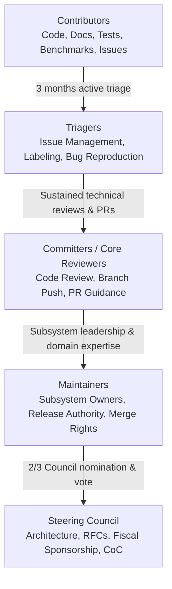

# Project Governance: Enterprise World Model Engine

## 1. Overview & Mission

The **Enterprise World Model Engine (EWM Engine)** is an open-source, scientifically grounded research and simulation framework dedicated to modeling, simulating, and evaluating complex socio-technical systems and organizational intervention dynamics.

This document describes the formal governance structure, the contributor advancement ladder, decision-making procedures, and secure release practices governing the project. EWM Engine aligns its governance model with **Scientific Python [SPEC 9](https://scientific-python.org/specs/spec-0009/)** (Developing Governance for Scientific Python Projects) and adopts **Scientific Python [SPEC 8](https://scientific-python.org/specs/spec-0008/)** (Secure Release Practices) by reference.

---

## 2. Governance Structure & Roles

EWM Engine operates under a **meritocratic Steering Council and Maintainer model**. Authority and responsibilities are distributed across five formal tiers defined in accordance with SPEC 9:

### Tier 1: Contributor
- **Definition**: Anyone who engages with the community by filing issues, submitting pull requests, improving documentation, designing benchmarks, participating in discussions, or testing features.
- **Privileges**: Public discussions, opening pull requests, submitting issue reports.
- **Criteria**: None. All community participants are welcome subject to the [Code of Conduct](CODE_OF_CONDUCT.md).

### Tier 2: Triager
- **Definition**: Active community members who help organize incoming issues, reproduce bug reports, verify test cases, apply labels, and guide new contributors.
- **Privileges**: GitHub `Triage` permissions (assign labels, request reviews, close invalid/duplicate issues, manage milestones).
- **Advancement Criteria**: Demonstrated understanding of repository workflows, polite community interaction, and sustained helpful triage activity for at least **3 months**.
- **Nomination**: Nominated by any Committer or Maintainer; approved by lazy consensus among Maintainers.

### Tier 3: Committer / Core Reviewer
- **Definition**: Proven technical contributors who perform rigorous code reviews, ensure adherence to type annotations and test gates, and mentor others.
- **Privileges**: GitHub `Write` access to non-protected feature branches, PR review approval authority, ability to trigger CI re-runs.
- **Advancement Criteria**: Sustained history of high-quality contributions ($\ge 5$ non-trivial merged pull requests), deep familiarity with testing protocols (Hypothesis, Mypy strict, Ruff), and constructive, respectful code reviews.
- **Nomination**: Nominated by a Maintainer; approved by a majority vote of active Maintainers.

### Tier 4: Maintainer (Subsystem Owner)
- **Definition**: Domain leaders responsible for a specific subsystem or cross-cutting concern (e.g., Core Engine, Dynamics, Constraints, Packaging, Observability, Verification). Maintainers are listed in [CODEOWNERS](.github/CODEOWNERS).
- **Privileges**: Subsystem review approval (mandatory per repository rulesets), merge authority into `main` via merge queue, release candidate testing.
- **Advancement Criteria**: Sustained leadership over a functional area for $\ge 6$ months, authorship of accepted Architecture Decision Records (ADRs) or API Change Proposals (ACPs), and consistent commitment to code quality and supply-chain integrity.
- **Nomination**: Nominated by any Maintainer; approved by 2/3 vote of the Steering Council.

### Tier 5: Steering Council
- **Definition**: The highest governing body of the project. The Steering Council provides long-term architectural stewardship, manages project assets and fiscal sponsorship (NumFOCUS), ratifies Request for Comments (RFCs), resolves deadlocks, and enforces the Code of Conduct.
- **Composition**: An odd number of voting members (initially 1 member during early expansion, growing to 3–5 members as the community matures).
- **Initial Council Chair**: **Vinicius Caridá** (`@vfcarida`).
- **Advancement Criteria**: Sustained holistic stewardship of the EWM Engine, deep domain expertise, commitment to open science and community health.
- **Election & Term**: Council members serve renewable 2-year terms. Vacancies and additions are confirmed by a 2/3 supermajority vote of the existing Council and consensus of Maintainers.

---

## 3. Decision-Making Procedures

We strive for consensus in all technical and governance matters. Decisions follow a two-tier model:

### 3.1. Lazy Consensus (Default for Routine Work)
- Applies to bug fixes, minor performance improvements, documentation updates, dependency bumps, and standard PR reviews.
- A proposal or PR is considered approved by lazy consensus if at least one authorized maintainer approves and no maintainer registers a reasoned objection within **72 hours**.
- If an objection is raised, the contributors discuss and iterate toward a mutually agreeable solution.

### 3.2. Formal Voting (Substantive & Architectural Decisions)
A formal vote is required for:
1. Approval of cross-cutting **RFCs** (Request for Comments) altering the public API surface or core execution semantics.
2. Breaking API changes or SemVer major bumps.
3. Adoption of new external core dependencies.
4. Changes to this Governance document or the [Code of Conduct](CODE_OF_CONDUCT.md).
5. Appointment of new Maintainers or Steering Council members.
6. Fiscal sponsorship and financial agreements (e.g., NumFOCUS).

**Voting Rules:**
- **Quorum**: At least 75% of active Steering Council members must participate.
- **Threshold**: Substantive decisions require a **2/3 supermajority** of voting Council members.
- **Discussion Period**: Formal votes are preceded by a mandatory 14-day RFC or discussion period.

---

## 4. Architecture Decision Records (ADRs) & RFCs

EWM Engine enforces two distinct engineering decision instruments:

1. **Architecture Decision Records (ADRs)**:
   - Stored in [`docs/adr/`](docs/adr/) using the **MADR 4.x** (Markdown Architectural Decision Records) specification.
   - Used for internal architectural choices, design patterns, testing strategies, and CI/CD mechanisms.
   - Authoritative and strictly append-only.

2. **Requests for Comments (RFCs)**:
   - Stored in [`rfcs/`](rfcs/) following the numbered template [`rfcs/0000-template.md`](rfcs/0000-template.md).
   - Used for major user-facing API changes, new mathematical paradigms, ecosystem adapters, or governance transitions.
   - Reviewed publicly through a 14-day community comment window before Steering Council ratification.

---

## 5. Adoption of Scientific Python SPEC 8 (Secure Releases)

EWM Engine formally adopts **Scientific Python SPEC 8** (Secure Release Practices) by reference:

1. **Cryptographic Release Provenance**:
   Every official package release published to PyPI or GitHub Releases must generate Sigstore-signed in-toto build provenance (SLSA Level 2+) via GitHub Actions OpenID Connect (`actions/attest-build-provenance`).
2. **Zero Static PyPI Tokens**:
   Package publishing uses exclusively OIDC Trusted Publishing with GitHub Actions (`id-token: write`). Static, long-lived PyPI API tokens are strictly prohibited.
3. **Dual Software Bill of Materials (SBOM)**:
   Releases generate both CycloneDX JSON (`cyclonedx-bom.json`) and Syft SPDX 2.3 JSON (`syft-bom.spdx.json`) from compiled wheel distributions.
4. **Reproducible Wheels & Verification**:
   Build artifacts are verified using `twine check --strict` and `check-wheel-contents` to ensure no test fixtures, temporary files, or undeclared binaries are distributed.
5. **Signed Git Tags**:
   All release tags (`vX.Y.Z`) must be cryptographically signed by an authorized Maintainer or Steering Council member.

---

## 6. Emeritus Status & Offboarding

Maintainers who have been inactive (no PR reviews, commits, or governance participation) for more than **12 months** will be contacted by the Steering Council to discuss transition to **Emeritus status**.
- Emeritus maintainers are recognized permanently in the [README](README.md) and governance documentation with gratitude.
- GitHub `Write` and `Admin` permissions are stepped down to preserve repository security hygiene.
- An Emeritus maintainer may request reinstatement to active status at any time, subject to confirmation by the Steering Council.

---

## 7. Conflict Resolution & Code of Conduct Enforcement

Disagreements that cannot be resolved through technical discussions will be escalated to the Steering Council:
1. The Council will review all arguments, benchmarks, and community impact considerations.
2. The Council may solicit input from external scientific advisors or domain experts.
3. If consensus cannot be reached, the Council Chair will call for a formal vote.
4. Code of Conduct violations are handled strictly and confidentially according to the 4-tier enforcement ladder outlined in [CODE_OF_CONDUCT.md](CODE_OF_CONDUCT.md). Reports should be addressed to `vfcarida@gmail.com`.
