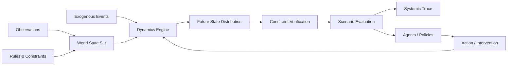
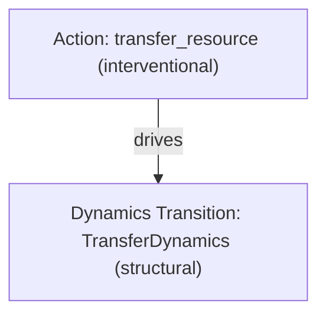

# Enterprise World Model Engine (EWM Engine)

**Simulate consequences before acting.**

[](https://github.com/vfcarida/Enterprise-World-Model-Engine/actions/workflows/ci.yml)
[](https://vfcarida.github.io/Enterprise-World-Model-Engine/)
[](LICENSE)
[](pyproject.toml)
[](ROADMAP.md)

---

## Why It Exists

Modern enterprise analytics and artificial intelligence are heavily optimized for answering:
> *"What has happened?"* (Reporting)  
> *"What is likely to happen next?"* (Observational Forecasting)

However, leadership teams, operations researchers, and autonomous agent systems routinely confront a more difficult operational question:
> *"What could happen if we do this instead of that?"* (Intervention Simulation)

Standard statistical learning and supervised machine learning learn conditional associations ($P(Y \mid X)$). When an organization changes a policy, reallocates critical inventory, or enacts an intervention, it alters the data-generating process. Observational correlations collapse under structural shifts due to unobserved confounding.

Meanwhile, pure large language models (LLMs) lack an explicit, conservation-preserving representation of enterprise state. They hallucinate quantities, violate physical and accounting balance equations, and cannot reliably simulate forward dynamics over time.

**Enterprise World Model Engine (EWM Engine)** exists to provide a domain-independent, action-conditioned, uncertainty-aware simulation kernel. It evaluates the downstream consequences of candidate decisions across stochastic futures before committing resources to reality.

---

## What an Enterprise World Model Means Here

An **Enterprise World Model** is an action-conditioned, uncertainty-aware executable representation of an organization's or socio-technical ecosystem's evolving state. It integrates explicit operational constraints, pluggable dynamics, external shocks, and decision policies to evaluate the downstream consequences of candidate interventions before deployment.

### The Hybrid Architecture: Known Structure + Learned Dynamics

Enterprise systems operate under rigid physical, accounting, and legal boundaries alongside uncertain human and market behaviors. EWM Engine enforces an explicit architectural separation:

$$\begin{aligned}
\textbf{Known Structural Knowledge} &\quad\longleftrightarrow\quad \text{Hard capacity limits, conservation laws, legal rules, invariants} \\
\textbf{Learned \& Stochastic Dynamics} &\quad\longleftrightarrow\quad \text{Customer behavior, demand surges, transit delays, weather shocks}
\end{aligned}$$

Forcing known physical and accounting equations into opaque neural network weights produces hallucinated states and physically impossible transitions. EWM Engine keeps structural rules explicit, verifiable, and audited.

---

## What It Is NOT

To maintain architectural focus, EWM Engine is **not**:

- **NOT a Chatbot or Agent Orchestrator**: It is not LangChain, AutoGen, CrewAI, or LangGraph. External agents interface with EWM Engine as decision actors.
- **NOT an RL-Only Discrete Gym**: While it supports policy rollouts, it is an enterprise state and evaluation kernel, not just a reinforcement learning benchmark wrapper.
- **NOT a 3D Digital Twin**: It models socio-technical state, contracts, resources, and operational rules, not CAD graphics or 3D visual rendering.
- **NOT a Univariate Time-Series Forecaster**: It simulates structural state transitions under candidate actions rather than extrapolating a single historical metric.
- **NOT a Monolithic Discrete-Event Simulator (DES) Replacement**: It is a modular Python kernel designed for programmatic integration, Monte Carlo uncertainty, and systemic dependency tracing.
- **NOT a Standalone JEPA Neural Network**: Joint Embedding Predictive Architectures are future research dynamics adapters, not a mandatory monolithic dependency.
- **NOT an Automated Causal Discovery Tool**: EWM Engine does not claim to magically discover true causal DAGs from raw observational data without explicit structural assumptions.

---

## Architecture Overview



---

## Five-Minute Quickstart

The following complete, runnable Python script initializes a two-warehouse world, executes a status-quo baseline rollout, branches the world to apply a resource transfer intervention, and compares distributional metrics:

```python
from ewm_engine import (
    Action,
    Entity,
    Relationship,
    Resource,
    Scenario,
    SimulationEngine,
    World,
    WorldState,
    compare_scenarios,
)
from ewm_engine.constraints.standard import ResourceCapacityConstraint
from ewm_engine.dynamics.deterministic import DeterministicTransferDynamics
from ewm_engine.simulation.scenario import ScheduledAction

# 1. Initialize World State S_0
state = WorldState(
    entities=[
        Entity(id="wh_north", type="warehouse", attributes={"region": "north"}),
        Entity(id="wh_south", type="warehouse", attributes={"region": "south"}),
    ],
    relationships=[
        Relationship(source="wh_north", target="wh_south", type="connected_to"),
    ],
    resources=[
        Resource(id="stock_north", current=100.0, min_value=0.0, max_value=200.0),
        Resource(id="stock_south", current=20.0, min_value=0.0, max_value=200.0),
    ],
)

# 2. Attach Constraints and Dynamics
world = World(
    state=state,
    dynamics=DeterministicTransferDynamics(),
    constraints=[
        ResourceCapacityConstraint(resource_id="stock_north"),
        ResourceCapacityConstraint(resource_id="stock_south"),
    ],
)

# 3. Simulate Baseline Scenario (Status Quo)
engine = SimulationEngine()
scenario_baseline = Scenario(
    scenario_id="baseline",
    name="Status Quo",
    horizon=2,
    samples=1,
    seed=42,
)
res_baseline = engine.run(world, scenario_baseline)

# 4. Branch and Simulate Scenario Intervention
world_alt = world.branch()
scenario_intervention = Scenario(
    scenario_id="intervention",
    name="Transfer 30 North -> South",
    horizon=2,
    samples=1,
    seed=42,
    scheduled_actions=(
        ScheduledAction(
            step=1,
            action=Action(
                id="act_transfer",
                type="transfer_resource",
                parameters={
                    "source_resource": "stock_north",
                    "target_resource": "stock_south",
                    "quantity": 30.0,
                },
            ),
        ),
    ),
)
res_intervention = engine.run(world_alt, scenario_intervention)

# 5. Evaluate and Compare Scenarios
comparison = compare_scenarios(
    baseline=res_baseline,
    candidates=[res_intervention],
    metrics=["resource_stock_north", "resource_stock_south", "violations_count"],
)

print(comparison.summary_table())
```

### Execution Output

```text
=== Scenario Comparison (Baseline: Status Quo) ===
---------------------------------------------------------------------------------------------------------------
Metric                    | Scenario                 | Mean (Std)         | p50 [p05, p95]       | Delta vs Base 
---------------------------------------------------------------------------------------------------------------
resource_stock_north      | Status Quo               | 100.00 (+/-0.00)   | 100.00 [100.00, 100.00] | -             
                          | Transfer 30 North -> South | 70.00 (+/-0.00)    | 70.00 [70.00, 70.00] | -30.00 (-30.0%)
---------------------------------------------------------------------------------------------------------------
resource_stock_south      | Status Quo               | 20.00 (+/-0.00)    | 20.00 [20.00, 20.00] | -             
                          | Transfer 30 North -> South | 50.00 (+/-0.00)    | 50.00 [50.00, 50.00] | +30.00 (+150.0%)
---------------------------------------------------------------------------------------------------------------
violations_count          | Status Quo               | 0.00 (+/-0.00)     | 0.00 [0.00, 0.00]    | -             
                          | Transfer 30 North -> South | 0.00 (+/-0.00)     | 0.00 [0.00, 0.00]    | +0.00 (+0.0%) 
---------------------------------------------------------------------------------------------------------------
```

---

## Scenario Branching Example

EWM Engine guarantees the **Branch Isolation Property (AC-005)**: branching a world creates an independent logical state without shared mutable references:

```python
# Create an isolated branch from the current world snapshot
policy_branch = world.branch()

# Configure an alternative scenario on the branch
branch_scenario = Scenario(
    scenario_id="branch_policy_b",
    name="Aggressive Reorder",
    horizon=5,
    samples=10,
    seed=101,
)

# Running simulation on policy_branch leaves world completely unaffected
branch_results = engine.run(policy_branch, branch_scenario)
assert world.initial_state.fingerprint == state.fingerprint
```

---

## Constraint Example

EWM Engine supports **phase-aware constraints** (`PRE_ACTION` and `POST_TRANSITION`) with explicit severity levels (`HARD` vs `SOFT`):

- `HARD + PRE_ACTION`: Rejects invalid actions before dynamics execute (e.g., attempting to transfer more inventory than exists).
- `HARD + POST_TRANSITION`: Immediately invalidates the rollout (`TrajectoryStatus.INVALID`), terminating execution without fabricating or repairing state.
- `SOFT`: Logs violation results with severity metadata and permits rollout continuation.

```python
from ewm_engine import Action, Scenario, SimulationEngine, World, WorldState, Resource
from ewm_engine.constraints.standard import ActionTransferAvailabilityConstraint
from ewm_engine.dynamics.deterministic import DeterministicTransferDynamics
from ewm_engine.simulation.scenario import ScheduledAction

state = WorldState(
    resources=[
        Resource(id="stock_a", current=100.0, min_value=0.0, max_value=200.0),
        Resource(id="stock_b", current=20.0, min_value=0.0, max_value=200.0),
    ]
)

world = World(
    state=state,
    dynamics=DeterministicTransferDynamics(),
    constraints=[ActionTransferAvailabilityConstraint()],
)

# Propose an action exceeding available source stock (150 > 100)
invalid_action_scenario = Scenario(
    scenario_id="reject_excess",
    horizon=1,
    scheduled_actions=(
        ScheduledAction(
            step=0,
            action=Action(
                id="act_overflow",
                type="transfer_resource",
                parameters={"source_resource": "stock_a", "target_resource": "stock_b", "quantity": 150.0},
            ),
        ),
    ),
)

res = SimulationEngine().run(world, invalid_action_scenario)
step = res.trajectories[0].steps[0]

# Action rejected pre-transition; stock_a remains preserved at 100.0
assert len(step.actions_proposed) == 1
assert len(step.actions_accepted) == 0
assert res.trajectories[0].final_state.get_resource("stock_a").current == 100.0
```

---

## Systemic Trace Example

Every simulation trajectory captures an inspectable **Systemic Trace**: a directed dependency graph recording discrete interactions with declared epistemic evidence levels (`EvidenceLevel`):

```python
trajectory = res_baseline.trajectories[0]
trace = trajectory.systemic_trace

# Export trace to Mermaid Markdown diagram
mermaid_diagram = trace.to_mermaid()
print(mermaid_diagram)

# Export to NetworkX DiGraph for graph theory metrics
nx_graph = trace.to_networkx()
print(f"Nodes: {nx_graph.number_of_nodes()}, Edges: {nx_graph.number_of_edges()}")
```

Generated Mermaid visualization:



*Note: Edges document simulated dependency chains with explicit EvidenceLevels and are never labeled `causes` by default.*

---

## Flagship Public Demo: CivicFlow

`examples/civicflow/` provides a flagship socio-technical research simulation demonstrating disaster logistics under severe flood emergencies:
- **Hydrological surges**: Rainfall surges inundating river valley cells and closing causeways.
- **Humanitarian routing**: Shelter bed limits, emergency relief convoys, and evacuee allocations.
- **Policy comparison**: Demonstrating how `capacity_aware_allocation` eliminates unserved demand compared to myopic `nearest_shelter_first` without breaching hard road passability constraints.

```bash
# Run CivicFlow via the CLI
ewm example civicflow

# Or execute directly via Python
uv run python examples/civicflow/run.py
```

---

## Installation

```bash
# Core package (no heavy ML, no solver required)
pip install ewm-engine

# With development tools (testing, ruff, mypy, hypothesis)
pip install "ewm-engine[dev]"

# With all optional dependencies (graphs, documentation, ML)
pip install "ewm-engine[all]"
```

### Development with uv (Recommended)

EWM Engine standardizes local development and CI automation on [`uv`](https://docs.astral.sh/uv/):

```bash
# Clone and synchronize virtual environment with exact locked dependencies
git clone https://github.com/vfcarida/Enterprise-World-Model-Engine.git
cd Enterprise-World-Model-Engine
uv sync --extra dev

# Run full test suite
uv run pytest -q

# Format and strict type check
uv run ruff check src tests examples
uv run ruff format --check src tests examples
uv run mypy src tests

# Verify test coverage quality gates (>=85% overall, >=90% core areas)
uv run python scripts/check_coverage.py

# Build and verify package distribution
uv run python -m build
uv run twine check dist/*
```

---

## Documentation Link

Comprehensive guides, conceptual foundations, and complete API references are available at:
👉 **[https://vfcarida.github.io/Enterprise-World-Model-Engine/](https://vfcarida.github.io/Enterprise-World-Model-Engine/)**

---

## Stability Policy

EWM Engine adheres strictly to [Semantic Versioning (SemVer 2.0.0)](https://semver.org/):

1. **Stable Public API Surface**: All symbols exported from root `ewm_engine` (`__all__`) are guaranteed backward-compatible across minor versions within `1.x`.
2. **Experimental Features**: New, unproven, or rapidly evolving research components reside exclusively under the `ewm_engine.experimental.*` namespace and carry explicit stability warnings.
3. **Deprecation Process**: Any planned modification to Stable APIs requires an Architecture Decision Record (ADR) and an approved API Change Proposal. Deprecated symbols remain functional across at least one minor release cycle before removal.

---

## Project Roadmap & Maturity

| Subsystem | Maturity Status | Architectural Scope |
| :--- | :--- | :--- |
| **Core Simulation & Branching** | Alpha | Immutable states, snapshot branching, scenario fingerprinting |
| **Constraint Engine** | Alpha | Pre-action and post-transition verification with full audit provenance |
| **Pluggable Dynamics** | Alpha | Deterministic, stochastic, and composite dynamic models |
| **Systemic Traces** | Alpha | Directed dependency graph generation with Mermaid and NetworkX export |
| **Learned Dynamics Protocol** | Experimental | Protocol interfaces and linear empirical regression baselines |
| **Causal Epistemics & Evaluation** | Research | Structural vs. interventional vs. observational evidence levels |
| **SMT Solvers & Optimizers** | Planned Adapter | Optional Z3 and Google OR-Tools constraint satisfaction |
| **LLM Agent Frameworks** | Planned Adapter | External adapters for LangGraph, AutoGen, and CrewAI |

See [ROADMAP.md](ROADMAP.md) for detailed release milestones.

---

## Contributing

We welcome contributions from researchers, software engineers, and domain experts! Please review [CONTRIBUTING.md](CONTRIBUTING.md), our [Code of Conduct](CODE_OF_CONDUCT.md), and [GOVERNANCE.md](GOVERNANCE.md) for branch protection and quality gate requirements.

---

## Citation

If you use EWM Engine in academic research, benchmark evaluation, or technical publications, please cite:

```bibtex
@software{carida2026ewmengine,
  author = {Carida, Vinicius},
  title = {Enterprise World Model Engine: An Open Framework for Modeling, Simulating, and Evaluating Organizational Dynamics},
  year = {2026},
  url = {https://github.com/vfcarida/Enterprise-World-Model-Engine},
  version = {0.1.0}
}
```

---

## License

EWM Engine is open-source software licensed under the [Apache License 2.0](LICENSE).
