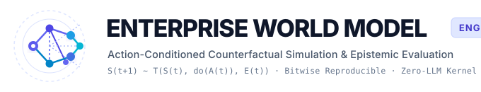
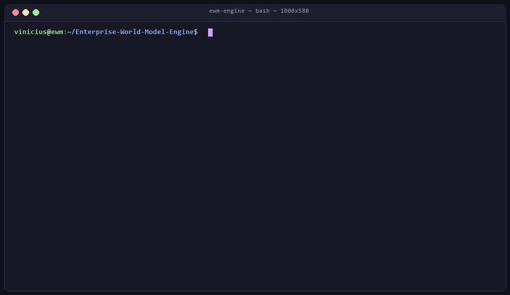
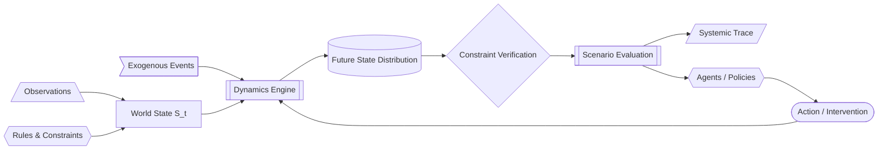
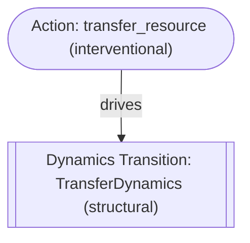

<p align="center">
  <picture>
    <source media="(prefers-color-scheme: dark)" srcset="assets/logo-dark.svg">
    <source media="(prefers-color-scheme: light)" srcset="assets/logo-light.svg">
    
  </picture>
</p>

<p align="center">
  <em>Simulate consequences before acting.</em>
</p>

<p align="center">
  <a href="https://github.com/vfcarida/Enterprise-World-Model-Engine/actions/workflows/ci.yml"></a>
  <a href="https://vfcarida.github.io/Enterprise-World-Model-Engine/"></a>
  <a href="https://pypi.org/project/ewm-engine/"></a>
  <a href="https://pypi.org/project/ewm-engine/"></a>
  <a href="scripts/check_coverage.py"></a>
  <a href="pyproject.toml"></a>
  <a href="https://github.com/astral-sh/ruff"></a>
  <a href="docs/adr/ADR-004-no-llm-dependency.md"></a>
  <!-- DOI / Zenodo badge placeholder (wired in R06) -->
  <a href="https://doi.org/10.5281/zenodo.placeholder"></a>
  <a href="LICENSE"></a>
</p>

<p align="center">
  <a href="https://vfcarida.github.io/Enterprise-World-Model-Engine/"><b>Docs</b></a> ·
  <a href="#five-minute-quickstart"><b>Quickstart</b></a> ·
  <a href="https://vfcarida.github.io/Enterprise-World-Model-Engine/concepts/world-models/"><b>Concepts</b></a> ·
  <a href="https://vfcarida.github.io/Enterprise-World-Model-Engine/reference/api/"><b>API Reference</b></a> ·
  <a href="#project-roadmap--maturity"><b>Roadmap</b></a> ·
  <a href="#citation"><b>Cite</b></a>
</p>

---

**Enterprise World Model Engine (EWM Engine)** is an open-source, domain-neutral Python framework for modeling, simulating, and evaluating complex socio-technical systems under interventional policy changes. Unlike observational predictive models or workflow engines (Airflow/Prefect), EWM executes **action-conditioned forward rollouts** ($\mathbb{E}[S_{t+H} \mid \text{do}(A_t)]$) that strictly decouple **known explicit rules and conservation laws** from **learned probabilistic dynamics** — guaranteeing bitwise reproducibility through cryptographic state fingerprints, seed-tree isolation, and zero mandatory LLM dependencies.

<p align="center">
  
  <br>
  <em>Interactive CLI rollout of CivicFlow disaster logistics evaluating flood surge counterfactuals and systemic traces.</em>
</p>

---

## Why It Exists

Modern enterprise analytics and artificial intelligence are heavily optimized for answering:
> *"What has happened?"* (Reporting & BI)  
> *"What is likely to happen next?"* (Observational Forecasting)

However, leadership teams, operations research engineers, and autonomous agents routinely confront a fundamentally distinct operational inquiry:
> *"What could happen if we do this instead of that?"* (Intervention Simulation & Counterfactual Evaluation)

Standard statistical learning and supervised machine learning optimize conditional associations:

$$P(Y \mid X)$$

When an enterprise enacts an operational intervention — altering dispatch rules, reallocating inventories, or shifting tariffs — it deliberately changes the data-generating mechanism. Observational correlations collapse under structural shifts due to unobserved confounding, policy feedback, and regime changes.

Meanwhile, pure large language models (LLMs) lack an explicit, conservation-preserving representation of enterprise state. They hallucinate quantities, breach physical and accounting balance equations, and cannot reliably simulate forward dynamics over multi-step horizons.

**EWM Engine** provides a domain-independent, action-conditioned, uncertainty-aware simulation kernel. It evaluates the downstream consequences of candidate decisions across stochastic futures before committing capital or operational resources to reality.

---

## What an Enterprise World Model Means Here

An **Enterprise World Model** is an action-conditioned, uncertainty-aware executable representation of an organization's or socio-technical ecosystem's evolving state. It integrates explicit operational constraints, pluggable dynamics, external shocks, and decision policies to evaluate the downstream consequences of candidate interventions before deployment.

### The Hybrid Architecture: Known Structure + Learned Dynamics

Enterprise systems operate under rigid physical, accounting, and legal boundaries alongside uncertain human and market behaviors. EWM Engine enforces an explicit architectural separation:

$$\begin{aligned}
\textbf{Known Structural Knowledge} &\quad\longleftrightarrow\quad \text{Hard capacity limits, conservation laws, legal rules, balance equations} \\
\textbf{Learned \& Stochastic Dynamics} &\quad\longleftrightarrow\quad \text{Customer behavior, demand surges, transit delays, weather shocks}
\end{aligned}$$

Forcing known physical and accounting equations into opaque neural network weights produces hallucinated states and physically impossible transitions. EWM Engine keeps structural rules explicit, verifiable, and audited.

### Formal Mathematical Specification

Formally, an enterprise world model at discrete step $t$ is defined as a tuple:

$$S_t = (G_t, R_t, M_t, \Gamma_t, C_t)$$

- **$G_t = (V_t, E_t)$**: Directed organizational topology graph containing typed entities ($V_t$) and relationships ($E_t$).
- **$R_t \in \mathbb{R}^d$**: Finite bounded resource vector with invariant domain $[R_{\min}, R_{\max}]$ preserving physical/accounting conservation laws.
- **$M_t$**: Temporal context and execution metadata (step, wall-clock time, SHA-256 state fingerprint).
- **$\Gamma_t$**: Inspectable Systemic Trace DAG recording causal dependencies with calibrated epistemic evidence levels.
- **$C_t$**: Active operational constraints partitioned into pre-action preconditions ($\mathcal{V}_{\text{pre}}$) and post-transition state invariants ($\mathcal{V}_{\text{post}}$).

State forward evolution under candidate action vector $A_t$ and exogenous shock vector $E_t \sim \mathcal{D}_{\text{exog}}$ is governed by:

$$A_t^{\text{valid}} = \mathcal{V}_{\text{pre}}(S_t, A_t)$$

$$S_{t+1} \sim \mathcal{T}(S_t, A_t^{\text{valid}}, E_t)$$

$$\text{Status}(S_{t+1}) = \begin{cases} \text{VALID}, & \text{if } \mathcal{V}_{\text{post}}(S_{t+1}) = \emptyset \\ \text{INVALID}, & \text{if } \exists c \in \mathcal{V}_{\text{post}}(S_{t+1}) \text{ with severity } \text{HARD} \end{cases}$$

---

## Architectural Comparison

How does EWM Engine compare to traditional simulators, reinforcement learning toolkits, and LLM frameworks?

| Capability | EWM Engine | Gymnasium (RL) | SimPy / Arena (DES) | LangGraph / CrewAI | Latent World Models (DreamerV3) |
| :--- | :--- | :--- | :--- | :--- | :--- |
| **Primary Focus** | Enterprise decision evaluation under uncertainty | Agent benchmark training | Queuing & process simulation | LLM workflow orchestration | Continuous latent planning |
| **State Representation** | Explicit typed graph + bounded resources ($S_t$) | Flat numeric tensor observation | Arbitrary Python objects / queues | String/JSON agent message state | High-dimensional latent vector ($z_t$) |
| **Conservation Laws** | Mathematically enforced by invariants | Left to reward shaping | Custom imperatively written rules | None (prone to hallucinations) | Approximated via neural loss |
| **Constraint Phases** | Explicit Pre-Action & Post-Transition gates | Reward penalty or termination | Imperative conditionals | LLM prompt instructions | None (latent transition) |
| **Branching Isolation** | $O(1)$ isolated snapshot branches (AC-005) | Requires environment reset | Mutable global memory | State history cloning | Parallel latent recurrent steps |
| **Epistemic Trace** | Calibrated `EvidenceLevel` dependency DAG | None | None | LLM message history | Black-box neural activations |
| **Simulation Core** | Zero-LLM, strictly deterministic PRNG | Environment-dependent | Deterministic / Stochastic | Non-deterministic LLM calls | Neural network inference |

---

## What It Is NOT

To maintain architectural focus and scientific integrity, EWM Engine is **not**:

- **NOT a Video or Pixel World Model**: It does not generate video frames (like Cosmos, Sora, or Genie) or 3D graphics (like World Labs). It models discrete, relational, and continuous organizational states.
- **NOT a Chatbot or Agent Orchestrator**: It is not LangChain, AutoGen, CrewAI, or LangGraph. External agents interface with EWM Engine as decision actors.
- **NOT an RL-Only Discrete Gym**: While it supports policy rollouts, it is an enterprise state and evaluation kernel, not just a reinforcement learning benchmark wrapper.
- **NOT a 3D Digital Twin**: It models socio-technical state, contracts, resources, and operational rules, not CAD graphics or 3D visual rendering.
- **NOT a Univariate Time-Series Forecaster**: It simulates structural state transitions under candidate actions rather than extrapolating a single historical metric.
- **NOT a Monolithic Discrete-Event Simulator (DES) Replacement**: It is a modular Python kernel designed for programmatic integration, Monte Carlo uncertainty, and systemic dependency tracing.
- **NOT an Automated Causal Discovery Tool**: EWM Engine does not claim to magically discover true causal DAGs from raw observational data without explicit structural assumptions.

---

## Positioning: Enterprise World Models vs. World Foundation Models (2024–2026)

The explosion of interest in **world models** across 2024–2026 encompasses two fundamentally distinct technological directions:

1. **World Foundation Models (WFMs)** (NVIDIA Cosmos, Google Genie 2/3, Meta V-JEPA 2, World Labs):
   Pre-trained generative models operating on sensorimotor, pixel, or 3D latent spaces. They simulate photorealistic interactive video, 3D scenes, or physical robot environments.
2. **Enterprise World Models (EWMs)** (EWM Engine):
   Domain-independent computational kernels operating on organizational, socio-technical, and relational state. They simulate business consequence distributions, physical/accounting conservation laws, multi-actor contracts, and operational interventions under uncertainty.

> [!IMPORTANT]
> **Clear Architectural Stance:** EWM Engine is **not** a video generation model, an interactive 3D graphics simulator, or a pixel diffusion pipeline. While EWM Engine **can host** a learned latent dynamics adapter (such as a DreamerV3-style RSSM or relational GNN module), the engine itself represents state as explicit typed entities, bounded resources, operational rules, and auditable causal traces.

### Architectural Contrast Table

| Dimension | Enterprise World Model Engine (EWM) | World Foundation Models (Cosmos, Genie 2/3, World Labs) | Latent / Predictive Models (V-JEPA 2, DreamerV3) |
| :--- | :--- | :--- | :--- |
| **Target Domain** | Socio-technical systems (enterprises, supply chains, healthcare, public logistics, financial networks). | Sensorimotor physical worlds, interactive video games, robotics manipulation. | Abstract visual/robotic representation, continuous motor control. |
| **State Representation** | Symbolic + Hybrid: Heterogeneous relational graph ($G_t$), bounded continuous resources ($R_t$), memory ($M_t$), active rules ($\Gamma_t$). | High-dimensional visual tokens, pixel lattices, or 3D Gaussian splats ($V_t$). | Abstract continuous latent vector ($z_t$) without pixel reconstruction. |
| **Physical & Business Laws** | **Strict Invariants**: Hard conservation laws, capacity limits, and legal constraints enforced by pre/post validation gates ($\mathcal{V}_{\text{pre}}$, $\mathcal{V}_{\text{post}}$). | **Statistical Illusion**: Invariants are learned implicitly from video; prone to physical hallucinations, object vanishing, and balance breaches. | **Loss Penalties**: Invariants approximated via latent regularization; no hard guarantees. |
| **Dynamics Mechanism** | **Pluggable Hybrid**: Structural mechanical rules + OR solvers + optional learned neural/GNN residuals. | Autoregressive diffusion, video spatio-temporal transformers. | Recurrent State-Space Models (RSSM) or Joint-Embedding Predictors. |
| **Epistemics & Causality** | **Honest Diagnostics**: Backdoor identifiability checks, positivity overlap, Twin Rollout noise coupling, Rosenbaum bounds, OOD regime detection. | **Pure Observational / Action-Conditioned**: Incurs unavoidable interventional bias when backdoor paths are open (Song & Cai, arXiv:2610.00012). | Latent planning without structural identification guarantees. |
| **Execution Core** | **Zero-LLM, Zero-GPU Required**: Lightweight, deterministically seeded, reproducible PRNG kernel. | Multi-billion-parameter neural networks requiring GPU/TPU clusters for inference. | Neural inference requiring PyTorch/JAX runtimes. |
| **Primary Output** | Decision-grade consequence distributions, Pareto trade-offs, and systemic dependency traces. | Rendered video frames or simulated sensory streams. | Latent value estimates and continuous control policies. |

---

## Architecture Overview



*Figure 1: Architectural pipeline of EWM Engine. External observations and invariant rules initialize the typed World State ($S_t$). The Dynamics Engine combines the state with action interventions and exogenous events to project a distribution of future states ($S_{t+1:t+H}$). Post-transition constraint verification evaluates validity, followed by counterfactual scenario evaluation and the generation of an auditable Systemic Trace DAG.*

---

## Five-Minute Quickstart

The following complete, runnable Python snippet initializes a two-warehouse world, executes a status-quo baseline rollout, branches the world to apply a resource transfer intervention, and evaluates distributional deltas:

```python
from ewm_engine import (
    Action,
    Entity,
    Relationship,
    Resource,
    Scenario,
    SimulationEngine,
    World,
    WorldState,
    compare_scenarios,
)
from ewm_engine.constraints.standard import ResourceCapacityConstraint
from ewm_engine.dynamics.deterministic import DeterministicTransferDynamics
from ewm_engine.simulation.scenario import ScheduledAction

# 1. Initialize World State S_0
state = WorldState(
    entities=[
        Entity(id="wh_north", type="warehouse", attributes={"region": "north"}),
        Entity(id="wh_south", type="warehouse", attributes={"region": "south"}),
    ],
    relationships=[
        Relationship(source="wh_north", target="wh_south", type="connected_to"),
    ],
    resources=[
        Resource(id="stock_north", current=100.0, min_value=0.0, max_value=200.0),
        Resource(id="stock_south", current=20.0, min_value=0.0, max_value=200.0),
    ],
)

# 2. Attach Constraints and Dynamics
world = World(
    state=state,
    dynamics=DeterministicTransferDynamics(),
    constraints=[
        ResourceCapacityConstraint(resource_id="stock_north"),
        ResourceCapacityConstraint(resource_id="stock_south"),
    ],
)

# 3. Simulate Baseline Scenario (Status Quo)
engine = SimulationEngine()
scenario_baseline = Scenario(
    scenario_id="baseline",
    name="Status Quo",
    horizon=2,
    samples=1,
    seed=42,
)
res_baseline = engine.run(world, scenario_baseline)

# 4. Branch and Simulate Scenario Intervention
world_alt = world.branch()
scenario_intervention = Scenario(
    scenario_id="intervention",
    name="Transfer 30 North -> South",
    horizon=2,
    samples=1,
    seed=42,
    scheduled_actions=(
        ScheduledAction(
            step=1,
            action=Action(
                id="act_transfer",
                type="transfer_resource",
                parameters={
                    "source_resource": "stock_north",
                    "target_resource": "stock_south",
                    "quantity": 30.0,
                },
            ),
        ),
    ),
)
res_intervention = engine.run(world_alt, scenario_intervention)

# 5. Evaluate and Compare Scenarios
comparison = compare_scenarios(
    baseline=res_baseline,
    candidates=[res_intervention],
    metrics=["resource_stock_north", "resource_stock_south", "violations_count"],
)

print(comparison.summary_table())
```

### Execution Output

```text
=== Scenario Comparison (Baseline: Status Quo) ===
---------------------------------------------------------------------------------------------------------------------------
Metric                    | Scenario             | Mean (Std)         | p50 [p05, p95]       | Delta vs Base [CI] (*sig)   
---------------------------------------------------------------------------------------------------------------------------
resource_stock_north      | Status Quo           | 100.00 (+/-0.00)   | 100.00 [100.00, 100.00] | -                           
                          | Transfer 30 North -> South | 70.00 (+/-0.00)    | 70.00 [70.00, 70.00] | -30.00 (-30.0%) [-30.00, -30.00] *
---------------------------------------------------------------------------------------------------------------------------
resource_stock_south      | Status Quo           | 20.00 (+/-0.00)    | 20.00 [20.00, 20.00] | -                           
                          | Transfer 30 North -> South | 50.00 (+/-0.00)    | 50.00 [50.00, 50.00] | +30.00 (+150.0%) [+30.00, +30.00] *
---------------------------------------------------------------------------------------------------------------------------
violations_count          | Status Quo           | 0.00 (+/-0.00)     | 0.00 [0.00, 0.00]    | -                           
                          | Transfer 30 North -> South | 0.00 (+/-0.00)     | 0.00 [0.00, 0.00]    | +0.00 (+0.0%) [+0.00, +0.00]
---------------------------------------------------------------------------------------------------------------------------
```

> [!NOTE]
> The summary table displays empirical non-parametric bootstrap confidence intervals `[CI]` on counterfactual deltas ($\Delta = \mu_{\text{candidate}} - \mu_{\text{baseline}}$). Statistically significant policy shifts under $P_{\text{model}}$ are flagged with an asterisk (`*`).

---

## Core Principles in Action

### 1. Scenario Branching Isolation (AC-005)

EWM Engine guarantees the **Branch Isolation Property (AC-005)**: branching a world creates an independent logical state without shared mutable references:

```python
# Create an isolated branch from the current world snapshot
policy_branch = world.branch()

# Configure an alternative scenario on the branch
branch_scenario = Scenario(
    scenario_id="branch_policy_b",
    name="Aggressive Reorder",
    horizon=5,
    samples=10,
    seed=101,
)

# Running simulation on policy_branch leaves baseline world completely unaffected
branch_results = engine.run(policy_branch, branch_scenario)
assert world.initial_state.fingerprint == state.fingerprint
```

### 2. Phase-Aware Constraints & Invalidation

EWM Engine supports **phase-aware constraints** (`PRE_ACTION` and `POST_TRANSITION`) with explicit severity levels (`HARD` vs `SOFT`):

- `HARD + PRE_ACTION`: Rejects invalid actions before dynamics execute (e.g., attempting to transfer more inventory than exists).
- `HARD + POST_TRANSITION`: Immediately invalidates the rollout (`TrajectoryStatus.INVALID`), terminating execution without fabricating or repairing state.
- `SOFT`: Logs violation results with severity metadata and permits rollout continuation.

```python
from ewm_engine import Action, Scenario, SimulationEngine, World, WorldState, Resource
from ewm_engine.constraints.standard import ActionTransferAvailabilityConstraint
from ewm_engine.dynamics.deterministic import DeterministicTransferDynamics
from ewm_engine.simulation.scenario import ScheduledAction

state = WorldState(
    resources=[
        Resource(id="stock_a", current=100.0, min_value=0.0, max_value=200.0),
        Resource(id="stock_b", current=20.0, min_value=0.0, max_value=200.0),
    ]
)

world = World(
    state=state,
    dynamics=DeterministicTransferDynamics(),
    constraints=[ActionTransferAvailabilityConstraint()],
)

# Propose an action exceeding available source stock (150 > 100)
invalid_action_scenario = Scenario(
    scenario_id="reject_excess",
    horizon=1,
    scheduled_actions=(
        ScheduledAction(
            step=0,
            action=Action(
                id="act_overflow",
                type="transfer_resource",
                parameters={
                    "source_resource": "stock_a",
                    "target_resource": "stock_b",
                    "quantity": 150.0,
                },
            ),
        ),
    ),
)

res = SimulationEngine().run(world, invalid_action_scenario)
step = res.trajectories[0].steps[0]

# Action rejected pre-transition; stock_a remains preserved at 100.0
assert len(step.actions_proposed) == 1
assert len(step.actions_accepted) == 0
assert res.trajectories[0].final_state.get_resource("stock_a").current == 100.0
```

### 3. Systemic Traces & Epistemic Honesty

Every simulation trajectory captures an inspectable **Systemic Trace**: a directed dependency graph recording discrete interactions with declared epistemic evidence levels (`EvidenceLevel`):

```python
# Inspect the interventional trajectory's systemic trace
trajectory = res_intervention.trajectories[0]
trace = trajectory.systemic_trace

# Export trace to Mermaid Markdown diagram
mermaid_diagram = trace.to_mermaid()

# Export to NetworkX DiGraph for graph theory metrics
nx_graph = trace.to_networkx()
print(f"Nodes: {nx_graph.number_of_nodes()}, Edges: {nx_graph.number_of_edges()}")
```



*Figure 2: Systemic dependency trace graph. Edges capture simulated dependencies with calibrated `EvidenceLevel` tiers (e.g., structural, interventional, predictive) and are never labeled as causal by default unless backed by verified experimental interventions.*

---

## Flagship Public Demo: CivicFlow

`examples/civicflow/` provides a flagship socio-technical research simulation demonstrating disaster logistics under severe flood emergencies:
- **Hydrological surges**: Rainfall surges inundating river valley cells and closing causeways.
- **Humanitarian routing**: Shelter bed limits, emergency relief convoys, and evacuee allocations.
- **Policy comparison**: Demonstrating how proactive regional allocation eliminates unserved demand compared to myopic nearest-shelter dispatch without breaching hard road passability constraints.

```bash
# Run CivicFlow via the CLI
ewm example civicflow

# Or execute directly via Python
uv run python examples/civicflow/run.py
```

---

## Installation

```bash
# Core package (zero-LLM, zero-GPU, lightweight dependencies)
pip install ewm-engine

# With development tools (pytest, hypothesis, ruff, mypy)
pip install "ewm-engine[dev]"

# With all ecosystem adapters (solvers, ML, visualization, serving)
pip install "ewm-engine[all]"
```

### Development with uv (Recommended)

EWM Engine standardizes local development and CI automation on [`uv`](https://docs.astral.sh/uv/):

```bash
# Clone and synchronize virtual environment with exact locked dependencies
git clone https://github.com/vfcarida/Enterprise-World-Model-Engine.git
cd Enterprise-World-Model-Engine
uv sync --extra dev

# Run full automated test suite (unit, property-based, contract, and integration gates)
uv run pytest -q

# Format and strict type check
uv run ruff check src tests examples benchmarks
uv run ruff format --check src tests examples benchmarks
uv run mypy src tests examples benchmarks

# Verify test coverage quality gates (>=85% overall, >=90% core areas)
uv run python scripts/check_coverage.py

# Build and verify package distribution
uv run python -m build
uv run twine check dist/*
```

---

## Documentation

Comprehensive guides, conceptual foundations, and complete API references are available at:
👉 **[https://vfcarida.github.io/Enterprise-World-Model-Engine/](https://vfcarida.github.io/Enterprise-World-Model-Engine/)**

Key sections:
- **[What is a World Model?](https://vfcarida.github.io/Enterprise-World-Model-Engine/concepts/world-models/)**: Epistemic foundation and state abstractions.
- **[Causal Epistemology](https://vfcarida.github.io/Enterprise-World-Model-Engine/concepts/causality/)**: Identifiability, positivity, and confounding guardrails.
- **[First-Class Constraints](https://vfcarida.github.io/Enterprise-World-Model-Engine/concepts/constraints/)**: Pre-action and post-transition verification.
- **[Systemic Traces](https://vfcarida.github.io/Enterprise-World-Model-Engine/concepts/systemic-traces/)**: Inspectable causal DAG extraction.
- **[API Reference](https://vfcarida.github.io/Enterprise-World-Model-Engine/reference/api/)**: Complete module and protocol specification.

---

## Research Adopters & Citations

EWM Engine is developed for computational researchers, operations research engineers, and socio-technical domain modelers.

<!--
Are you using EWM Engine in academic research, enterprise simulation, or open-source benchmarking?
We would love to feature your organization, laboratory, or paper!
Please open a PR to add your project or citation below.
-->

| Project / Organization | Domain | Focus Area / Artifact | Reference |
| :--- | :--- | :--- | :--- |
| **CivicFlow Project** | Humanitarian Logistics | Flood emergency evacuation & disaster relief resource allocation under hydrological surges | [Reference Implementation](examples/civicflow/) |
| *Your Organization / Lab Here* | *Supply Chain / Healthcare / Energy / Public Policy* | *Contribute your world model or benchmark study via pull request* | [Submit a Pull Request](https://github.com/vfcarida/Enterprise-World-Model-Engine/pulls) |

> [!TIP]
> **Adopter Inquiries & Collaborative Research:** If you are publishing academic research using EWM Engine or evaluating organizational world models in production, please open an issue or submit your citation to be indexed in the official registry.

---

## Stability Policy

EWM Engine adheres strictly to [Semantic Versioning (SemVer 2.0.0)](https://semver.org/):

1. **Stable Public API Surface**: All symbols exported from root `ewm_engine` (`__all__`) are guaranteed backward-compatible across minor versions within `1.x`.
2. **Experimental Features**: Research and prototype components reside exclusively under the `ewm_engine.experimental.*` namespace and carry explicit stability warnings.
3. **Deprecation Process**: Any planned modification to Stable APIs requires an Architecture Decision Record (ADR) and an approved API Change Proposal. Deprecated symbols remain functional across at least one minor release cycle before removal.

---

## Project Roadmap & Maturity

Capabilities in EWM Engine are classified under explicit, strictly enforced maturity levels sourced directly from [ROADMAP.md](ROADMAP.md):

| Subsystem | Maturity Status | Architectural Scope & Standards |
| :--- | :---: | :--- |
| **Core Simulation Kernel** | **Stable (v1.0.0)** | Deterministic Monte Carlo rollout, seed spawning, bitwise reproducibility (AC-004, AC-009) |
| **World & State Model** | **Stable (v1.0.0)** | Deeply immutable snapshot states, canonical JSON serializer, SHA-256 fingerprinting (AC-005, AC-010) |
| **Constraint Engine** | **Stable (v1.0.0)** | Phase-aware (`PRE_ACTION`, `POST_TRANSITION`), normative action rejection and rollout invalidation (AC-006–AC-008) |
| **Pluggable Dynamics Protocol** | **Stable (v1.0.0)** | Structural `DynamicsModel` protocol, composite and deterministic transfer implementations |
| **Scenario Branching** | **Stable (v1.0.0)** | Safe branch isolation without mutable state cross-contamination (AC-005) |
| **Systemic Traces** | **Stable (v1.0.0)** | Epistemic honesty with explicit `EvidenceLevel` tiers; DAG export to Mermaid and NetworkX (AC-011) |
| **Declarative Serialization** | **Stable (v1.0.0)** | Draft 2020-12 versioned JSON Schemas, safe YAML loader, trusted closed `WorldFactory` registry (AC-002, AC-003, AC-018) |
| **Scenario Evaluation** | **Stable (v1.1.0)** | Bootstrap CIs on counterfactual deltas, empirical significance flags, multi-objective Pareto analysis (FEAT-001, ADR-016) |
| **Distributed Monte Carlo** | **Beta Adapter (v1.1.0)** | High-throughput parallel execution preserving `SeedSequence` determinism across workers (FEAT-002, ADR-017) |
| **OpenTelemetry Observability** | **Beta Adapter (v1.1.0)** | Zero-overhead OpenTelemetry span and metric export from lifecycle hooks without core coupling (ADR-013, ADR-024) |
| **OR & Continuous Planners** | **Beta Adapter (v1.1.0)** | Google OR-Tools CP-SAT discrete and SciPy continuous allocation planners with timeout guards (ADR-018) |
| **SMT Formal Verification** | **Beta Adapter (v1.1.0)** | Z3 SMT constraint satisfaction adapter with timeout and resource limits (ADR-018) |
| **Gymnasium RL Adapter** | **Beta Adapter (v1.1.0)** | Standard Gym environment wrapper (`gymnasium.Env`) with step-bound resource safeguards |
| **Durability & Replay (T1, T2)** | **Beta (v1.2.0)** | Event-sourced `TraceLog`, `EventStore` protocol (SQLite/JSON), fingerprint-keyed `ResultStore` (ADR-026) |
| **Native Cards & Tracking (T9)** | **Beta (v1.2.0)** | Pydantic Scenario/Model/Dataset Cards with SHA-256 fingerprints; `TrackerBackend` protocol and MLflow adapter (ADR-029) |
| **Trajectory Verification (T3)** | **Beta (v1.3.0)** | Oracle-graph DAG verifier (CORE) and RTAMT Signal Temporal Logic (STL) robustness monitoring (`[stl]`, ADR-027) |
| **Scientific Experimentation (T4)** | **Beta (v1.4.0)** | DoE sweep harness (LHS/Sobol), walk-forward backtesting, global sensitivity (SALib), and multi-objective optimization (ADR-028) |
| **Platform Interoperability (T5)** | **Beta (v1.5.0)** | Master co-simulation stepping loop (CORE), FMI 3.0 / FMU adapter (FMPy), SimPy, Mesa, and System Dynamics (PySD) (ADR-029) |
| **Multi-Agent Coordination (T6)** | **Beta (v1.5.0)** | Multi-actor observation/action views, deterministic mediator, Nash equilibrium solving via Nashpy (ADR-029) |
| **Reporting & Serving (T7, T8)** | **Beta (v1.5.0)** | Pydantic `ReportModel`, Plotly interactive fan charts, local multiprocessing `JobRunner`, FastAPI REST service (ADR-029) |
| **Learned-Dynamics Eval Harness** | **Experimental (v1.2.0)** | Multi-step rollout divergence, invariant verification, and dataset collection (ADR-019) |
| **Torch Neural Residual Baseline** | **Experimental (v1.2.0)** | PyTorch MLP residual baseline with symlog scaling (`[ml]` extra, ADR-019) |
| **Scientific Benchmark Families** | **Research (v1.2.0)** | 5 scientific shift benchmark families probing structural dynamics under change (ADR-025) |
| **Planning & Controller Layer** | **Experimental (v1.3.0)** | Pluggable rollout scorers (CVaR, constraint-penalized) & receding-horizon control (ADR-020) |
| **OOD & Regime-Shift Detection** | **Experimental (v1.4.0)** | Grounded-regime detection (support bounds, Mahalanobis covariance, ADR-021) |
| **Honest Causal Diagnostics** | **Experimental (v1.4.0)** | Backdoor identifiability, positivity checks, and Twin Rollout noise coupling (ADR-021) |
| **Heterogeneous Graph State & GNN** | **Experimental (v2.0.0-alpha)** | Relational graph state representation, schema migration, and GNN dynamics (FEAT-003, ADR-022) |
| **World Specification Language** | **Experimental (v2.0.0-alpha)** | Declarative safe YAML/JSON grammar, validator, compiler, and exporter (FEAT-003, ADR-023) |

See [ROADMAP.md](ROADMAP.md) and [01_EXPANDED_ROADMAP.md](01_EXPANDED_ROADMAP.md) for detailed milestone descriptions and architectural tracking.

---

## Contributing

We welcome contributions from researchers, software engineers, and domain experts! Please review:
- [CONTRIBUTING.md](CONTRIBUTING.md): Workflow guidelines, testing procedures, and submission standards.
- [CODE_OF_CONDUCT.md](CODE_OF_CONDUCT.md): Community engagement expectations.
- [GOVERNANCE.md](GOVERNANCE.md): Project governance and maintainer authority.

---

## Citation

If you use EWM Engine in academic research, benchmark evaluation, or technical publications, please cite:

```bibtex
@software{carida2026ewmengine,
  author = {Carida, Vinicius},
  title = {Enterprise World Model Engine: An Open Framework for Modeling, Simulating, and Evaluating Organizational Dynamics},
  year = {2026},
  url = {https://github.com/vfcarida/Enterprise-World-Model-Engine},
  version = {1.0.0}
}
```

See [CITATION.cff](CITATION.cff) for complete citation metadata.

---

## License

EWM Engine is open-source software licensed under the [Apache License 2.0](LICENSE).
