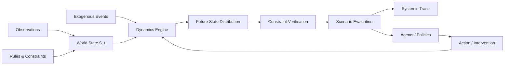
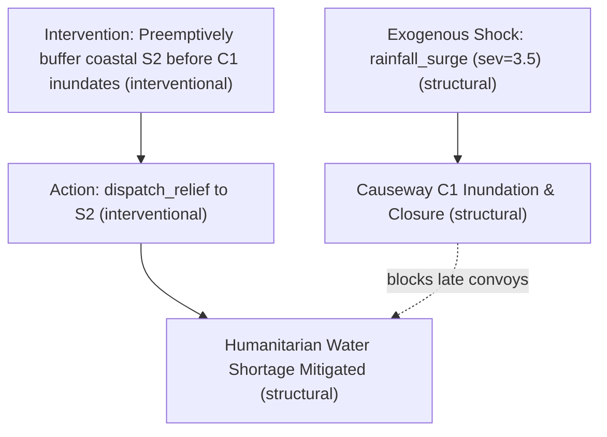

# Enterprise World Model Engine (EWM Engine)

**Simulate consequences before acting.**

[](https://github.com/vfcarida/Enterprise-World-Model-Engine/actions/workflows/ci.yml)
[](https://vfcarida.github.io/Enterprise-World-Model-Engine/)
[](LICENSE)
[](pyproject.toml)
[](ROADMAP.md)

---

**EWM Engine** is an open-source framework for building executable models of complex organizational and socio-technical systems.

Instead of asking only:
> *"What is likely to happen next?"*

EWM Engine is designed to explore:
> *"What could happen if we do this instead of that?"*

$$\begin{aligned}
&\text{Current World State } (S_t) \\
+\; &\text{Proposed Action / Intervention } (A_t) \\
+\; &\text{Exogenous Environmental Events } (E_t) \\
+\; &\text{Pluggable Dynamics } (\mathcal{T}) \\
+\; &\text{Operational Constraints } (\Gamma_t) \\
\hline
\longrightarrow\; &\textbf{Distribution Over Possible Futures } (S_{t+1:t+H})
\end{aligned}$$

---

## Architecture Overview



---

## Core Distinctions: Prediction vs. Simulation vs. Intervention

EWM Engine enforces an explicit epistemic boundary across four distinct analytical questions:

1. **Prediction ($P(Y \mid X)$)**: Observational forecasting of what is likely to happen next based on historical correlation.
2. **Simulation ($P(S_{1:T} \mid S_0, \theta)$)**: Executing generative system dynamics forward in time.
3. **Intervention ($P(Y \mid \text{do}(X))$)**: Evaluating how the system evolves when structural policies or actions are deliberately altered.
4. **Decision Evaluation**: Comparative risk, equity, efficiency, and constraint violation analysis across counterfactual trajectories.

> **Intellectual Honesty on Causality**: EWM Engine does **not** assume observational correlation equals causal effect. All transition models and trace dependencies carry an explicit `EvidenceLevel` (`STRUCTURAL`, `INTERVENTIONAL`, `QUASI_CAUSAL`, `PREDICTIVE`, `ASSUMED`).

---

## Core Architectural Principle: Structure vs. Probabilistic Dynamics

EWM Engine separates what an enterprise **knows as explicit rules** from what it **learns probabilistically**:

$$\begin{aligned}
\textbf{Known Structural Knowledge} &\longleftrightarrow \text{Hard capacity limits, conservation laws, legal rules, invariants} \\
\textbf{Learned \& Stochastic Dynamics} &\longleftrightarrow \text{Human behavior, demand surges, disruptions, congestion}
\end{aligned}$$

Known operational and physical limits are never forced into black-box neural weights. They are enforced as first-class `Constraint` instances with full audit provenance.

---

## What EWM Engine Is NOT

To maintain architectural focus, EWM Engine is **not**:
- Another chatbot, RAG, or agent orchestration framework (not LangChain, AutoGen, CrewAI, or LangGraph).
- An RL-only discrete environment gym (though it supports policy rollouts).
- A digital-twin 3D visualization tool.
- A univariate statistical time-series forecasting library.
- A discrete-event simulator (DES) replacement.
- A JEPA neural network implementation alone.
- A financial high-frequency trading platform.

It is an **open integration architecture for executable world dynamics**. External agents and solvers interface through narrow protocol boundaries.

---

## Minimal Runnable Example

The following minimal example demonstrates defining a two-warehouse world, attaching conservation dynamics, branching from an identical initial state, and comparing a status-quo policy against a proactive replenishment intervention:

```python
from ewm_engine.core import World, WorldState, Entity, Relationship, Resource, Intervention
from ewm_engine.constraints import (
    ConstraintRegistry,
    ResourceCapacityConstraint,
    ActionTransferAvailabilityConstraint,
)
from ewm_engine.dynamics import (
    CompositeDynamics,
    DeterministicTransferDynamics,
    StochasticDemandDynamics,
)
from ewm_engine.actors import ThresholdReplenishmentActor
from ewm_engine.simulation import Scenario
from ewm_engine.evaluation import compare_scenarios

# 1. World State S_0
state = WorldState(
    entities=[
        Entity(id="wh_north", type="warehouse"),
        Entity(id="wh_south", type="warehouse"),
    ],
    relationships=[
        Relationship(source="wh_north", target="wh_south", type="connected_to"),
    ],
    resources=[
        Resource(id="stock_north", current=150.0, min_value=0.0, max_value=250.0),
        Resource(id="stock_south", current=35.0, min_value=0.0, max_value=200.0),
    ],
)

# 2. Constraints & Dynamics
constraints = ConstraintRegistry(
    [
        ResourceCapacityConstraint(resource_id="stock_north"),
        ResourceCapacityConstraint(resource_id="stock_south"),
        ActionTransferAvailabilityConstraint(),
    ]
)

dynamics = CompositeDynamics(
    [
        DeterministicTransferDynamics(),
        StochasticDemandDynamics(resource_id="stock_south", mean_demand=18.0, std_demand=3.0),
    ]
)

base_world = World(state=state, dynamics=dynamics, constraints=constraints)

# 3. Simulate Baseline (Status Quo)
res_baseline = base_world.simulate(
    scenario=Scenario(name="Status Quo", horizon=10, samples=20, seed=42)
)

# 4. Branch and Simulate Counterfactual Intervention
proactive_world = base_world.branch()
proactive_world.add_actor(
    ThresholdReplenishmentActor(
        actor_id="controller",
        source_resource="stock_north",
        target_resource="stock_south",
        reorder_point=40.0,
        order_quantity=40.0,
    )
)

res_proactive = proactive_world.simulate(
    scenario=Scenario(
        name="Proactive Policy",
        horizon=10,
        samples=20,
        seed=42,
        intervention=Intervention(
            id="proactive_policy",
            description="Reorder 40 units whenever stock <= 40",
        ),
    )
)

# 5. Evaluate and Compare
comparison = compare_scenarios(
    baseline=res_baseline,
    candidates=[res_proactive],
    metrics=["resource_stock_south", "resource_stock_north", "violations_count"],
)

print(comparison.summary_table())
```

### Execution Output

```
=== Scenario Comparison (Baseline: Status Quo) ===
---------------------------------------------------------------------------------------------------------------
Metric                    | Scenario               | Mean (Std)         | p50 [p05, p95]       | Delta vs Base 
---------------------------------------------------------------------------------------------------------------
resource_stock_south      | Status Quo             | 0.00 (+/-0.00)     | 0.00 [0.00, 0.00]    | -             
                          | Proactive Policy       | 0.00 (+/-0.00)     | 0.00 [0.00, 0.00]    | +0.00 (+0.0%) 
---------------------------------------------------------------------------------------------------------------
resource_stock_north      | Status Quo             | 150.00 (+/-0.00)   | 150.00 [150.00, 150.00] | -             
                          | Proactive Policy       | 30.00 (+/-0.00)    | 30.00 [30.00, 30.00] | -120.00 (-80.0%)
---------------------------------------------------------------------------------------------------------------
violations_count          | Status Quo             | 0.00 (+/-0.00)     | 0.00 [0.00, 0.00]    | -             
                          | Proactive Policy       | 1.00 (+/-0.00)     | 1.00 [1.00, 1.00]    | +1.00 (+0.0%) 
---------------------------------------------------------------------------------------------------------------
```

---

## Flagship Public Demo: CivicFlow

`examples/civicflow/` provides a comprehensive disaster logistics research simulation demonstrating multi-entity regional networks, hydrological river surges, roadway inundations, and humanitarian supply routing.

```bash
# Run CivicFlow directly from the CLI
ewm example civicflow
```

### Inspectable Systemic Dependency Trace
CivicFlow generates auditable dependency graphs showing how interventions and external events propagate:



---

## Installation

```bash
# Core package (no heavy ML, no cloud required)
pip install ewm-engine

# With development tools (testing, ruff, mypy, hypothesis)
pip install "ewm-engine[dev]"

# With all optional dependencies (graphs, documentation, ML)
pip install "ewm-engine[all]"
```

### Development with uv (Recommended)

EWM Engine standardizes development environments and CI on [`uv`](https://docs.astral.sh/uv/):

```bash
# Clone and synchronize virtual environment with exact locked dependencies
git clone https://github.com/vfcarida/Enterprise-World-Model-Engine.git
cd Enterprise-World-Model-Engine
uv sync --extra dev

# Run test suite
uv run pytest -q

# Format and strict type check
uv run ruff check src tests && uv run ruff format --check src tests
uv run mypy src tests
```

---

## Project Roadmap & Maturity

| Capability | Current Maturity | Scope |
|---|---|---|
| **Core Simulation & Branching** | Alpha | Deterministic Monte Carlo rollouts, snapshot branching, scenario fingerprinting |
| **Constraint Engine** | Alpha | Pre-action and post-state verification with full provenance logging |
| **Pluggable Dynamics** | Alpha | Deterministic, stochastic, and composite dynamic models |
| **Systemic Traces** | Alpha | Directed dependency graph generation with Mermaid and NetworkX export |
| **Learned Dynamics Protocol** | Experimental | Protocol interfaces and linear empirical regression baselines |
| **Causal Epistemics** | Research | Structural vs. interventional vs. observational evidence levels |
| **SMT Solvers & Optimizers** | Planned Adapter | Optional Z3 and Google OR-Tools integration |
| **Agent Frameworks** | Planned Adapter | External adapters for LangGraph, AutoGen, CrewAI |

See [ROADMAP.md](ROADMAP.md) for details.

---

## Contributing

We welcome contributions from researchers, software engineers, and domain experts! Please review [CONTRIBUTING.md](CONTRIBUTING.md) and our [Code of Conduct](CODE_OF_CONDUCT.md).

---

## Citation

If you use EWM Engine in academic research or technical publications, please cite:

```bibtex
@software{carida2026ewmengine,
  author = {Carida, Vinicius},
  title = {Enterprise World Model Engine: A General-Purpose Framework for Modeling, Simulating, and Evaluating Organizational Dynamics},
  year = {2026},
  url = {https://github.com/vfcarida/Enterprise-World-Model-Engine},
  version = {0.1.0}
}
```

---

## License

EWM Engine is open-source software licensed under the [Apache License 2.0](LICENSE).
