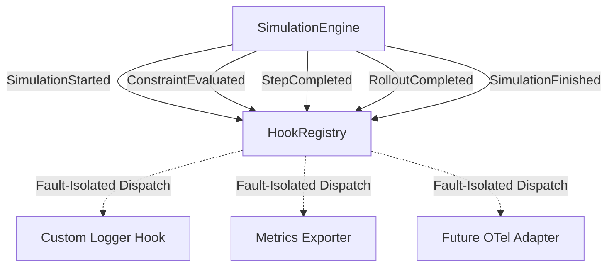

# Observability & Lifecycle Hooks

EWM Engine provides an optional, lightweight observability layer consisting of a lifecycle hook protocol, structured runtime metrics, and standard library logging.

---

## Architecture Overview



---

## Lifecycle Events

All lifecycle events inherit from `HookEvent` and are deeply frozen Pydantic models:

| Event | Emission Point | Key Payload |
|---|---|---|
| `SimulationStarted` | Prior to executing sample rollouts | `scenario_id`, `horizon`, `samples`, `seed`, `initial_state_fingerprint` |
| `ConstraintEvaluated` | During pre-action and post-transition checks | `phase`, `constraint_id`, `severity`, `satisfied`, `result` |
| `StepCompleted` | Following discrete step evolution | `step`, `state_hash`, `record`, `is_invalid` |
| `RolloutCompleted` | At termination of an individual rollout | `rollout_idx`, `status`, `step_count`, `trajectory` |
| `SimulationFinished` | Concluding entire simulation run | `result`, `run_metrics`, `duration_seconds` |

---

## The Hook Protocol

To observe a simulation, implement the `Hook` protocol or supply a callable:

```python
from ewm_engine.hooks import HookEvent, HookRegistry, SimulationFinished

class ProgressReporter:
    def on_event(self, event: HookEvent) -> None:
        if isinstance(event, SimulationFinished):
            print(f"Simulation completed in {event.duration_seconds:.3f}s")

# Register with the simulation engine
registry = HookRegistry([ProgressReporter()])
engine = SimulationEngine(hooks=registry)
result = engine.run(world, scenario)
```

Alternatively, single-argument callables can be registered directly:

```python
registry.register(lambda ev: logger.info("Event: %s", type(ev).__name__))
```

---

## Fault Isolation Policy

Hooks are strictly observational and run in isolated dispatch blocks:
1. An unhandled exception inside any hook is caught and logged via `logging.getLogger("ewm_engine.hooks")` with full stack trace.
2. The exception **never** interrupts or terminates the simulation run.
3. Other registered hooks continue to receive events.
4. Hooks have zero ability to mutate simulation state, actions, or RNG streams.

---

## Programmatic RunMetrics

Every simulation run records structured execution statistics in a `RunMetrics` object accessible via `result.run_metrics` and in provenance metadata:

```python
result = engine.run(world, scenario)
metrics = result.run_metrics

print(f"Total steps: {metrics.step_count}")
print(f"Completed rollouts: {metrics.completed_rollout_count}")
print(f"Invalid rollouts: {metrics.invalid_rollout_count}")
print(f"Hard constraint violations: {metrics.hard_violation_count}")
print(f"Constraint evaluations: {metrics.constraint_evaluation_count}")
print(f"Duration: {metrics.simulation_duration_seconds:.4f}s")
```

All metrics contain strictly operational counters and timing information. No confidential entity data, user context, or secrets are ever included.

---

## OpenTelemetry Future Adapter Architecture

EWM Engine does **not** bundle OpenTelemetry SDK or exporter dependencies into its core kernel. Instead:
- An OpenTelemetry integration is planned as a future optional package (`ewm-engine-otel`).
- Host applications wishing to integrate OpenTelemetry today can simply implement a `Hook` that translates `HookEvent` instances into OpenTelemetry spans, events, and metrics counters.
