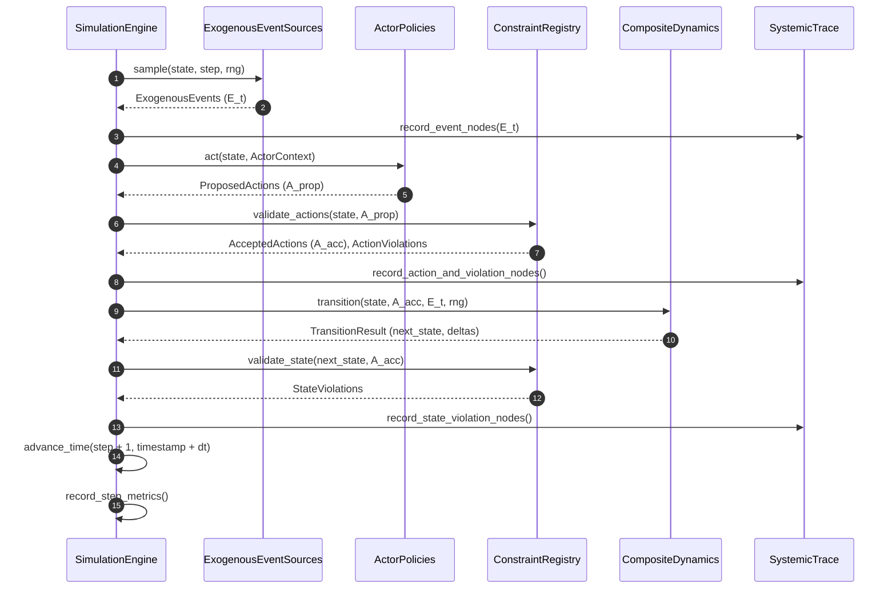

# Simulation Execution Lifecycle

The simulation engine coordinates state evolution through an explicit, reproducible step execution loop.

---

## Detailed Step Lifecycle



---

## Reproducible Seed Sequence Architecture

To guarantee exact bit-for-bit determinism across Monte Carlo rollouts:
1. The user supplies a master seed $s$ (e.g. `seed=42`).
2. The engine constructs a NumPy `SeedSequence(s)`.
3. Independent child seeds are spawned for each sample:
   ```python
   child_seeds = SeedSequence(scenario.seed).spawn(scenario.samples)
   ```
4. Each rollout trajectory receives its own dedicated pseudo-random generator `default_rng(child_seeds[k])`.
5. Rollouts are completely independent and immune to order-of-execution variations.
