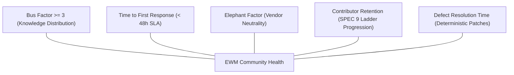

# Community Health & CHAOSS Metrics

## 1. Overview & Commitment

The Enterprise World Model Engine (EWM Engine) believes that long-term scientific and industrial credibility requires not only rigorous mathematics and deterministic software, but also a **transparent, inclusive, and sustainable open-source community**.

To monitor repository health, mitigate project risk, and ensure sustainable maintenance, EWM Engine tracks community metrics established by the **[CHAOSS Project](https://chaoss.community/)** (Community Health Analytics Open Source Software, a Linux Foundation project) using **[CollectOSS](https://collectoss.org/)** and **[GrimoireLab](https://chaoss.github.io/grimoirelab/)** *(note: the Augur project departed CHAOSS circa 2025; GrimoireLab and CollectOSS represent the standard CHAOSS analytics pipeline)*.

---

## 2. Public Community Health Dashboard

All community analytics and live metric trends are published openly:

- **Live CollectOSS Dashboard**: [`https://collectoss.org/dashboard/vfcarida/Enterprise-World-Model-Engine`](https://collectoss.org/dashboard/vfcarida/Enterprise-World-Model-Engine)
- **GrimoireLab Analytics Portal**: [`https://chaoss.community/grimoirelab/vfcarida/Enterprise-World-Model-Engine`](https://chaoss.community/grimoirelab/vfcarida/Enterprise-World-Model-Engine)
- **Governance Framework**: [GOVERNANCE.md](https://github.com/vfcarida/Enterprise-World-Model-Engine/blob/main/GOVERNANCE.md) (aligned with Scientific Python SPEC 9)

---

## 3. Core CHAOSS Metrics & Key Performance Indicators (KPIs)

EWM Engine actively monitors five primary CHAOSS metric categories:

### 3.1. Bus Factor ($\ge 3$)
- **CHAOSS Standard**: [Risk: Bus Factor](https://chaoss.community/kb/metric-bus-factor/)
- **Target KPI**: **$\text{Bus Factor} \ge 3$ across all critical subsystems.**
- **Rationale**: A healthy open-source project must never depend on a single point of human failure. No single contributor's departure should halt development or security response.
- **Implementation Strategy**:
  - Subsystem code ownership distributed across [`CODEOWNERS`](https://github.com/vfcarida/Enterprise-World-Model-Engine/blob/main/.github/CODEOWNERS).
  - Explicit maintainer ladder ([GOVERNANCE.md](https://github.com/vfcarida/Enterprise-World-Model-Engine/blob/main/GOVERNANCE.md)) providing clear advancement from Triager to Committer and Maintainer.
  - Pair code reviews, comprehensive Architecture Decision Records ([ADR-038](adr/ADR-038-open-source-governance-community-health-and-rfc-process.md)), and self-describing normative fixtures.

### 3.2. Time to First Response (TTFR)
- **CHAOSS Standard**: [Evolution: Time to First Response](https://chaoss.community/kb/metric-time-to-first-response/)
- **Target KPI**:
  - **Issues**: Median TTFR $< 48$ hours.
  - **Pull Requests**: Median TTFR $< 72$ hours.
- **Implementation Strategy**:
  - Automated welcome bot greeting first-time contributors with onboarding resources ([`greetings.yml`](https://github.com/vfcarida/Enterprise-World-Model-Engine/blob/main/.github/workflows/greetings.yml)).
  - Automated component triage via `actions/labeler` ([`labeler.yml`](https://github.com/vfcarida/Enterprise-World-Model-Engine/blob/main/.github/labeler.yml)) routing PRs to relevant CODEOWNERS.
  - Generous stale bot policies with ample grace windows ([`stale.yml`](https://github.com/vfcarida/Enterprise-World-Model-Engine/blob/main/.github/workflows/stale.yml)).

### 3.3. Elephant Factor (Organizational Neutrality)
- **CHAOSS Standard**: [Risk: Elephant Factor](https://chaoss.community/kb/metric-elephant-factor/)
- **Target KPI**: **No single commercial enterprise or university accounts for $> 40\%$ of total commits, reviews, or Steering Council seats.**
- **Rationale**: EWM Engine is designed as a vendor-neutral, scientific reference platform. Maintaining low organizational concentration prevents commercial capture and aligns with NumFOCUS non-profit principles.
- **Implementation Strategy**: Meritocratic Steering Council representation and open RFC deliberation.

### 3.4. Contributor Retention & Advancement
- **CHAOSS Standard**: [Evolution: Contributor Retention](https://chaoss.community/kb/metric-contributor-retention/)
- **Target KPI**: **$\ge 20\%$ of new contributors submit a second pull request or participate in issue triage within 6 months.**
- **Implementation Strategy**:
  - Curated, mentor-backed good first issues ([`good-first-issues.md`](good-first-issues.md)).
  - Inclusive recognition of non-code contributions (docs, benchmark design, triage) via the **all-contributors** specification.
  - Transparent advancement criteria defined in the SPEC 9 maintainer ladder.

### 3.5. Defect Resolution Time
- **CHAOSS Standard**: [Evolution: Defect Resolution Time](https://chaoss.community/kb/metric-defect-resolution-time/)
- **Target KPI**:
  - **Critical Security / Data Invariants**: $< 7$ calendar days.
  - **General Bug Fixes**: $< 21$ calendar days.
- **Implementation Strategy**:
  - 100% automated regression gates in CI (unit, property, contract, security, memray).
  - Rapid reproduction via minimal script templates.

---

## 4. Automation & Tooling Integration

| Tool | Purpose | Configuration / Link |
| :--- | :--- | :--- |
| **CollectOSS / GrimoireLab** | Live git history & community metrics analytics | [`collectoss.org/dashboard/vfcarida/Enterprise-World-Model-Engine`](https://collectoss.org/dashboard/vfcarida/Enterprise-World-Model-Engine) |
| **All-Contributors** | Acknowledging all forms of contribution | [`.all-contributorsrc`](https://github.com/vfcarida/Enterprise-World-Model-Engine/blob/main/.all-contributorsrc) |
| **Labeler Action** | Automated PR routing and component tagging | [`labeler.yml`](https://github.com/vfcarida/Enterprise-World-Model-Engine/blob/main/.github/workflows/labeler.yml) |
| **First-Interaction Bot** | Welcoming new contributors with guidelines | [`greetings.yml`](https://github.com/vfcarida/Enterprise-World-Model-Engine/blob/main/.github/workflows/greetings.yml) |
| **Stale Management** | Polite notification of dormant discussions | [`stale.yml`](https://github.com/vfcarida/Enterprise-World-Model-Engine/blob/main/.github/workflows/stale.yml) |

---

## 5. Annual Community Health Review

The Steering Council conducts an annual community health audit every October to:
1. Review CHAOSS metrics and trends over the preceding 12 months.
2. Evaluate Bus Factor progress and invite active Triagers / Reviewers to join the Maintainer tier.
3. Review Code of Conduct incident logs (anonymized) to ensure community psychological safety.
4. Report health metrics to **NumFOCUS** as part of annual fiscal sponsorship stewardship.
