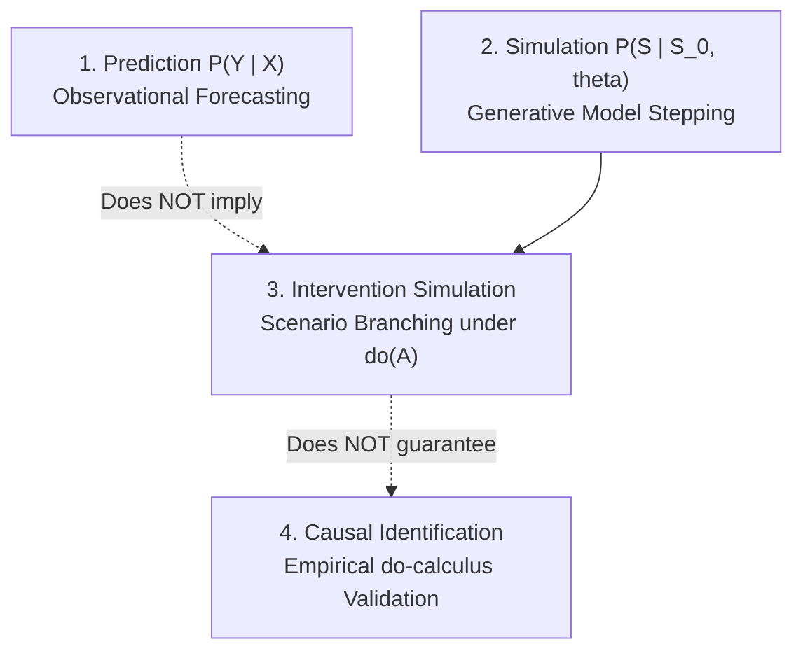

# Causal Epistemology and Scientific Integrity

One of the defining commitments of the **Enterprise World Model Engine (EWM Engine)** is **epistemic honesty**: the refusal to label predictive or observational associations as proven real-world causal relationships.

---

## Prediction vs. Simulation vs. Intervention vs. Causal Identification

In decision science and machine learning, four distinct analytical capabilities are frequently conflated:

1. **Prediction ($P(Y \mid X)$)**: Observational forecasting of future metrics given historical data. Answers: *"What has typically occurred when $X$ was observed?"*
2. **Simulation ($P(S_{1:T} \mid S_0, \theta)$)**: Stepping a generative model forward in time given an initial state $S_0$ and transition parameters $\theta$. Answers: *"How does our mathematical model evolve over time?"*
3. **Intervention Simulation ($P(S_{1:T} \mid S_0, \text{do}(A))$)**: Altering actions or structural rules within the model to observe simulated downstream state changes. Answers: *"What happens inside this simulation if we inject action $A$?"*
4. **Causal Identification ($P(Y \mid \text{do}(X))$ in the Real World)**: Mathematically proving that a simulated interventional distribution corresponds to the actual real-world response under deliberate manipulation. Answers: *"Will real-world reality change in the predicted manner if we alter policy $X$?"*

---

## Why $P(Y \mid X) \neq P(Y \mid \text{do}(X))$

A foundational error in applied enterprise analytics is equating conditional observational forecasting with interventional outcomes:

$$P(Y \mid X) \;\neq\; P(Y \mid \text{do}(X))$$

### The Observational Confounding Trap
Observing that a retailer experiences stockouts whenever price promotions are active ($P(\text{Stockout} \mid \text{Promotion})$) does **not** prove that launching a price promotion will causally induce stockouts. Unobserved confounders—such as major holiday seasons, competitor supply shortages, or local weather events—can drive both customer foot traffic and promotional timing simultaneously.

Conditioning on $X$ filters historical data where $X$ naturally occurred. Intervening with $\text{do}(X)$ severs the incoming causal parents of $X$, altering the structural data-generating mechanism.

### The Intervention Simulation Distinction
EWM Engine enables developers to simulate scenario branches:
$$\text{Simulate under } \text{do}(\text{Policy}_A) \quad\text{vs}\quad \text{do}(\text{Policy}_B)$$

However, **simulating an intervention inside a world model does not magically guarantee that the simulation is causally identified in reality**. The validity of the simulated future depends entirely on the epistemic basis of the transition models and assumptions.

---

## The EvidenceLevel Hierarchy

To prevent overclaiming, every transition model, dynamic component, and systemic trace edge in EWM Engine carries an explicit `EvidenceLevel`:

| Evidence Level | Status | Epistemic Basis |
| :--- | :--- | :--- |
| `STRUCTURAL` | Proven Invariant | Grounded in deterministic physical conservation, legal accounting invariants, or verified mechanical rules (e.g., $S_{t+1} = S_t - \text{outflow} + \text{inflow}$). |
| `INTERVENTIONAL` | Empirically Identified | Validated through randomized controlled trials (A/B testing), laboratory experiments, or formal Judea Pearl *do-calculus* identification without unobserved confounders. |
| `QUASI_CAUSAL` | Econometric Estimate | Estimated via quasi-experimental designs (e.g., difference-in-differences, instrumental variables, regression discontinuity, synthetic control). |
| `PREDICTIVE` | Observational Association | Learned through statistical regression, deep neural networks, or supervised forecasting without causal identification ($P(Y \mid X)$). |
| `ASSUMED` | Heuristic / Working Hypothesis | Operational assumption, domain heuristic, or expert judgment not yet empirically validated. |

---

## What EWM Engine Does NOT Claim

To maintain scientific humility, EWM Engine explicitly rejects the following claims:

1. **No Automated Causal Discovery**: EWM Engine does not claim to automatically extract true causal DAGs from raw observational tabular data without explicit structural assumptions.
2. **No Confounder Elimination**: Simulating a scenario does not eliminate real-world unobserved confounding. If a transition model is trained purely on observational correlations, its interventional rollouts remain subject to confounding bias.
3. **No Unqualified "Counterfactuals"**: The normative terminology in EWM Engine is **scenario branching** and **simulated dependency**. The term *counterfactual* is reserved strictly for formal Structural Causal Models (SCMs) where exogenous noise variables are fixed or abducted under explicit structural identification assumptions.
4. **No Omniscient Prophecy**: Simulation outputs represent probability distributions over possible model futures, not infallible predictions of reality.

---

## Scenario Branching and Epistemic Honesty in Practice

When constructing an enterprise world model:
- **Keep structural knowledge explicit**: Enforce physical and accounting conservation using `STRUCTURAL` dynamics and hard constraints.
- **Tag empirical components honestly**: If consumer demand response is estimated via supervised regression, tag it `EvidenceLevel.PREDICTIVE`.
- **Trace evidence propagation**: When analyzing a systemic dependency trace, the weakest link in the chain determines the epistemic strength of the conclusions.
