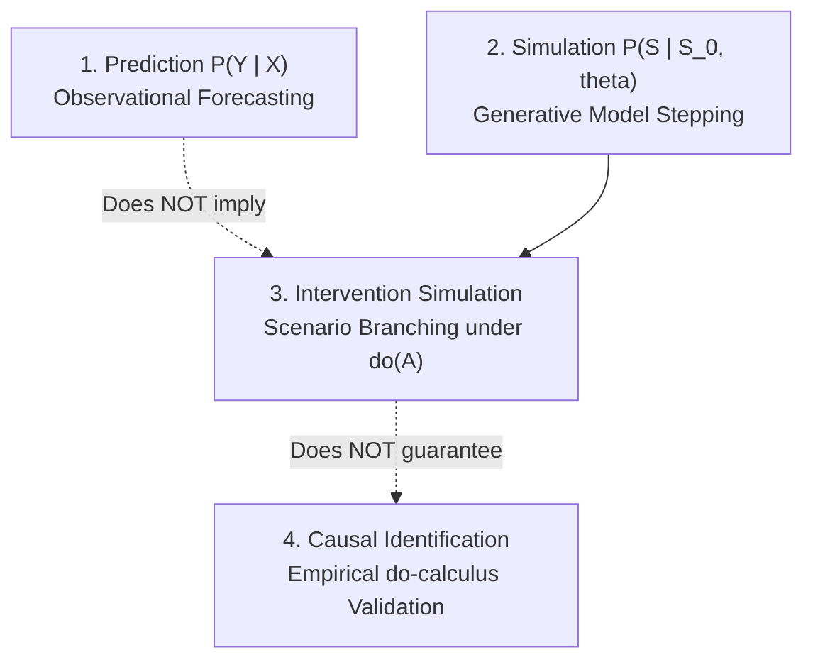
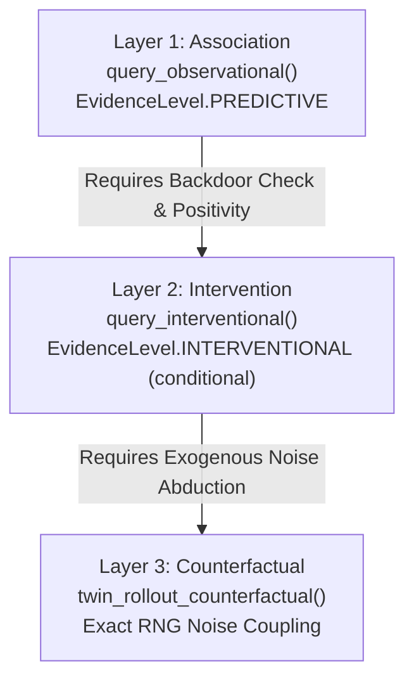

# Causal Epistemology and Scientific Integrity

One of the defining commitments of the **Enterprise World Model Engine (EWM Engine)** is **epistemic honesty**: the absolute refusal to label predictive, observational associations or simulation branchings as proven real-world causal relationships.

---

## 1. Prediction vs. Simulation vs. Intervention vs. Causal Identification

In enterprise decision science and machine learning, four distinct analytical capabilities are frequently conflated:

1. **Prediction ($P(Y \mid X)$)**: Observational forecasting of future metrics given historical data. Answers: *"What has typically occurred when $X$ was observed?"*
2. **Simulation ($P(S_{1:T} \mid S_0, \theta)$)**: Stepping a generative model forward in time given an initial state $S_0$ and transition parameters $\theta$. Answers: *"How does our mathematical model evolve over time?"*
3. **Intervention Simulation ($P(S_{1:T} \mid S_0, \text{do}(A))$)**: Altering actions or structural rules within the model to observe simulated downstream state changes. Answers: *"What happens inside this model if we inject action $A$?"*
4. **Causal Identification ($P(Y \mid \text{do}(X))$ in the Real World)**: Mathematically and empirically proving that a simulated interventional distribution corresponds to the actual real-world response under deliberate manipulation. Answers: *"Will real-world reality change in the predicted manner if we alter policy $X$?"*



---

## 2. Theoretical Foundations: Why $P(Y \mid X) \neq P(Y \mid \text{do}(X))$

A foundational error in applied enterprise analytics is equating conditional observational forecasting with interventional outcomes:

$$P(Y \mid X) \;\neq\; P(Y \mid \text{do}(X))$$

### 2.1 The Observational Confounding Trap
Observing that a retailer experiences stockouts whenever price promotions are active ($P(\text{Stockout} \mid \text{Promotion})$) does **not** prove that launching a price promotion will causally induce stockouts. Unobserved confounders—such as major holiday seasons, competitor supply disruptions, or regional demand spikes—drive both customer foot traffic and promotional timing simultaneously.

Conditioning on $X$ filters historical data where $X$ naturally occurred. Intervening with $\text{do}(X)$ severs the incoming causal parents of $X$, altering the structural data-generating mechanism.

### 2.2 Recent Research Anchors (2024–2026)
Recent breakthroughs in causal machine learning formally establish that:
- **Observational world models incur unavoidable interventional error** when backdoor paths are open (Song & Cai, *arXiv:2610.00012*). A predictive dynamics model trained on observational trajectories cannot distinguish true causal influence from spurious confounding correlations.
- **Action-conditioned rollout $\neq$ counterfactual reasoning** (*arXiv:2608.11601*). Stepping an action-conditioned simulator does not perform Pearlian counterfactual inference unless exogenous latent disturbances are explicitly coupled or abducted.
- **Causal Representation Learning** (Schölkopf et al., 2021) emphasizes that reliable world models must modularize dynamics into **independent causal mechanisms (ICM)** that remain invariant under localized interventions.

---

## 3. Pearl's Typed Ladder of Causation (`ewm_engine.experimental.causal`)

To turn these epistemics into operational code without overclaiming, the engine introduces a typed Ladder-of-Causation surface:



### 3.1 Layer 1: Observational Association
`query_observational(data, treatment_var, outcome_var, ...)` computes the conditional expectation $\mathbb{E}[Y \mid X=x]$. It returns a [`CausalQueryResult`](file:///c:/Users/vinicius/Documents/GeminiCodes/Enterprise-World-Model-Engine/src/ewm_engine/experimental/causal.py) strictly tagged with:
- `causal_level = CausalLevel.ASSOCIATION`
- `evidence_level = EvidenceLevel.PREDICTIVE`
- Clear warnings that the estimate reflects observational correlation, not causal identification.

### 3.2 Layer 2: Interventional Identification & Backdoor Checking
`query_interventional(data, treatment_var, outcome_var, causal_graph, conditioning_vars, ...)` attempts to identify $\mathbb{E}[Y \mid \text{do}(X=x)]$.

Before returning any numerical estimate, the function executes **Judea Pearl's Backdoor Criterion** against the user-declared [`CausalGraph`](file:///c:/Users/vinicius/Documents/GeminiCodes/Enterprise-World-Model-Engine/src/ewm_engine/experimental/causal.py):
1. **Descendant Check**: No variable in the conditioning set $Z$ may be a descendant of treatment $X$.
2. **Backdoor Blocking Check**: Conditioning set $Z$ must block all active backdoor paths from $X$ to outcome $Y$.

If an unblocked backdoor path or collider activation exists, the engine **refuses to compute a causal estimate**, returning a [`NotIdentifiableResult`](file:///c:/Users/vinicius/Documents/GeminiCodes/Enterprise-World-Model-Engine/src/ewm_engine/experimental/causal.py) detailing:
- `open_backdoor_paths`: List of unblocked paths (e.g., `['X <- Confounder -> Y']`).
- `assumptions_needed`: Explicit statement of required adjustments.
- `evidence_level = EvidenceLevel.ASSUMED`.

Only when the backdoor check passes against the declared graph is `EvidenceLevel.INTERVENTIONAL` emitted. **This level is set by the declared structural graph and mathematical check, never inferred from raw data.**

---

## 4. Empirical Diagnostics for Observational Data

Even if a causal graph is identified in theory, empirical estimation from finite observational datasets requires two non-trivial conditions: **Positivity** and **Unconfoundedness**.

### 4.1 Overlap & Positivity Diagnostics (`check_positivity_overlap`)
Positivity (or common support) requires that every unit has a non-zero probability of receiving any treatment:

$$0 < P(X = 1 \mid Z = z) < 1 \quad \forall z$$

`check_positivity_overlap` fits propensity scores and computes:
- **Overlap Index**: Proportion of units with propensity scores within the reliable support $[\epsilon, 1 - \epsilon]$.
- **Extreme Propensity Identification**: Identifies near-deterministic treatment assignments ($P \approx 0$ or $P \approx 1$) that lead to extreme variance and ungrounded extrapolation in inverse-probability weighting or stratification.

### 4.2 Confounding Sensitivity Diagnostics (`report_confounding_sensitivity`)
No observational study can empirically prove the absence of unobserved confounding. Rather than pretending unobserved confounding is zero, `report_confounding_sensitivity` implements **Rosenbaum sensitivity bounds** ($\Gamma$):
- Measures how strong an unobserved confounder would have to be (odds ratio $\Gamma$) to explain away the observed effect estimate.
- A critical threshold $\Gamma_{\text{crit}} \approx 1.15$ signals that even a tiny hidden bias could render the effect null, whereas $\Gamma_{\text{crit}} > 3.0$ indicates robust stability against hidden confounding.

---

## 5. Layer 3: Noise-Coupled Counterfactual Branching (Twin Rollouts)

In standard simulation, branching a scenario with a new seed creates stochastic divergence unrelated to the intervention:

```
Factual:         S_0 ---> S_1(w_1) ---> S_2(w_2)
Counterfactual:  S_0 ---> S_1(w'_1) ---> S_2(w'_2)   (Noise uncoupled: confounded by stochasticity)
```

EWM Engine implements **Twin Rollouts** (*arXiv:2608.08982*):
`twin_rollout_counterfactual(scenario, intervention_step, intervention_fn)`:
1. **Noise Coupling**: Locks the pseudo-random generator stream (SeedSequence / identical RNG seed stream) between the factual and counterfactual rollouts.
2. **Abduction by Construction**: Exogenous noise realizations $U_t$ are identical across factual and counterfactual branches, fulfilling Judea Pearl's third rung of the ladder ($P(Y_x \mid x', y')$).
3. **Off-Target Locality Divergence**: Computes state divergence for non-targeted variables immediately following the intervention:
   $$\text{LocalityDivergence} = \| S^{\text{CF}}_{\text{untargeted}} - S^{\text{Factual}}_{\text{untargeted}} \|$$
   An unexpected immediate divergence in untargeted state dimensions flags hidden coupling or structural confounding in the simulation equations.

---

## 6. What EWM Engine Strictly Does NOT Claim

To preserve scientific humility and prevent executive overclaim:

1. **No Automated Causal Discovery**: The engine does not infer causal graphs from data. All causal graphs must be explicitly declared and defended by the domain modeler.
2. **Diagnostics, Not Verdicts**: Diagnostic functions report *"under stated assumptions A, the effect is identified / not identified"*. They do not declare real-world truth.
3. **No Automatic Level Elevation**: Predictive models or ungrounded simulations are **never** auto-upgraded to `INTERVENTIONAL`.
4. **No `"causes"` Edges**: Provenance traces remain dependency graphs. The engine explicitly forbids `"causes"` relations in systemic traces.
