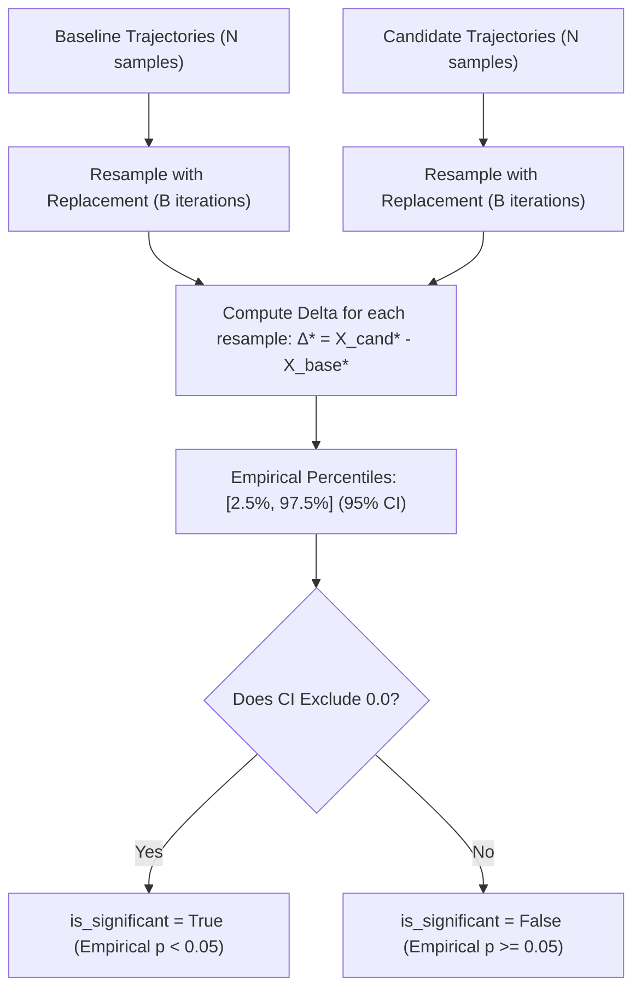

# Decision-Grade Scenario Evaluation & Epistemic Rigor

In complex organizational and socio-technical systems, the central objective of simulation is answering **"what could happen if we intervene?"** rather than forecasting a single deterministic line.

Evaluating counterfactual interventions requires decision-grade rigor: distinguishing meaningful systematic improvements from Monte Carlo noise, characterizing tail risk, evaluating trade-offs across conflicting objectives, and maintaining epistemic humility.

---

## 1. Why Point Deltas Mislead

In standard evaluation, two scenarios (e.g., *Baseline* vs. *Intervention*) are often compared using simple mean point deltas:

$$\Delta = \bar{X}_{cand} - \bar{X}_{base}$$

This naive comparison introduces two critical failure modes:
1. **Sample Noise vs. Systematic Improvement**: If $N$ is small or trajectory variance is high, an apparent delta of $-15\%$ may be pure stochastic jitter. Acting upon it risks severe real-world operational failure.
2. **Hidden Tail Risk**: An intervention that improves average throughput by $5\%$ while tripling the 95th percentile worst-case backlog ($p_{95}$ or $\text{CVaR}_{05}$) is catastrophic in mission-critical environments (e.g. disaster relief or supply-chain logistics).

---

## 2. Calibrated Uncertainty: Bootstrap Confidence Intervals

To capture sampling uncertainty without making unrealistic Gaussian or symmetric distribution assumptions, EWM Engine implements **non-parametric percentile bootstrap resampling**:

$$\Delta^*_b = \bar{X}^*_{cand, b} - \bar{X}^*_{base, b}, \quad b = 1, \dots, B$$



### Deterministic Seeding (AC-004)
To preserve the engine's bitwise reproducibility invariant, bootstrap resampling accepts an optional `seed` parameter, guaranteeing that identical runs produce identical confidence intervals.

---

## 3. Epistemic Honesty: Simulation Significance vs. Causal Proof

A foundational principle of EWM Engine is **epistemic discipline**:

> [!IMPORTANT]
> **The Epistemic Guardrail on Statistical Significance:**  
> A `is_significant = True` flag indicates that the observed difference between scenarios is statistically distinguishable from zero **under the simulation model's internal mechanics and stochastic parameters ($P_{model}$)**.  
> It **DOES NOT** guarantee empirical real-world causal significance ($P(Y \mid \text{do}(X))$). Real-world inference requires empirical identification, observational re-grounding, and validation against unobserved confounders.

Traces remain dependency traces; the relation `"causes"` is forbidden on `TraceEdge`, and components default to `EvidenceLevel.ASSUMED`.

---

## 4. Multi-Objective Trade-Offs & The Pareto Frontier

Real enterprise interventions inherently touch multiple conflicting dimensions:
- Unit holding cost vs. Stockout penalty
- Service delivery latency vs. Labor overtime
- Evacuee transit time vs. Causeway road passability risk

Evaluating candidates against a scalar sum or arbitrary index hides trade-offs and distorts decision quality.

### Strict Pareto Dominance
Scenario $A$ dominates scenario $B$ ($A \succ B$) if and only if:
1. $A$ is at least as good as $B$ across **all** specified objectives ($A_j \le B_j$ for minimization; $A_j \ge B_j$ for maximization).
2. $A$ is strictly better than $B$ in **at least one** objective ($A_k < B_k$ or $A_k > B_k$).

The **Pareto Frontier** is the set of all non-dominated candidates:

$$\mathcal{P} = \{ s \in \mathcal{S} \mid \nexists s' \in \mathcal{S} \text{ such that } s' \succ s \}$$

---

## 5. The Anti-Winner Principle: "No Objective $\implies$ No Ranking"

A common flaw in simulation tools is automatically declaring an arbitrary "best" scenario (e.g. highest throughput) without consulting decision-makers.

In EWM Engine:
- **Default Behavior (`objective=None`)**: The engine returns the non-dominated Pareto set and pairwise trade-offs. It **refuses to rank candidates or declare a winner**.
- **Explicit Preference (`objective=Callable`)**: Only when the user explicitly provides a preference/utility function:
  $$\mathcal{U}: \text{dict}[\text{metric}, \text{mean}] \to \mathbb{R}$$
  will the engine rank scenarios.

```python
from ewm_engine.evaluation import compare_scenarios
from ewm_engine.evaluation.pareto import ObjectiveDirection

# 1. Multi-Objective Mode without ranking (epistemically neutral)
comparison = compare_scenarios(
    baseline=res_base,
    candidates=[res_policy_a, res_policy_b],
    metrics=["holding_cost", "unmet_demand"],
    objectives={
        "holding_cost": ObjectiveDirection.MINIMIZE,
        "unmet_demand": ObjectiveDirection.MINIMIZE,
    },
)
# comparison.rankings is None -> No artificial winner declared!

# 2. User-Specified Utility Ranking (only when preferences are explicit)
comparison_ranked = compare_scenarios(
    baseline=res_base,
    candidates=[res_policy_a, res_policy_b],
    objective=lambda m: -m["unmet_demand"] * 10.0 - m["holding_cost"] * 0.1,
)
# comparison_ranked.rankings contains deterministic score rankings
```

---

## 6. Proper Scoring Rules & Calibration Diagnostics

When evaluating predictive and learned dynamics against held-out rollouts:

### Continuous Ranked Probability Score (CRPS)
CRPS measures both calibration (reliability) and sharpness (precision) for continuous distributions:

$$\text{CRPS}(F_N, y) = \frac{1}{N} \sum_{i=1}^N |x_i - y| - \frac{1}{2 N^2} \sum_{i=1}^N \sum_{j=1}^N |x_i - x_j|$$

- Proper scoring rule: minimized if and only if the predicted rollout distribution matches the data-generating distribution.
- Computed in pure NumPy via `compute_crps(samples, actual)`.

### Interval Coverage Diagnostics
`compute_interval_coverage(actuals, lower_bounds, upper_bounds)` measures the empirical fraction of test values contained within predicted intervals (e.g. $[p_{05}, p_{95}]$), comparing empirical coverage against the nominal $90\%$ target.

---

## 7. Machine-Readable Summary

`ScenarioComparison.to_dict()` outputs structured evaluation data:
- `"baseline"`: Baseline scenario identifier.
- `"scenarios"`: Full quantile statistics per scenario per metric.
- `"deltas_vs_baseline"`: Point estimates and percentage shifts.
- `"bootstrap_deltas"`: Bootstrap CI bounds (`ci_lower`, `ci_upper`), empirical p-values, and `is_significant` booleans.
- `"pareto_frontier"`: Non-dominated set, dominance mappings, and trade-off summaries.
- `"rankings"`: User utility ranking (`None` unless `objective` callable was provided).
