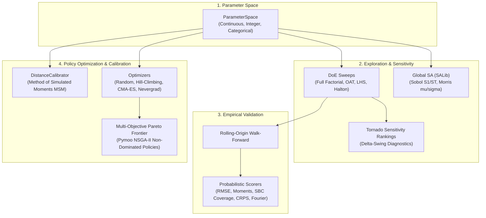

# Experimentation: Scientific Exploration, Validation, and Optimization

Traditional simulation applications often treat execution as an ad-hoc trial-and-error process: run a single trajectory, tweak an input parameter manually, and inspect an aggregated scalar.

The Enterprise World Model Engine provides a first-class **scientific experimentation layer** (`ewm_engine.experimentation`) designed to move decision-making from *"simulate once"* to **"systematically explore, validate, calibrate, and optimize"**:

---

## 1. Structured Exploration: Design of Experiments (DoE)

Rather than random uncalibrated guesses, `ParameterSpace` enables rigorous experimentation:
- **Continuous Dimensions:** Interval bounds $[x_{\min}, x_{\max}]$.
- **Integer Dimensions:** Discrete integer steps $[k_{\min}, k_{\max}]$.
- **Categorical Dimensions:** Nominal categories (e.g. `("standard", "priority", "bulk")`).

### Design Methodologies
1. **Full Factorial:** Cartesian product over discrete grid levels. Ideal for low-dimensional exhaustive sweeps ($D \le 3$).
2. **One-At-a-Time (OAT):** Perturbs one parameter while holding all others at baseline defaults. Ideal for isolating direct marginal effects.
3. **Latin Hypercube Sampling (LHS):** Stratified Monte Carlo sampling ensuring every parameter sub-interval is sampled exactly once.
4. **Halton Quasi-Random Sequences:** Deterministic low-discrepancy sequence based on prime bases, avoiding the clustering and gaps of pseudo-random draws.

### Tornado Diagram Sensitivity Data
For any chosen metric, `compute_tornado_data` evaluates parameter swings $|y_{\text{high}} - y_{\text{low}}|$ and ranks parameters in descending order of influence. This immediately reveals which operational variables dominate outcomes.

---

## 2. Validation & Backtesting: Rolling-Origin Ensembles

Simulation models must be validated against historical reality before using their recommendations in production.

`run_walk_forward_backtest` implements **rolling-origin walk-forward evaluation**:
1. At step $t$, initialize `WorldState` from historical state snapshots.
2. Run $N$ seeded stochastic Monte Carlo rollouts forward to $t + h$.
3. Compare the predicted ensemble distribution against the observed historical series.
4. Advance origin by step size $s$ and repeat across the entire historical record.

### Probabilistic Scoring Functions (Zero-Dependency)
- **RMSE:** Measures central point forecast accuracy.
- **Method-of-Moments Distance:** Quantifies bias and dispersion discrepancies in mean and variance.
- **Empirical Coverage (SBC / TARP Concept):** Measures the empirical proportion of time steps where the ground-truth observed value falls inside the nominal $(1-\alpha)$ credible interval (e.g. 50%, 80%, 95%). Under a well-calibrated world model, the 95% interval should contain the truth ~95% of the time.
- **Continuous Ranked Probability Score (CRPS):** Strictly proper scoring rule generalizing mean absolute error to probabilistic ensemble forecasts:
  $$\text{CRPS}(F, y) = \frac{1}{M}\sum_{m=1}^M |x_m - y| - \frac{1}{2M^2}\sum_{m=1}^M \sum_{m'=1}^M |x_m - x_{m'}|$$
- **Spectral / Fourier Distance:** Computes the Euclidean distance between FFT magnitude spectra, detecting whether the simulation captures cyclic seasonality and dynamic frequency modes.

---

## 3. Parameter Calibration: Method of Simulated Moments (MSM)

When historical time series are available but underlying physical parameters are uncertain, `DistanceCalibrator` fits parameters by minimizing the distance between simulated and empirical summary moments.

### Permissive MSM Quadratic Loss
To maintain strict license integrity without relying on restrictive AGPL-3.0 libraries, EWM Engine includes a clean permissive Method of Simulated Moments loss:
$$L(\theta) = \sum_k w_k \left(\frac{m_{\text{sim}, k}(\theta) - m_{\text{target}, k}}{\max(|m_{\text{target}, k}|, 1)}\right)^2$$
where moments include mean, variance, and quantiles (p25, p50, p75).

---

## 4. Multi-Objective Intervention Optimization: The Pareto Frontier

Real enterprise decisions involve conflicting goals (e.g. minimizing inventory holding cost vs maximizing order fulfillment SLA). Forcing a scalar argmax obscures these fundamental trade-offs.

`ewm_engine.experimentation` treats **multi-objective optimization** as first-class:
- **`ObjectiveVector`:** Stores individual metrics with explicit optimization directions (`"minimize"` or `"maximize"`).
- **Pareto Dominance:** Policy $A$ dominates $B$ if $A$ is no worse than $B$ across all objectives and strictly better in at least one.
- **`ParetoFront`:** Returns the set of all mutually non-dominated policy candidates, each tagged with its evaluated objectives, parameter configuration, and canonical cryptographic fingerprint.
