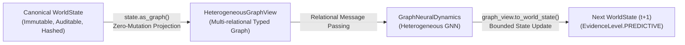

# Heterogeneous Graph World State & GNN Dynamics

In complex socio-technical systems—such as multimodal supply chains, financial payment networks, hospital bed networks, or distributed energy grids—state is fundamentally relational, multi-typed, and dynamic.

The Enterprise World Model Engine provides a first-class **Heterogeneous Temporal Relational Graph View** ([`ewm_engine.core.graph`](file:///c:/Users/vinicius/Documents/GeminiCodes/Enterprise-World-Model-Engine/src/ewm_engine/core/graph.py)) and **Graph Neural Network Dynamics** ([`ewm_engine.experimental.graph_dynamics`](file:///c:/Users/vinicius/Documents/GeminiCodes/Enterprise-World-Model-Engine/src/ewm_engine/experimental/graph_dynamics.py)) to model network-structured enterprises without sacrificing canonical state immutability.

---

## 1. The Additive Graph View Pattern

Rather than forcing an incompatible state representation or rewriting the core data structures, EWM Engine adopts the **Additive Graph View Pattern** ([ADR-022](file:///c:/Users/vinicius/Documents/GeminiCodes/Enterprise-World-Model-Engine/docs/adr/ADR-022-heterogeneous-graph-world-state-and-gnn-dynamics.md)):



### Formal Representation
The graph state is defined as:
$$\mathcal{G}_t = (\mathcal{V}_t, \mathcal{E}_t, \mathcal{R}, \mathcal{T}, \mathbf{X}_v, \mathbf{X}_e)$$
Where:
- $\mathcal{V}_t = \bigcup_{\tau \in \mathcal{T}_v} \mathcal{V}_t^{(\tau)}$ represents entity nodes partitioned by type (e.g., `warehouse`, `hospital`, `vehicle`).
- $\mathcal{E}_t = \bigcup_{r \in \mathcal{R}} \mathcal{E}_t^{(r)}$ represents directed edges partitioned by canonical relation triples `src_type__rel_type__dst_type`.
- $\mathbf{X}_v \in \mathbb{R}^{|\mathcal{V}^{(\tau)}| \times d_\tau}$ is the node feature matrix combining static entity attributes and dynamic resource levels.
- $\mathbf{X}_e \in \mathbb{R}^{|\mathcal{E}^{(r)}| \times d_r}$ is the edge feature matrix containing edge weights, bandwidth, and latency attributes.
- Temporal validity intervals $[t_{\text{valid\_from}}, t_{\text{valid\_until}})$ allow topological routes and nodes to dynamically activate or expire over simulation steps.

---

## 2. Using `HeterogeneousGraphView`

### Projecting and Querying Graphs
```python
from ewm_engine.core import WorldState, Entity, Relationship, Resource

# Build state
state = WorldState(
    entities=[
        Entity(id="wh_1", type="warehouse", attributes={"sqft": 50000}),
        Entity(id="store_1", type="retail", attributes={"foot_traffic": 1200}),
    ],
    resources=[
        Resource(id="inventory", entity_id="wh_1", current=450.0, min_value=0.0, max_value=1000.0),
    ],
    relationships=[
        Relationship(source="wh_1", target="store_1", type="supplies", attributes={"weight": 1.5}),
    ],
)

# Zero-copy additive projection
graph = state.as_graph()

print("Node Types:", graph.node_types)  # ['retail', 'warehouse']
print("Edge Types:", graph.edge_types)  # ['warehouse__supplies__retail']

# Extract vectorized NumPy feature matrices for ML or GNNs
X_wh = graph.get_node_features("warehouse")
src_idx, dst_idx = graph.get_edge_index("warehouse__supplies__retail")
```

### Temporal Topology Filtering
Network topologies often evolve over time:
```python
# Create an active sub-graph view at simulation time t=15.0
active_graph = graph.filter_temporal(current_time=15.0)
```

---

## 3. Relational GNN Dynamics (`GraphNeuralDynamics`)

Under the `ml` extra, [`GraphNeuralDynamics`](file:///c:/Users/vinicius/Documents/GeminiCodes/Enterprise-World-Model-Engine/src/ewm_engine/experimental/graph_dynamics.py) implements relational message passing:

$$\mathbf{h}_v^{(l+1)} = \text{ReLU}\left( \mathbf{W}_{\text{self}} \mathbf{h}_v^{(l)} + \sum_{r \in \mathcal{R}} \frac{1}{\max(1, |\mathcal{N}_r(v)|)} \sum_{u \in \mathcal{N}_r(v)} \mathbf{W}_r \mathbf{h}_u^{(l)} \right)$$

### Key Epistemic and Architectural Invariants
1. **Zero PyTorch in Core**: `torch` is strictly lazy-loaded via `_load_torch()`. The core engine remains 100% dependency-free.
2. **Action Injections**: Actions targeting specific entities inject parameter perturbations directly into the node feature vector prior to message passing.
3. **Hard Conservation & Clamping**: Predicted continuous deltas are clipped to declared resource $[min, max]$ bounds.
4. **Epistemic Label**: Outputs are strictly labeled `EvidenceLevel.PREDICTIVE`.

---

## 4. Schema Migration (v1.x $\leftrightarrow$ v2.0)

To transition worlds between `schema_version="1.0.0"` and `schema_version="2.0.0"`, [`ewm_engine.core.migration`](file:///c:/Users/vinicius/Documents/GeminiCodes/Enterprise-World-Model-Engine/src/ewm_engine/core/migration.py) provides bidirectional migration functions:

```python
from ewm_engine.core.migration import migrate_v1_to_v2, migrate_v2_to_v1

# Upgrade state to v2.0 with graph attributes
state_v2 = migrate_v1_to_v2(state_v1)
assert state_v2.schema_version == "2.0.0"

# Down-migrate back to v1.0 without loss of core state
restored_v1 = migrate_v2_to_v1(state_v2)
assert restored_v1.schema_version == "1.0.0"
```
