# Interoperability & Ecosystem Architecture

Modern decision environments require enterprise world models to connect seamlessly with diverse external models, multi-agent frameworks, reporting surfaces, serving backends, and experiment tracking infrastructure.

The Enterprise World Model Engine addresses this via five dedicated, zero-dependency core packages with quarantined adapters:

```mermaid
flowchart TD
    subgraph CoSim ["1. Co-Simulation (T5)"]
        CSM["CoSimMaster\n(Fixed-Step Scheduling)"]
        ENV["CoSimExchangeEnvelope\n(Typed Zero-Order-Hold)"]
        ADAPT_CS["Adapters\n(FMI/FMU, SimPy, Mesa, PySD)"]
    end

    subgraph MultiAgent ["2. Multi-Agent (T6)"]
        VIEW["ActorObservationView\n(Role Masks)"]
        PROP["ActorActionProposal\n(Resource Claims)"]
        MED["ConstraintMediator\n(Deterministic Adjudication)"]
        GAME["Game Solvers & Gym\n(Nashpy, PettingZoo)"]
    end

    subgraph Reporting ["3. Visualization (T7)"]
        REP["ReportModel\n(Empirical Quantiles & DAG)"]
        RICH["Rich Terminal CLI"]
        PLOTLY["Plotly Interactive Fan Charts"]
        VEGA["Vega-Lite Fingerprinted Specs"]
    end

    subgraph Serving ["4. Serving (T8)"]
        RUNNER["LocalJobRunner\n(Concurrency & SeedSequence)"]
        API["FastAPI REST Application\n(POST /simulate, GET /jobs)"]
        ORCH["Orchestrators\n(Prefect & Dagster Cache Keys)"]
    end

    subgraph Trackers ["5. Experiment Trackers (T9)"]
        TRACK["LocalJsonTracker\n(.ewm_runs/{fp}/run.json)"]
        OMEGA["OmegaConf\n(Hierarchical YAML Interpolation)"]
        EXT_TRK["Adapters\n(MLflow, Weights & Biases)"]
    end

    CSM --> ENV
    ENV --> ADAPT_CS
    VIEW --> PROP
    PROP --> MED
    MED --> GAME
    REP --> RICH
    REP --> PLOTLY
    REP --> VEGA
    RUNNER --> API
    RUNNER --> ORCH
    TRACK --> OMEGA
    TRACK --> EXT_TRK
```

---

## Key Design Principles

1. **Zero-Dependency Substrates:** The master scheduling loop, multi-agent mediation, report data models, local job runner, and file tracker require zero external packages beyond stdlib, NumPy, and Pydantic.
2. **Deterministic Constraint Mediation:** In accordance with [ADR-004](file:///docs/adr/ADR-004-no-llm-dependency.md), multi-agent proposals are adjudicated strictly using pre-defined priorities, arrival timestamps, and resource capacity limits without non-deterministic LLM arbiters.
3. **Cryptographic Provenance:** Every report, Vega-Lite chart specification, orchestrator cache key, and experiment log is cryptographically keyed to the canonical simulation SHA-256 fingerprint.
