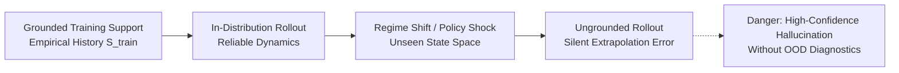

# Out-of-Distribution (OOD) & Regime-Shift Epistemics

A central failure mode of generative world models and simulation engines is **epistemic overclaim through extrapolation**: stepping a model into regimes where its training data or structural equations are ungrounded, while continuing to output plausible-looking trajectories.

The Enterprise World Model Engine (EWM Engine) resolves this through **grounded-regime diagnostics** (`ewm_engine.experimental.ood`). Rather than halting simulation or failing silently, the engine detects when a trajectory leaves the empirical support, measures the **grounded fraction**, and annotates the systemic trace with novelty diagnostics.

---

## 1. The Extrapolation Trap

When simulating complex enterprises (supply chains, market expansions, dynamic pricing, or balance-sheet operations), models are frequently evaluated under policies that push state variables into previously unseen regimes:



Standard supervised dynamics models ($s_{t+1} = f_\theta(s_t, a_t)$) minimize empirical risk over observed transitions. Outside this support:
1. **Predictive variance vanishes or becomes uncalibrated**: models may output confidently wrong transitions.
2. **Correlation assumptions collapse**: covariance structures learned in steady-state operations break down under crisis or structural reorganization.
3. **Simulated rollouts diverge from reality**: decisions optimized against ungrounded rollouts suffer severe real-world performance collapse.

---

## 2. Grounded Regimes vs. Ungrounded Regimes

EWM Engine operationalizes the concept of a **grounded regime**:

| Regime | Definition | Epistemic Trust | Engine Behavior |
| :--- | :--- | :--- | :--- |
| **Grounded** | States $S_t$ reside within the verified support (empirical or structural boundaries) where transition models were calibrated. | Calibrated confidence; nominal error bounds apply. | Trajectory flagged as grounded; `grounded_fraction = 1.0`. |
| **Ungrounded (OOD)** | States $S_t$ violate support bounds, trigger rule shifts, or exhibit covariance anomalies exceeding empirical thresholds. | Extrapolative; dynamics models operate beyond verified evidence. | Diagnostic alert triggered; `SystemicTrace` annotated with step and metric anomalies; `grounded_fraction < 1.0`. |

---

## 3. Detection Detectors (`ewm_engine.experimental.ood`)

The OOD framework exposes a standardized protocol [`OODDetector`](file:///c:/Users/vinicius/Documents/GeminiCodes/Enterprise-World-Model-Engine/src/ewm_engine/experimental/ood.py) with two primary reference implementations:

### 3.1 Support Boundary Detector (`SupportBoundaryOODDetector`)
Computes feature-wise empirical minimums and maximums across reference or training states, with an optional expansion margin $\alpha$:

$$\text{Support}_k = [m_k - \alpha (M_k - m_k), \; M_k + \alpha (M_k - m_k)]$$

Any state with a feature $x_k \notin \text{Support}_k$ triggers an OOD signal. Additionally, users can declare custom **rule invariants** (e.g., non-negative inventory, liquidity adequacy ratios) to flag structural violations.

### 3.2 Mahalanobis Covariance Detector (`MahalanobisOODDetector`)
Detects multivariate correlation shifts even when individual features remain within their marginal bounds:

$$D_M(x) = \sqrt{(x - \mu)^T \Sigma^{-1} (x - \mu)}$$

Where:
- $\mu$ is the empirical mean vector of reference states.
- $\Sigma$ is the regularized covariance matrix ($\Sigma + \epsilon I$).
- Threshold $\tau$ is calibrated to a target false-positive rate $\alpha_{\text{calib}}$ using the Chi-Square distribution:
  $$\tau = \chi^2_d(1 - \alpha_{\text{calib}})$$

If $D_M(x) > \tau$, the detector flags an anomalous covariance novelty.

---

## 4. Operational Diagnostics: Grounded Fraction & Trace Annotation

### 4.1 Grounded Fraction
For any trajectory $\tau = (S_0, S_1, \dots, S_T)$, the detector produces an [`OODTrajectoryReport`](file:///c:/Users/vinicius/Documents/GeminiCodes/Enterprise-World-Model-Engine/src/ewm_engine/experimental/ood.py):

$$\text{grounded\_fraction} = \frac{\sum_{t=0}^T \mathbb{I}[S_t \text{ is in-distribution}]}{T + 1}$$

- A score of `1.0` indicates complete empirical grounding across the entire horizon.
- A score of `0.4` indicates that 60% of the simulated horizon stepped into ungrounded territory, alerting decision-makers that downstream conclusions rely on extrapolation.

### 4.2 Systemic Trace Integration
OOD events are recorded directly into the [`SystemicTrace`](file:///c:/Users/vinicius/Documents/GeminiCodes/Enterprise-World-Model-Engine/src/ewm_engine/core/trace.py):
- Added as non-causal trace metadata nodes (`ood_regime_shift`, `ood_covariance_novelty`).
- Captures the exact step index, anomalous feature names, and distance scores.
- **Strict Epistemic Invariant**: OOD detection does **not** alter or auto-downgrade `EvidenceLevel`, nor does it emit forbidden `"causes"` edges. Traces remain honest dependency audits.

---

## 5. Usage Example

```python
from ewm_engine.core.resource import Resource
from ewm_engine.core.state import WorldState
from ewm_engine.experimental.ood import (
    SupportBoundaryOODDetector,
    MahalanobisOODDetector,
)

# Reference historical baseline states
baseline_states = [
    WorldState(
        step=i,
        resources=[
            Resource(id="demand", current=100.0 + i, min_value=0.0, max_value=1000.0),
            Resource(id="inventory", current=500.0 - i, min_value=0.0, max_value=1000.0),
        ],
    )
    for i in range(50)
]

# Initialize and fit support detector
detector = SupportBoundaryOODDetector(tolerance_fraction=0.05)
detector.fit(baseline_states)

# Evaluate a simulated trajectory
report = detector.evaluate_trajectory(simulated_trajectory)

print(f"Trajectory Grounded Fraction: {report.grounded_fraction:.2%}")
if report.ood_steps > 0:
    print(f"First OOD encountered at step: {report.first_ood_step}")
    for step_rep in report.step_reports:
        if step_rep.is_ood:
            print(f"Step {step_rep.step}: {step_rep.offending_features}")
```

