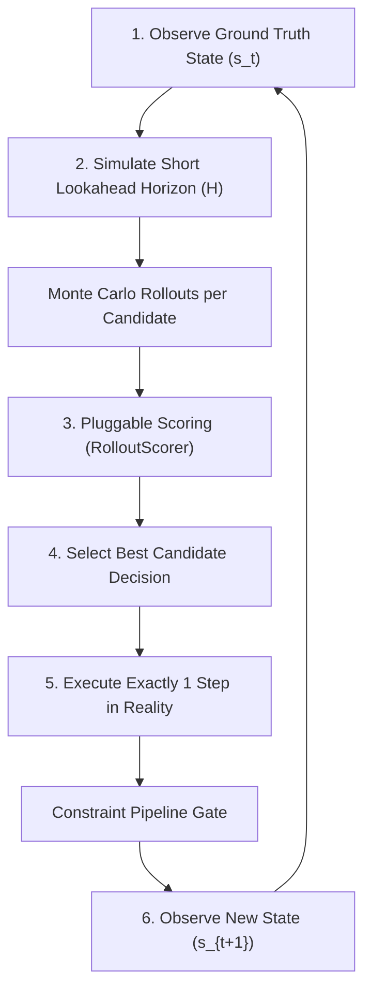
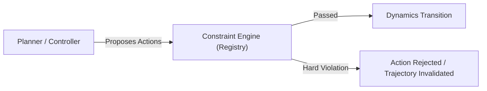

# Planning and Controller Layer: Decision-Making Under World Models

Enterprise World Model Engine treats the world model not as an infallible oracle, but as a **reproducible, interactive sandbox** for evaluating candidate interventions before committing real-world actions.

---

## 1. The Epistemic Stance: Long Open-Loop Rollouts Are Not Forecasts

A common pathology in automated planning and AI decision systems is the confusion of **long-horizon simulation** with **predictive prophecy**.

In socio-technical and complex enterprise systems:
1. **Unmodeled Exogenous Shocks**: Macroeconomic regime shifts, supply disruptions, and regulatory reforms cannot be perfectly anticipated.
2. **Compounding Autoregressive Drift**: As demonstrated by the `LongHorizon` benchmark family, small errors in single-step state transition estimates compound exponentially across extended rollouts ($T \gg 10$).
3. **The Lucas Critique**: Actors within an organization adapt their behavioral policies when organizational rules or tax incentives shift, altering the underlying transition dynamics.

> [!IMPORTANT]
> **Core Principle:**  
> The EWM Engine explicitly rejects long open-loop rollouts as literal forecasts. The world model is a *counterfactual research instrument* to probe immediate risks and trade-offs. To control systems responsibly, **continuous state re-grounding** is a first-class operational requirement.

---

## 2. The Re-Grounding Control Loop (Receding Horizon / MPC)

Inspired by Model Predictive Control (MPC) and modern world-model planning architectures (e.g., Dreamer, Navigation World Models), the engine operates via an iterative re-grounding feedback cycle:

At step $t$:
1. **Observe**: The controller inspects the actual observed world state $s_t$.
2. **Simulate**: The engine branches the world and simulates short lookahead trajectories of horizon $H$ (typically $H \in [2, 5]$) across $K$ candidate options and $N$ Monte Carlo samples.
3. **Score**: Trajectories are scored using a typed `RolloutScorer` that balances expected return, tail risk, variance, and constraint compliance.
4. **Act**: The optimal candidate is selected. Exactly **one step** is executed in the host world.
5. **Re-ground**: The actual state $s_{t+1}$ is recorded, correcting any simulation drift, and the lookahead horizon recedes forward by one step.

---

## 3. Pluggable Rollout Scorers

Different decision makers face different utility landscapes. A naive mean argmax often chooses high-risk strategies that catastrophically breach physical constraints or insolvency thresholds. EWM Engine provides four standard built-in scorers in `ewm_engine.experimental.planning`:

### ExpectedObjectiveScorer
Evaluates the mathematical expectation of a target metric:
$$\text{Score} = \mathbb{E}[M] \quad (\text{or } -\mathbb{E}[M] \text{ if minimizing})$$
Suitable for risk-neutral, repetitive operational decisions with symmetric cost distributions.

### CVaRScorer (Conditional Value-at-Risk / Risk-Averse)
Evaluates tail catastrophe at quantile level $\alpha \in (0, 1]$ (e.g., bottom 10% worst outcomes):
$$\text{CVaR}_\alpha = \mathbb{E}[M \mid M \le q_\alpha]$$
When minimizing loss/violations, $\text{CVaR}_\alpha$ evaluates the upper-tail mean ($\mathbb{E}[L \mid L \ge q_{1-\alpha}]$). This penalizes strategies that perform well on average but occasionally suffer catastrophic stockouts, defaults, or service crashes.

### ConstraintPenalizedScorer
Applies explicit linear penalties for hard and soft constraint violations or trajectory invalidations:
$$\text{Score} = \text{BaseScore} - \lambda_{\text{viol}} \cdot \bar{V} - \lambda_{\text{inv}} \cdot P(\text{Invalid})$$
Guarantees that candidates with high nominal profit are sharply downweighted if they stress or violate organizational invariants.

### UncertaintyPenalizedScorer
Penalizes variance or spread across rollout futures to reward robust, predictable interventions:
$$\text{Score} = \mu - \lambda \cdot \sigma$$
(or $-(\mu + \lambda \cdot \sigma)$ when minimizing cost).

---

## 4. Inviolability of the Constraint Pipeline

A critical architectural guarantee of the EWM Engine is that **planners propose decisions; constraints dispose**.

Even if a planner's lookahead model hallucinated that an illegal action was viable, the actual execution step passes through the host world's `ConstraintRegistry`. Hard invariants (non-negative stock, budget limits, legal compliance) are inviolable and cannot be bypassed by any optimization heuristic.

---

## 5. The Simulation-Reality Gap

When using world models for planning, practitioners must acknowledge the **simulation-reality gap**:
- The world model represents **simulated beliefs** based on specified rules and empirical dynamics.
- Optimization over simulated rollouts maximizes utility with respect to the *model*, which may diverge from true organizational complexity.
- **Auditability via Provenance**: Every `PlanningDecision` serializes the candidates evaluated, the lookahead seed, the sample count, the scorer details, and cryptographic state hashes before and after execution, ensuring full governance audit trails.
