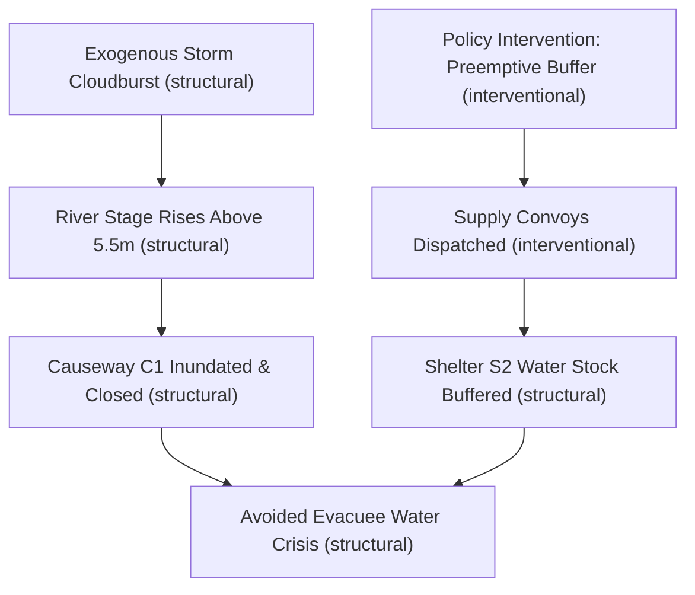

# Systemic Traces: Explaining Cascading Dynamics

Traditional simulation engines and ML models often return scalar summary outputs:
$$\text{Average Service Level} = 0.82$$
Such aggregated metrics fail to answer the essential operational question: **Why did this metric change, and what chain of events caused it?**

---

## The Concept of a Systemic Trace

A **Systemic Trace** in EWM Engine is a directed dependency graph recording how an initial intervention, combined with exogenous shocks and autonomous agent decisions, propagated through physical states to impact final metrics.



---

## Simulated Dependencies vs. Real-World Causality

EWM Engine makes a strict distinction:
- **Simulated Dependencies**: The edges in a systemic trace document the exact mathematical and computational causal chain enacted inside the simulator:
  $$\text{Intervention} \longrightarrow \text{Action} \longrightarrow \Delta\text{State} \longrightarrow \text{Constraint Violation} \longrightarrow \text{Metric}$$
- **Real-World Causality**: The engine does **not** claim that this simulated chain represents reality unless the individual edges and transition dynamics have been empirically identified under Pearlian causal criteria (`EvidenceLevel.INTERVENTIONAL`).

---

## Inspecting and Exporting Traces

Systemic traces can be inspected programmatically and exported to standard formats:

### Mermaid Markdown Flowcharts
```python
trace = trajectory.systemic_trace
print(trace.to_mermaid())
```

### NetworkX DiGraph (Graph Theory & Centrality Analysis)
```python
nx_graph = trace.to_networkx()
print(f"Nodes: {nx_graph.number_of_nodes()}, Edges: {nx_graph.number_of_edges()}")
```
