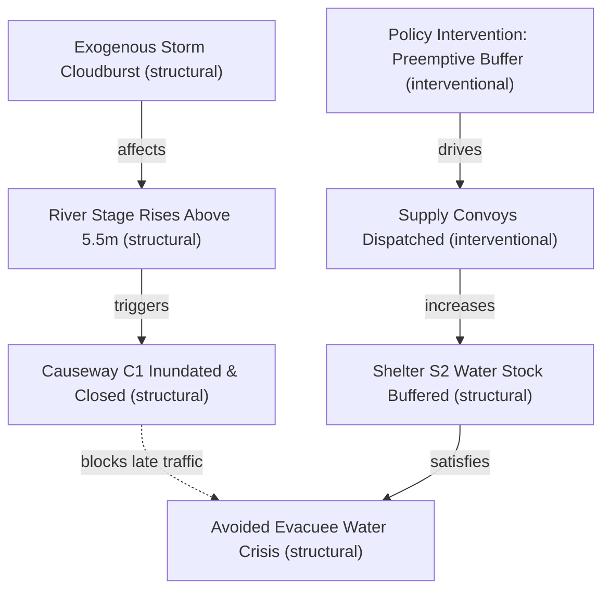

# Systemic Traces: Explaining Cascading Dynamics

Traditional simulation engines and machine learning models often return scalar summary outputs:
$$\text{Average Service Level} = 0.82$$

Such aggregated numbers leave the core operational question unanswered: **Why did this outcome occur, and through what sequence of state transitions did the policy propagate?**

---

## What is a Systemic Trace?

A **Systemic Trace** in EWM Engine is a directed dependency graph recording how an initial intervention, combined with exogenous shocks and autonomous agent decisions, propagated through discrete physical states to produce the final metrics.



---

## Simulated Dependencies vs. Causal Graphs

EWM Engine enforces a crucial epistemic distinction:

- **Simulated Dependency Trace**: The graph records the precise sequence of state transitions, actions, and events computed by the simulation engine:
  $$\text{Intervention} \longrightarrow \text{Action} \longrightarrow \Delta\text{State} \longrightarrow \text{Constraint Check} \longrightarrow \text{Metric}$$
- **Not an Identified Causal DAG by Default**: A systemic trace documents what happened *within the computational model*. It does **not** claim to be an empirically identified real-world causal DAG unless each underlying relationship has been verified under Pearlian causal identification (`EvidenceLevel.INTERVENTIONAL`).
- **No Unlabeled "Causes"**: Edges are labeled with explicit operational relations (such as `drives`, `affects`, `triggers`, `violates`) and annotated with their corresponding `EvidenceLevel`.

---

## Inspecting and Exporting Traces

Systemic traces can be inspected programmatically or exported to standard visualization and network analysis formats:

### Export to Mermaid Markdown Flowcharts
```python
trace = trajectory.systemic_trace
mermaid_markup = trace.to_mermaid()
print(mermaid_markup)
```

### Export to NetworkX DiGraph (Graph Theory & Centrality)
```python
nx_graph = trace.to_networkx()
print(f"Nodes: {nx_graph.number_of_nodes()}, Edges: {nx_graph.number_of_edges()}")
```

### Auditable Trace Edge Schema
Every edge in the trace adheres to the strict `TraceEdge` schema:
- `source`: Unique ID of the originating event, action, or state change.
- `target`: Unique ID of the downstream impacted component.
- `step`: Simulation step index at which the interaction occurred.
- `relation`: Descriptive interaction type (`drives`, `affects`, `triggers`, `violates`).
- `evidence_level`: Epistemic classification (`EvidenceLevel`).
- `metadata`: Key-value audit attributes and transition parameters.
