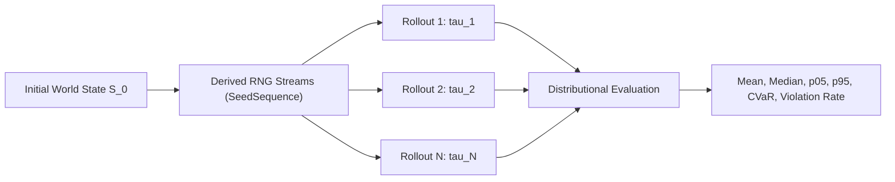
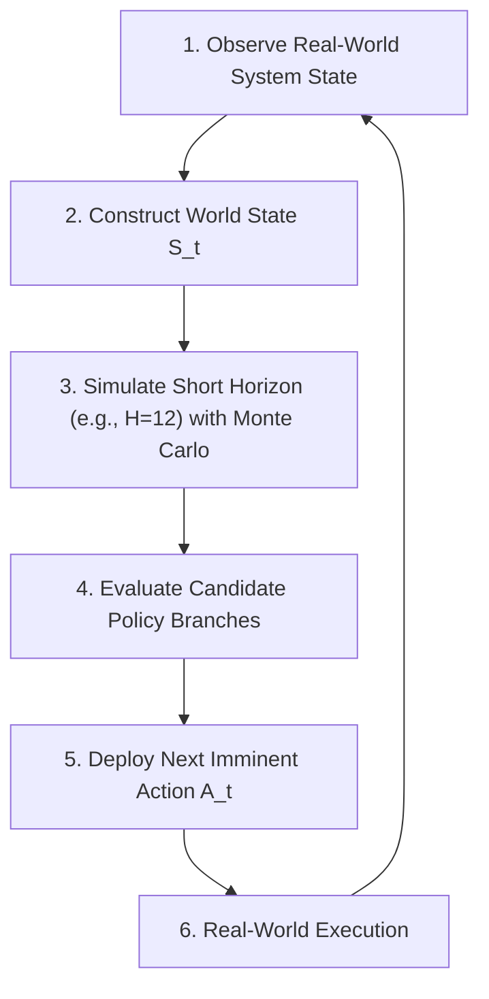

# Uncertainty Quantification: Futures as Distributions

In complex enterprise environments, the future is not a deterministic prophecy. It is a **probability distribution over possible trajectories**.

---

## Why Single-Trajectory Rollouts Fail

Deterministic point forecasts output a single scalar line:
$$\hat{Y}_{t+1:t+H}$$

In actual operational systems:
- Customer demand fluctuates stochastically with heavy-tailed spikes.
- Transport corridors experience weather and congestion delays.
- Supplier lead times exhibit fat-tailed disruptions.
- Machine breakdowns and labor shortages occur intermittently.

A policy that optimizes solely for the *expected average* case frequently collapses under tail-risk events. In mission-critical logistics, healthcare, or disaster relief, evaluating the 5th percentile worst-case scenario ($p_{05}$ or $\text{CVaR}_{05}$) is essential to ensure operational resilience and constraint compliance.

---

## Monte Carlo Rollouts in EWM Engine

EWM Engine uses reproducible pseudo-random seed derivation to execute $N$ independent rollout trajectories across an experimental horizon $H$:

$$\mathcal{T} = \{\tau_1, \tau_2, \dots, \tau_N\}$$

For any target metric $M$, the engine computes full distributional statistics:

- **Central Tendency**: Mean ($\mu$) and Median ($p_{50}$).
- **Spread & Dispersion**: Standard Deviation ($\sigma$) and Interquartile Range ($\text{IQR} = p_{75} - p_{25}$).
- **Tail Risks**:
  - $p_{05}$ (5th percentile lower bound)
  - $p_{95}$ (95th percentile upper bound)
  - $\text{CVaR}_{05}$ (Conditional Value-at-Risk / Expected Shortfall in worst 5% cases)
- **Constraint Violation Probability**:
  $$P(\text{Violation}) = \frac{1}{N} \sum_{k=1}^N \mathbb{I}(\text{Violations}(\tau_k) > 0)$$

---

## The Reproducibility Contract (AC-004)

Enterprise decision making demands cryptographic auditability and exact experiment replication across different machines. EWM Engine guarantees:

> **The Reproducibility Invariant:**  
> Same logical initial state + scenario specification + component versions + master seed $\implies$ the exact same built-in logical trajectory across runs and operating systems.

### Deterministic RNG Derivation (AC-009)
- The engine uses `numpy.random.SeedSequence(scenario.seed).spawn(scenario.samples)` to derive $N$ independent, mathematically non-overlapping pseudo-random streams.
- Each rollout receives its own `np.random.Generator` instance passed explicitly into dynamics, exogenous event sources, and stochastic actors.
- **Zero Global State**: Core simulation code never calls or reads global `random` or `numpy.random` state. Reseeding global RNG from host code has zero effect on simulation trajectories.

### Hardware & ML Adapter Non-Determinism Caveat
Built-in dynamics models and standard constraints adhere strictly to bitwise reproducibility. However, external **neural, deep learning, or GPU adapters** (such as PyTorch models, GPU-accelerated solvers, or CUDA kernels) are subject to hardware-level floating-point non-determinism caused by parallel thread scheduling, non-deterministic atomic reductions, and differing BLAS/cuBLAS kernels across GPU microarchitectures. Such ML adapters carry an explicit caveat that hardware-level bitwise equivalence is outside this contract.

### Branch Isolation Property (AC-005)
Scenario branches spawned from a world snapshot via `world.branch()` share no mutable references. Mutating resources, scheduling actions, or running rollouts on branch $B_1$ leaves branch $B_2$ and parent initial state fingerprints completely unaltered.

---

## Model Predictive Control (MPC) and Re-grounding

Long open-loop simulations naturally accumulate variance and diverge from physical reality over extended horizons.

EWM Engine advocates a **receding-horizon execution loop** (Model Predictive Control):

By coupling anticipatory forward simulation over a short window with continuous empirical re-grounding at each discrete decision step, organizations prevent simulation drift while retaining forward visibility.

---

## Counterfactual Comparison & Multi-Objective Evaluation (v1.1)

Evaluating candidate interventions against a baseline requires more than simple point deltas. EWM Engine provides statistical uncertainty quantification and multi-criteria decision analysis:

### 1. Bootstrap Confidence Intervals on Deltas

When comparing candidate policies $\pi_{cand}$ against baseline $\pi_{base}$, raw deltas ($\Delta = \mu_{cand} - \mu_{base}$) are subject to Monte Carlo sampling variance. `compare_scenarios` computes non-parametric percentile bootstrap confidence intervals:

$$\Delta^*_b = \bar{X}^*_{cand, b} - \bar{X}^*_{base, b}, \quad b = 1, \dots, B$$

- **Bootstrap CI**: Reports empirical $[(1-\alpha)/2, 1-(1-\alpha)/2]$ percentile bounds (e.g. 95% CI) without assuming Gaussian or symmetric metric distributions.
- **Empirical Significance**: Tests whether the confidence interval strictly excludes zero, reporting two-tailed empirical p-values and an `is_significant` flag.

> [!IMPORTANT]
> **Epistemic Honesty on Simulation Significance**:  
> Significance flags in EWM Engine measure whether a metric difference is distinguishable from zero **under the simulation model's internal stochasticity** ($P_{model}$). They **do not** prove real-world empirical causal significance ($P(Y \mid \text{do}(X))$). Real-world inference requires empirical identification, observational re-grounding, and unobserved confounder validation.

### 2. Multi-Objective Optimization & Pareto Frontiers

In enterprise socio-technical systems, interventions involve inherent trade-offs (e.g., holding inventory costs vs. stockout rates vs. constraint violations).

- **Objective Specifications**: Each metric can be configured with an `ObjectiveDirection` (`MINIMIZE` or `MAXIMIZE`) and an optional preference weight.
- **Pareto Dominance**: A scenario $A$ dominates scenario $B$ ($A \succ B$) if it is at least as good in all objectives and strictly better in at least one.
- **Non-Dominated Frontier**: The engine extracts the non-dominated set and tracks explicit pairwise dominance relationships.

> [!NOTE]
> **The Anti-Winner Guardrail**:  
> Unless explicit, normalized decision-maker preference weights are supplied, EWM Engine **refuses to declare an automated "winner"** among non-dominated scenarios. Instead, it surfaces the Pareto frontier and trade-offs so stakeholders can perform principled Multi-Criteria Decision Analysis (MCDA).

