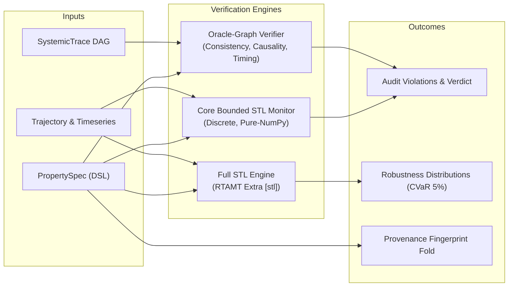

# Trajectory Verification: Oracle-Graph and Temporal Logic

Enterprise decision simulations cannot rely solely on per-step static constraints. Real-world socio-technical, logistical, and policy requirements are fundamentally **temporal, sequential, and relational**:
- *"Whenever an emergency alert is triggered, first responders must arrive within 45 minutes."*
- *"Buffer inventory must never remain below safety stock for more than 2 consecutive steps."*
- *"If river surge exceeds 5.0m, causeway closure must precede dispatch rerouting."*

`ewm_engine.verification` provides a formal, audit-ready verification layer over whole simulation trajectories and systemic dependency traces without mutating state.



---

## 1. The Oracle-Graph Pattern (Meta ARE)

Recent empirical work from Meta's Agent Reliability Evaluation (ARE, [arXiv:2509.17158](https://arxiv.org/abs/2509.17158)) revealed that evaluating complex agent or simulation trajectories using unstructured LLM-as-a-judge prompts achieved only **0.72 inter-annotator agreement**. In contrast, structured **oracle-graph verifiers** operating over explicit state transitions reached **0.98 agreement**.

An **Oracle Graph** is a directed acyclic graph of expected events verified against a simulation's `SystemicTrace` across three formal axes:

### Axis 1: Consistency
Checks whether each expected event in the Oracle Graph occurred with exact matching parameters:
- **Category:** e.g., `'action'`, `'event'`, `'state_change'`.
- **Expected Parameters:** Exact dictionary key-value matches (e.g., `{"mission_id": "M1", "units": 5}`).
- **Injective Matching:** Each trace event satisfies at most one oracle node, preventing duplicate counting.

### Axis 2: Causality
Verifies that topological parent-before-child ordering holds:
- For every directed dependency edge $(u \to v)$, the simulation step of $u$ must precede or equal the step of $v$:
  $$\text{step}(u) \le \text{step}(v)$$
- **Branch Independence:** Independent branches in the DAG may interleave arbitrarily in simulation time without generating false causality violations.

### Axis 3: Timing
Enforces discrete step and continuous timestamp bounds across linked events:
- **Discrete Step Windows:** $\Delta k \in [k_{\min}, k_{\max}]$
- **Continuous Timestamp Windows:** $\Delta t \in [t_{\min}, t_{\max}]$

If a delivery arrives either too early ($\Delta k < k_{\min}$) or too late ($\Delta k > k_{\max}$), a structured `VerificationViolation` is emitted with exact delay audit details.

---

## 2. Signal Temporal Logic (STL) over Trajectories

While Oracle Graphs verify event sequences and causality, **Signal Temporal Logic (STL)** verifies continuous and discrete quantitative invariants over timeseries signals.

### Core Bounded-Future Monitor (Zero-Dependency)
The core engine includes a pure-NumPy discrete monitor for bounded-future formulas:

| Operator | Mathematical Syntax | Core Builder | Semantics |
| :--- | :--- | :--- | :--- |
| **Predicate** | $\mu \equiv x \ge c$ | `predicate("x", ">=", c)` | Holds if signal $x_t \ge c$; margin $\rho = x_t - c$. |
| **Always** | $\square_{[k_1, k_2]} \phi$ | `always(phi, k1, k2)` | $\phi$ holds at every step $t + \Delta k \in [k_1, k_2]$. |
| **Eventually** | $\lozenge_{[k_1, k_2]} \phi$ | `eventually(phi, k1, k2)` | $\phi$ holds at some step $t + \Delta k \in [k_1, k_2]$. |
| **Until** | $\phi \ \mathcal{U}_{[k_1, k_2]} \ \psi$ | `until(phi, psi, k1, k2)` | $\phi$ holds until $\psi$ becomes true within window $[k_1, k_2]$. |
| **Implies** | $\phi \to \psi$ | `implies(phi, psi)` | $\neg \phi \lor \psi$ evaluated point-in-time. |

Evaluating a formula returns an `STLVerdict`:
```python
verdict = evaluate_stl_bounded(formula, trajectory)
print(f"Satisfied: {verdict.satisfied}, Margin: {verdict.robustness}")
```

### Full STL & Quantitative Robustness via RTAMT (`[stl]` Extra)
When the optional `[stl]` extra is installed (`pip install 'ewm-engine[stl]'`), the engine connects to **RTAMT** for full STL/MTL parsing and continuous robustness evaluation.

In addition to Boolean pass/fail, RTAMT computes the **quantitative robustness degree** $\rho$:
- $\rho > 0$: The property is satisfied with a safety margin of $\rho$.
- $\rho = 0$: The property is marginally satisfied on the boundary.
- $\rho < 0$: The property is violated by magnitude $|\rho|$.

Across Monte Carlo rollouts, `RTAMTEvaluationBackend.evaluate_monte_carlo` aggregates robustness into a `RobustnessDistribution`:
- **Satisfaction Probability:** Empirical probability $P(\rho \ge 0)$.
- **Quantiles:** Robustness thresholds at 5%, 25%, 50%, 75%, 95%.
- **Tail Risk (CVaR 5%):** Expected robustness margin in the worst 5% of simulation trajectories, providing rigorous risk guarantees for mission-critical systems.

---

## 3. Auditable Property-Spec DSL and Provenance Folding

Simulation runs are only as trustworthy as the properties checked against them. The engine defines a declarative `PropertySpec` model:

```python
from ewm_engine.verification import PropertySpec, fold_properties_into_fingerprint

spec = PropertySpec(
    property_id="prop_sla_recovery",
    name="SLA Recovery Within 3 Steps",
    property_type="stl_bounded",
    definition={"formula": "always(demand_surge -> eventually[0, 3] (sla >= 0.95))"},
    parameters={"k1": 0, "k2": 3, "threshold": 0.95},
)

# Canonical SHA-256 hash computed over normalized JSON representation
prop_hash = spec.property_hash

# Cryptographic provenance: fold property hashes into simulation fingerprint
provenance_fp = fold_properties_into_fingerprint(base_simulation_fingerprint, [spec])
```

By folding property hashes into provenance fingerprints:
1. **Audit Integrity:** Downstream consumers know exactly which formal properties were verified without trusting external documentation.
2. **Permutation Invariance:** The folded fingerprint is strictly identical regardless of the order in which properties are passed.
3. **Change Detection:** Any modification to thresholds, formulas, or timing bounds strictly alters the resultant fingerprint.

---

## 4. Epistemic Principles & Non-Mutation Guarantees

1. **Verification Strictly Reads Traces:** Verifiers inspect `SystemicTrace` and `Trajectory` objects without modifying them. No state repair or trajectory mutation is ever performed during verification.
2. **Simulated Properties vs. Real-World Guarantees:** A verified temporal property is a guarantee about the *computational model and its simulated assumptions*, not an empirical real-world certainty.
3. **Forbidden Causal Claims:** Dependency edges with relation `"causes"` remain forbidden; only structural, interventional, or predictive relations with explicit `EvidenceLevel` are permitted.
