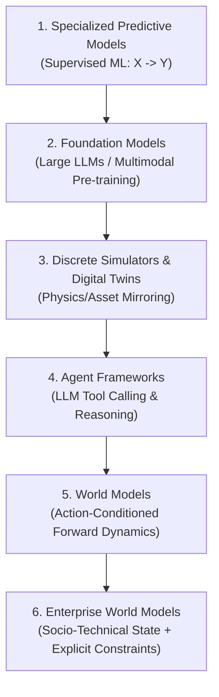

# What is an Enterprise World Model?

## The Evolution of Models in Artificial Intelligence

To understand where **Enterprise World Models (EWM)** sit within artificial intelligence and computational modeling, consider how the field has evolved across distinct paradigms:

### 1. Specialized Machine Learning
Classic statistical and supervised machine learning fits isolated function approximators:
$$\hat{y} = f_\theta(x)$$
While effective for stationary point predictions (such as credit scoring or demand forecasting), they cannot simulate how an environment will respond when an organization enacts a novel structural intervention that breaks historical correlations.

### 2. Foundation Models
Large language models (LLMs) and foundation models capture broad world knowledge and linguistic patterns. However, standard LLMs lack an explicit, conservation-preserving representation of enterprise state. They frequently hallucinate numbers, violate basic physical and accounting bounds, and cannot reliably step discrete operational systems forward through time.

### 3. Digital Twins vs. World Models
Industrial digital twins typically mirror the sensory telemetry of specific mechanical or physical assets (e.g., jet engines, wind turbines, manufacturing assembly lines). An Enterprise World Model extends this to **socio-technical systems**: modeling organizational policies, multi-actor behavioral responses, resource allocations, inventory flows, and external disruptions under candidate interventions.

### 4. Agent Frameworks vs. World Models
Modern agent frameworks (such as LangGraph, CrewAI, or AutoGen) focus on **how agents reason, plan, and invoke tools**.  
An Enterprise World Model focuses on **the environment within which agents act**.  
Without an executable world model, autonomous agents are forced to test experimental policies directly on live production systems—a dangerous operational hazard. An EWM serves as a safe computational "flight simulator" for both automated agents and human leadership.

---

## Academic Lineage of World Models

The concept of a *World Model* in AI originates from reinforcement learning, cognitive science, and computational neuroscience:

1. **Ha & Schmidhuber (2018)**: *World Models* ([arXiv:1803.10122](https://arxiv.org/abs/1803.10122)) demonstrated that an agent can learn a compact latent representation of its environment (Vision model), a recurrent predictive model of dynamics over time (Memory RNN), and train a policy entirely inside its own simulated dreams.
2. **Hafner et al. (2020–2023)**: *Dreamer* and *DreamerV3* ([arXiv:2301.04104](https://arxiv.org/abs/2301.04104)) showed that action-conditioned Recurrent State-Space Models (RSSMs) can master diverse robotic, visual, and discrete domains by learning behaviors entirely within latent world models.
3. **LeCun (2022–2024)**: *A Path Towards Autonomous Machine Intelligence* and Joint Embedding Predictive Architectures (*I-JEPA*, *V-JEPA 2*) argue that intelligent systems must predict future abstract states rather than pixel-level or token-level details, focusing on action-conditioned hierarchical world models.
4. **Peters, Janzing, & Schölkopf (2017)**: *Elements of Causal Inference* established the mathematical foundations for distinguishing observational predictions from interventional mechanics, inspiring modern research in *Causal World Models*.
5. **Ding et al. (2024)**: *Diffusion World Models* explore generative diffusion processes as action-conditioned trajectory simulators for visual and complex interactive dynamics.

---

## Formal Definition: Enterprise World Model

> An **Enterprise World Model** is an action-conditioned, uncertainty-aware executable representation of an organization's or socio-technical ecosystem's evolving state, integrating explicit operational constraints, pluggable dynamics, external shocks, and decision policies to evaluate the downstream consequences of candidate interventions before real-world deployment.

### The Hybrid Architecture: Known Structure + Learned Dynamics

Enterprise systems differ fundamentally from video games or physical robots: organizations operate under rigid, non-negotiable legal, physical, and accounting boundaries alongside highly stochastic human and market behaviors.

EWM Engine enforces an explicit architectural separation:

$$\begin{aligned}
\textbf{Known Structural Knowledge} &\quad\longleftrightarrow\quad \text{Hard capacity limits, conservation laws, legal rules, invariants} \\
\textbf{Learned \& Stochastic Dynamics} &\quad\longleftrightarrow\quad \text{Customer behavior, demand swings, transit delays, weather shocks}
\end{aligned}$$

Forcing known physical and accounting equations into opaque neural network weights produces hallucinated states and physically impossible transitions. EWM Engine keeps structural rules explicit, verifiable, and audited.
