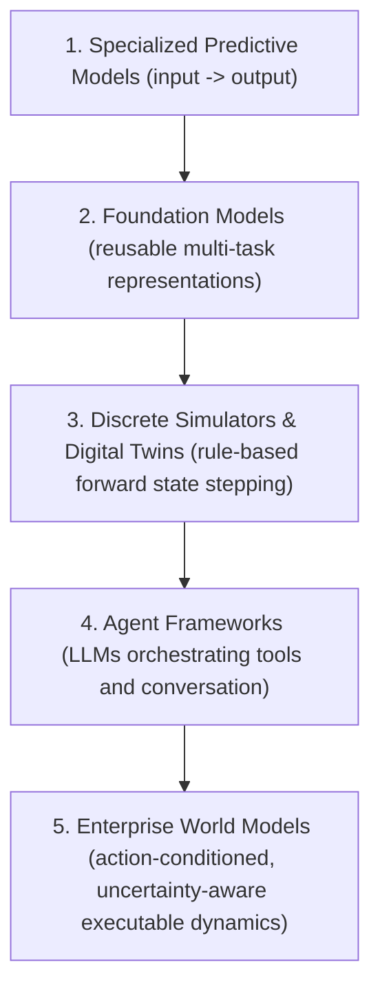

# What is an Enterprise World Model?

## The Evolution of Models in Artificial Intelligence

To understand where **Enterprise World Models** fit into the technological landscape, consider the conceptual evolution across five paradigms:

### 1. Specialized Machine Learning
Classic statistical learning constructs isolated function approximators:
$$\hat{y} = f_\theta(x)$$
While effective for narrowly bounded tasks (e.g., fraud classification or demand point forecasting), they cannot simulate the counterfactual feedback loops that occur when an organization enacts a novel policy.

### 2. Foundation Models
Transformers and large multimodal models capture rich latent representations of human language and visual patterns. However, they do not maintain an executable, conservation-preserving state of an enterprise's physical, logistical, and legal constraints.

### 3. Digital Twins vs. World Models
Traditional industrial digital twins typically mirror sensor telemetry of mechanical assets (e.g., a turbine or conveyor belt). An Enterprise World Model expands this scope to **socio-technical systems**: modeling organizational policies, multi-actor behavioral responses, resource allocations, and external disruptions under hypothetical interventions.

### 4. Agent Frameworks vs. World Models
Agent frameworks (such as LangGraph, CrewAI, or AutoGen) focus on **how agents reason and take actions**.
Enterprise World Models focus on **the environment within which agents operate**.
Without an executable world model, autonomous agents are forced to test experimental policies directly on production enterprise systems—a reckless and often disastrous operational risk.

---

## Formal Definition of an Enterprise World Model

> An **Enterprise World Model** is an action-conditioned, uncertainty-aware representation of an organization's or ecosystem's evolving state, integrating learned dynamics, agent behavior, exogenous events, memory, and explicit operational constraints to evaluate possible consequences of interventions before deployment.

---

## The Hybrid Architecture: Known Structure + Learned Dynamics

Organizations possess non-negotiable physical, accounting, and legal boundaries alongside highly uncertain, stochastic human and environmental behaviors.

EWM Engine enforces an explicit architectural separation:

$$\begin{aligned}
\textbf{Known Structural Knowledge} &\quad\longleftrightarrow\quad \text{Hard Invariants, Capacity Limits, Balance Conservation} \\
\textbf{Learned \& Stochastic Dynamics} &\quad\longleftrightarrow\quad \text{Consumer Behavior, Demand Swings, Congestion, Weather Shocks}
\end{aligned}$$

Forcing known physical laws into unconstrained neural network weights creates hallucinations and violation of basic physical realities. EWM Engine keeps structure explicit, transparent, and verified.
