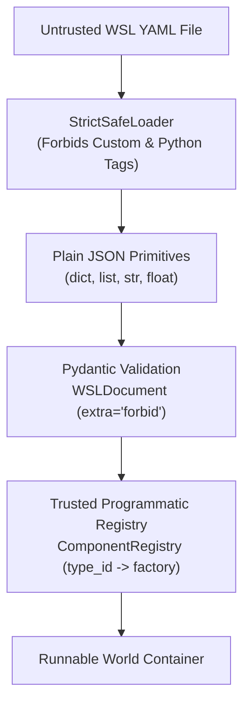

# World Specification Language (WSL)

The **World Specification Language (WSL)** is a declarative, human-readable serialization grammar for defining, sharing, and versioning enterprise world models in YAML or JSON ([ADR-023](file:///c:/Users/vinicius/Documents/GeminiCodes/Enterprise-World-Model-Engine/docs/adr/ADR-023-declarative-world-specification-language-wsl.md)).

---

## 1. Safety Architecture & Scope Creep Rejection

Because world specification files are often imported from untrusted repositories, shared across multi-tenant teams, or generated by autonomous agents, WSL enforces **strict declarative safety**:



### Strict Non-Goals (Scope Creep Rejection)
1. **NO Embedded Code / Eval**: No Python expressions, math string parsing, or inline script blocks (`eval`, `exec`).
2. **NO Custom YAML Tags**: Tags like `!python/object`, `!cmd`, or `!ref` raise immediate `SerializationSecurityError`.
3. **NO Import-by-String**: Models and constraints cannot reference arbitrary Python module strings; all dynamic components must be registered via a programmatic `ComponentRegistry`.

---

## 2. WSL Grammar (`wsl/2.0.0`)

A canonical WSL specification is structured into declarative top-level sections:

```yaml
schema_version: "wsl/2.0.0"

metadata:
  id: "global_supply_chain"
  name: "Multimodal Logistics Network"
  version: "2.0.0"
  author: "Logistics Engineering Team"
  description: "Cross-regional supply network with multi-echelon inventory."
  tags: ["supply_chain", "logistics", "multimodal"]

temporal:
  time_unit: "day"
  step_duration: 1.0
  default_horizon: 30

entities:
  - id: "port_rotterdam"
    type: "hub"
    attributes:
      berths: 14
      throughput_capacity: 10000.0
    tags: ["maritime", "tier_1"]

  - id: "dc_frankfurt"
    type: "distribution_center"
    attributes:
      sqft: 250000
    tags: ["central_europe"]

relationships:
  - source: "port_rotterdam"
    target: "dc_frankfurt"
    type: "routes_to"
    attributes:
      transit_days: 2
    weight: 0.85

resources:
  - id: "rotterdam_stock"
    current: 4500.0
    min_value: 0.0
    max_value: 10000.0
    unit: "TEU"
    entity_id: "port_rotterdam"

  - id: "frankfurt_stock"
    current: 2000.0
    min_value: 0.0
    max_value: 5000.0
    unit: "TEU"
    entity_id: "dc_frankfurt"

dynamics:
  type_id: "deterministic_transfer"
  parameters:
    action_type: "transfer_stock"
  evidence_level: "STRUCTURAL"

constraints:
  - id: "non_negative_stock"
    type_id: "resource_non_negative"
    parameters: {}
    phase: "POST_DYNAMICS"
    severity: "HARD"

scenarios:
  - id: "baseline_rollout"
    name: "30-Day Steady State"
    seed: 42
    horizon: 30
    interventions: []
```

---

## 3. Python API Integration

### Parsing and Compiling
```python
from ewm_engine.serialization import parse_wsl_file, compile_wsl

# Safely parse and validate against schema
doc = parse_wsl_file("models/supply_network.wsl.yaml")

# Compile into an executable World container via trusted registry
world = compile_wsl(doc)

# Run simulation
engine = SimulationEngine()
result = engine.run(world, scenario)
```

### Exporting Active Worlds to WSL
```python
from ewm_engine.serialization import export_wsl, dump_wsl_yaml

# Export world state and topology
doc = export_wsl(world)

# Safe canonical YAML serialization
yaml_str = dump_wsl_yaml(doc)
```

---

## 4. Canonical Machine-Readable Schema

A versioned JSON Schema is maintained at:
- `docs/schemas/wsl-v2.schema.json`

This schema can be integrated into IDEs (VS Code, JetBrains), CI linters, or web interfaces for real-time validation and autocompletion.
