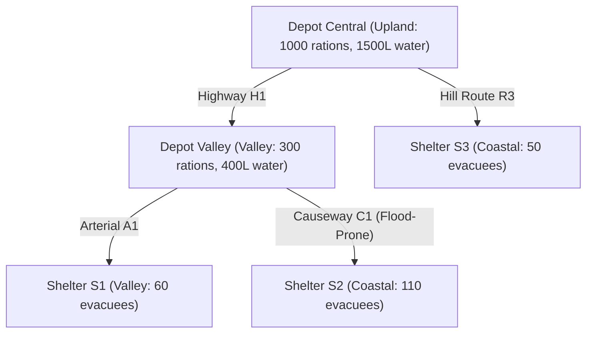

# CivicFlow Flagship Simulation Walkthrough

> **RESEARCH & EDUCATIONAL DISCLAIMER**  
> CivicFlow is an academic and computational research simulation. It is **not an operational emergency-response system** and is not certified for operational emergency-management deployment.
> The numerical outcomes and policy comparisons are normative **only** for the synthetic `tiny_flood_v1` benchmark fixture; they do not establish real-world policy superiority. The model addresses logistical allocation only, with no medical-treatment decisions.

---

## The Research Question

$$\begin{aligned}
&\text{Given identical initial world state } S_0 \text{ and storm shocks: } \\
&\textbf{How does a myopic nearest-first policy compare to a capacity-aware regional buffering policy?}
\end{aligned}$$

---

## Topology and Regional Setup

---

## Systemic Coupling: Rain $\to$ River $\to$ Road Severance

1. **Hydrological Dynamics**: Rainfall accumulation raises river stage. At $5.5\text{ m}$, Coastal Causeway `C1` is inundated and closed.
2. **Cascading Failure**: Once `C1` closes, `Shelter S2` is completely cut off from `Depot Valley`.
3. **Policy A Failure**: The myopic policy services `S1` first. By the time it attends to `S2`, `C1` is submerged, resulting in massive water deficits.
4. **Policy B Success**: The proactive coordinator notices river stage acceleration and rushes emergency reserves across `C1` before closure, mitigating humanitarian shortfall.
