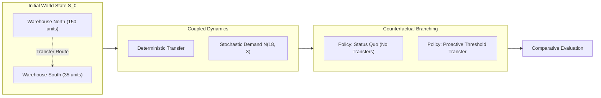

# Minimal Supply World Walkthrough

The **Minimal Supply World** provides a concise, 50-line introduction to the core abstractions of the Enterprise World Model Engine.

---

## Architecture Diagram



---

## Code Walkthrough

See the full executable code in [`examples/minimal_world/run.py`](https://github.com/vfcarida/Enterprise-World-Model-Engine/blob/main/examples/minimal_world/run.py).

### 1. State Definition
```python
state = WorldState(
    entities=[
        Entity(id="wh_north", type="warehouse"),
        Entity(id="wh_south", type="warehouse"),
    ],
    resources=[
        Resource(id="stock_north", current=150.0, min_value=0.0, max_value=250.0),
        Resource(id="stock_south", current=35.0, min_value=0.0, max_value=200.0),
    ],
)
```

### 2. Constraints and Dynamics
```python
constraints = ConstraintRegistry([
    ResourceCapacityConstraint(resource_id="stock_north"),
    ResourceCapacityConstraint(resource_id="stock_south"),
    ActionTransferAvailabilityConstraint(),
])

dynamics = CompositeDynamics([
    DeterministicTransferDynamics(),
    StochasticDemandDynamics(resource_id="stock_south", mean_demand=18.0, std_demand=3.0),
])

base_world = World(state=state, dynamics=dynamics, constraints=constraints)
```

### 3. Simulating and Comparing Counterfactuals
```python
# Baseline
res_base = base_world.simulate(scenario=Scenario(name="Status Quo", horizon=10, samples=20, seed=42))

# Proactive Branch
proactive_world = base_world.branch()
proactive_world.add_actor(
    ThresholdReplenishmentActor(
        actor_id="controller",
        source_resource="stock_north",
        target_resource="stock_south",
        reorder_point=40.0,
        order_quantity=40.0,
    )
)
res_proactive = proactive_world.simulate(scenario=Scenario(name="Proactive", horizon=10, samples=20, seed=42))

# Compare
comparison = compare_scenarios(baseline=res_base, candidates=[res_proactive])
print(comparison.summary_table())
```
