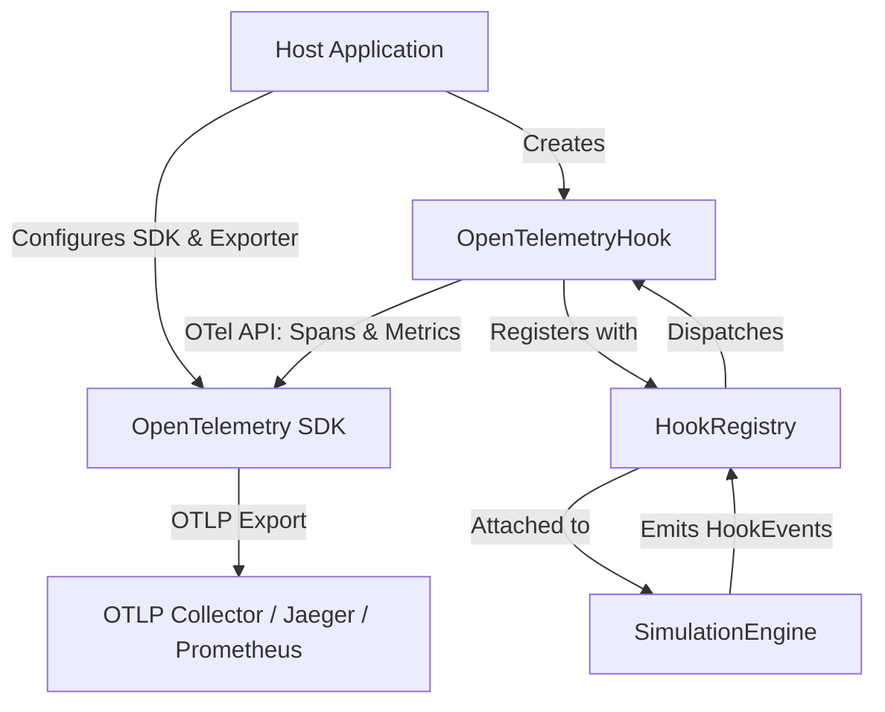

# OpenTelemetry Observability Guide

The Enterprise World Model Engine provides an OpenTelemetry integration (`OpenTelemetryHook`) in `ewm_engine.integrations.otel` that exposes simulation lifecycle events and runtime metrics to OpenTelemetry-compatible observability platforms (Jaeger, Prometheus, Datadog, Grafana Tempo, AWS X-Ray, etc.).

---

## 1. Design Principles & Architecture

The OpenTelemetry integration adheres strictly to the official [OpenTelemetry Python Library Guidelines](https://opentelemetry.io/docs/specs/otel/overview/):
1. **API-Only Dependency**: The library depends exclusively on `opentelemetry-api`. It **never** imports or bundles `opentelemetry-sdk` in runtime code.
2. **Host-Owned Pipeline**: The host application controls the tracer provider, meter provider, sampler, processors, and exporter (e.g., OTLP/gRPC, OTLP/HTTP, Console).
3. **Zero Overhead When Unattached**: If no `OpenTelemetryHook` is registered, event dispatch has zero telemetry overhead.
4. **Safe Default Attributes**: To prevent confidential enterprise context or PII leaks, spans emit only canonical IDs, counts, cryptographic hashes, fingerprints, and timings by default. Raw entity attributes or memory dictionaries are never emitted unless explicitly opted in.



---

## 2. Installation

Install EWM Engine with the `otel` optional extra:

```bash
pip install "ewm-engine[otel]"
```

For the host application to export spans and metrics, also install your preferred OpenTelemetry SDK and exporters:

```bash
pip install "opentelemetry-sdk>=1.25.0" "opentelemetry-exporter-otlp"
```

---

## 3. Span Hierarchy

When a simulation executes, `OpenTelemetryHook` generates a hierarchical trace tree:

```text
ewm.simulation:capacity_stress [scenario_id=capacity_stress, samples=2, horizon=5]
  ├── ewm.rollout:0 [sample_id=0, status=completed, step_count=5]
  │     ├── ewm.step:0 [state_hash=..., actions_accepted=1, violations=0]
  │     ├── ewm.step:1 [state_hash=..., actions_accepted=1, violations=0]
  │     │     └── event: constraint_evaluated [constraint_id=cap_limit, satisfied=true]
  │     └── ...
  └── ewm.rollout:1 [sample_id=1, status=invalid, step_count=2]
        ├── ewm.step:0 [state_hash=..., is_invalid=false]
        └── ewm.step:1 [state_hash=..., is_invalid=true, status=ERROR]
```

### Span Attributes

| Span Name | Level | Default Attributes | Error Semantics |
| :--- | :--- | :--- | :--- |
| `ewm.simulation:{scenario_id}` | Root | `ewm.scenario_id`, `ewm.horizon`, `ewm.samples`, `ewm.seed`, `ewm.initial_state_fingerprint`, `ewm.duration_seconds`, `ewm.rollout_count`, `ewm.completed_rollout_count`, `ewm.invalid_rollout_count` | `StatusCode.OK` upon clean finish |
| `ewm.rollout:{rollout_idx}` | Child of Simulation | `ewm.rollout_idx`, `ewm.sample_id`, `ewm.seed`, `ewm.status`, `ewm.step_count`, `ewm.final_state_fingerprint` | `StatusCode.ERROR` if rollout terminated with `INVALID` status |
| `ewm.step:{step_idx}` | Child of Rollout | `ewm.rollout_idx`, `ewm.step`, `ewm.state_hash`, `ewm.actions_accepted_count`, `ewm.actions_proposed_count`, `ewm.violations_count`, `ewm.is_invalid`, `ewm.transition_model` | `StatusCode.ERROR` if step caused fatal invalidation |

---

## 4. Metric Instruments

When `SimulationFinished` is emitted, `OpenTelemetryHook` records operational metrics:

| Metric Name | Instrument | Unit | Description |
| :--- | :--- | :--- | :--- |
| `ewm.simulation.duration` | Histogram | `s` | Total wall-clock duration of simulation run |
| `ewm.rollouts.total` | Counter | `{rollout}` | Total Monte Carlo rollouts executed (labeled by `status`) |
| `ewm.steps.total` | Counter | `{step}` | Total discrete simulation steps executed across all rollouts |
| `ewm.constraints.evaluations` | Counter | `{evaluation}` | Total individual constraint evaluations performed |
| `ewm.constraints.hard_violations` | Counter | `{violation}` | Total hard constraint violations encountered |
| `ewm.constraints.soft_violations` | Counter | `{violation}` | Total soft constraint violations encountered |
| `ewm.dynamics.transitions` | Counter | `{transition}` | Total state dynamics transitions performed |
| `ewm.trace.edges` | Counter | `{edge}` | Total systemic trace causal edges recorded |

---

## 5. End-to-End Example: Host SDK Setup

Below is a complete working example demonstrating host application initialization with Console exporters:

```python
from opentelemetry import metrics, trace
from opentelemetry.sdk.metrics import MeterProvider
from opentelemetry.sdk.metrics.export import ConsoleMetricExporter, PeriodicExportingMetricReader
from opentelemetry.sdk.trace import TracerProvider
from opentelemetry.sdk.trace.export import BatchSpanProcessor, ConsoleSpanExporter

from ewm_engine.core import World, WorldState
from ewm_engine.integrations.otel import OpenTelemetryHook
from ewm_engine.simulation import Scenario, SimulationEngine

# 1. Host Application initializes OpenTelemetry Tracing SDK
tracer_provider = TracerProvider()
tracer_provider.add_span_processor(BatchSpanProcessor(ConsoleSpanExporter()))
trace.set_tracer_provider(tracer_provider)

# 2. Host Application initializes OpenTelemetry Metrics SDK
metric_reader = PeriodicExportingMetricReader(ConsoleMetricExporter())
meter_provider = MeterProvider(metric_readers=[metric_reader])
metrics.set_meter_provider(meter_provider)

# 3. Create the EWM Engine OpenTelemetry hook
otel_hook = OpenTelemetryHook(
    include_state_attributes=False,  # Keep attributes safe & compact
    record_step_spans=True,  # Record full step hierarchy
)

# 4. Run the simulation
engine = SimulationEngine(hooks=[otel_hook])
world = World(initial_state=WorldState())
scenario = Scenario(scenario_id="logistics_eval", horizon=10, samples=5, seed=42)

result = engine.run(world=world, scenario=scenario)
print(f"Simulation completed with {len(result.trajectories)} trajectories.")

# 5. Flush host SDK before process exit
tracer_provider.shutdown()
meter_provider.shutdown()
```

---

## 6. Configuration Options

`OpenTelemetryHook` accepts configuration parameters:

```python
hook = OpenTelemetryHook(
    tracer_provider=custom_tracer_provider,  # Optional custom TracerProvider
    meter_provider=custom_meter_provider,  # Optional custom MeterProvider
    tracer_name="my-custom-service",  # Instrumentation scope name (default: "ewm-engine")
    meter_name="my-custom-service",  # Instrumentation scope name (default: "ewm-engine")
    include_state_attributes=True,  # Attach numeric step metrics (default: False)
    record_step_spans=False,  # Disable step spans for high-horizon simulations
)
```

> [!TIP]
> **Performance Recommendation**: For massive scale simulations ($N > 1{,}000$ samples or $H > 100$ steps), set `record_step_spans=False`. This generates only simulation- and rollout-level spans, substantially reducing span memory overhead while preserving complete metric reporting.
