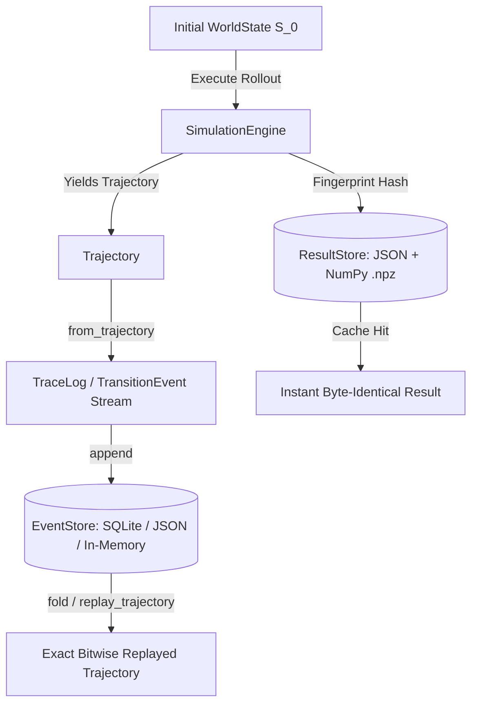

# Persistence, Event-Sourced Replay, and ResultStore

In production decision systems, simulations must not live purely in transient process memory. The Enterprise World Model Engine provides a comprehensive durability and reproducibility subsystem in `ewm_engine.durability`:
1. **Append-Only `TraceLog`**: An event-sourced transition log where state is a deterministic fold over events ($S_t = \text{fold}(S_0, [e_1, \dots, e_t])$), conforming to Meta ARE's "everything is an event" paradigm (arXiv:2509.17158).
2. **Deterministic Replay**: Bitwise-identical trajectory reconstruction from recorded event streams.
3. **Branching as a DAG**: Decision counterfactuals modeled as forks in the event DAG, preserving strict lineage isolation.
4. **Pluggable `EventStore` Protocol**: Standard-library backends (`InMemoryEventStore`, `JsonFileEventStore`, `SqliteEventStore`) with zero external dependencies.
5. **Fingerprint-Keyed `ResultStore` & Memoization**: Exact rollout caching keyed by canonical SHA-256 simulation fingerprints, eliminating redundant Monte Carlo computation.



---

## 1. Event-Sourced Replay: State as a Fold Over Events

In EWM Engine, `WorldState` is immutable and fingerprinted via canonical SHA-256 hashes. Each simulation step is an atomic transition:
$$(S_t, a_t, \xi_t) \xrightarrow{\text{dynamics}} S_{t+1}$$

This transition is captured in a `TransitionEvent` locked to `schema_version = "1.0.0"`.

### Recording and Replaying Trajectories

```python
from ewm_engine.core.world import World
from ewm_engine.core.state import WorldState
from ewm_engine.core.resources import Resource
from ewm_engine.simulation.engine import SimulationEngine
from ewm_engine.simulation.scenario import Scenario
from ewm_engine.durability import TraceLog, fold_events, replay_trajectory, verify_trajectory_replay

# 1. Initialize World and Scenario
world = World(initial_state=WorldState(resources=[Resource(id="inventory", current=500.0)]))
scenario = Scenario(scenario_id="quarterly_ops", horizon=10, samples=1, seed=42)

# 2. Run simulation
engine = SimulationEngine()
result = engine.run(world, scenario)
original_traj = result.trajectories[0]

# 3. Convert trajectory to an append-only TraceLog
trace_log = TraceLog.from_trajectory(original_traj, stream_id="sim_run_001")

# 4. Deterministic Replay: Fold events over initial state
reconstructed_final_state = fold_events(
    initial_state=world.initial_state,
    events=trace_log.events,
)
assert reconstructed_final_state.fingerprint == original_traj.final_state.fingerprint

# 5. Replay full trajectory with step records
replayed_traj = replay_trajectory(
    events=trace_log.events,
    initial_state=world.initial_state,
    seed=original_traj.seed,
)

# 6. Prove bitwise equivalence
assert verify_trajectory_replay(original_traj, replayed_traj) is True
```

---

## 2. Decision Branching in the Event DAG

When evaluating counterfactual interventions, decision makers explore alternate decision branches starting from a common historical milestone. In `TraceLog`, branches are represented as forks in the event DAG:

```python
# Fork a new branch from step 4 of the main trajectory
branch_log = trace_log.branch(new_stream_id="expansion_branch", at_step=4)

# Subsequent events appended to branch_log do not mutate trace_log
dag_metadata = branch_log.get_dag()
print(f"Fork point fingerprint: {dag_metadata['fork_fingerprint']}")
```

---

## 3. Persistent Event Stores

The `EventStore` protocol allows plugging in custom event persistence layers. The engine ships with three built-in, zero-dependency implementations:

| Backend | Class | Storage Engine | Concurrency | Best For |
|---|---|---|---|---|
| **In-Memory** | `InMemoryEventStore` | Python Dicts + RLock | In-Process | Unit testing, ephemeral runs |
| **JSON / YAML** | `JsonFileEventStore` | Disk Files (`.json` / `.yaml`) | Atomic write (`.tmp` + rename) | Human audit, file sharing |
| **SQLite** | `SqliteEventStore` | Embedded `sqlite3` | WAL Mode (`PRAGMA journal_mode=WAL`) | Production embedded workloads |

### Using `SqliteEventStore`

```python
from ewm_engine.durability import SqliteEventStore

# Open a persistent SQLite event store (or ':memory:')
store = SqliteEventStore("simulation_events.db")

# Append events
store.append("quarterly_ops", trace_log.events)

# Read historical event stream
events = store.read_stream("quarterly_ops", from_step=0, to_step=5)

# Reconstruct final state directly from database
final_state = store.fold(initial_state=world.initial_state, stream_id="quarterly_ops")

store.close()
```

---

## 4. Fingerprint-Keyed ResultStore & Memoization

Simulation rollouts are computationally intensive. The engine computes a canonical SHA-256 fingerprint over:
1. `world.initial_state.fingerprint`
2. Component versions (dynamics models, actors, constraints)
3. Scenario parameters (`scenario_id`, `horizon`, `samples`, `seed`)
4. Interventions and scheduled actions

Because this fingerprint uniquely identifies the inputs and deterministic seed entropy of the rollout, it serves as the exact cache key.

### Using `FilesystemResultStore`

`FilesystemResultStore` stores simulation results on disk:
- `result.json`: Serialized scenario configuration, run metrics, and trajectories.
- `arrays.npz`: Compressed NumPy sidecar containing trajectory metric series, rollout seeds, and step metrics for fast numeric inspection.

```python
from ewm_engine.durability import FilesystemResultStore, MemoizedSimulationRunner

# Initialize disk cache store
cache_store = FilesystemResultStore(".ewm_cache")

# Wrap engine with memoization runner
runner = MemoizedSimulationRunner(engine=engine, store=cache_store)

# First call: Cache miss (executes simulation rollouts)
res1 = runner.run(world, scenario)
assert runner.last_cache_hit is False

# Second call: Cache hit (served instantly from disk)
res2 = runner.run(world, scenario)
assert runner.last_cache_hit is True

# Result is byte-identical and logically identical to fresh run
assert res1.trajectories[0].final_state.fingerprint == res2.trajectories[0].final_state.fingerprint
```

### Inspecting NumPy Sidecars

```python
import numpy as np

fp = runner.last_fingerprint
arrays_path = f".ewm_cache/{fp}/arrays.npz"

with np.load(arrays_path) as data:
    print("Rollout seeds:", data["seeds"])
    print("Step counts:", data["step_counts"])
```

---

## 5. Distributed Cache Backends (`[cache]` Extra)

For cloud and multi-node cluster deployments, Redis and Amazon S3 result stores are available via the `cache` optional extra:

```bash
pip install "ewm-engine[cache]"
```

Interfaces:
- `RedisResultStore(url="redis://localhost:6379/0", ttl_seconds=86400)`
- `S3ResultStore(bucket="my-ewm-cache", prefix="simulations/")`
