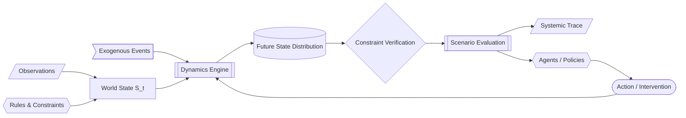

# Enterprise World Model Engine (EWM Engine)

**Simulate consequences before acting.**

An open-source framework for building executable, action-conditioned models of complex organizational and socio-technical systems.

---

## The Core Thesis

Traditional machine learning optimizes specialized predictive mappings:
$$\text{input} \longrightarrow \text{prediction}$$

Examples include:
- `text` $\to$ `intent`
- `customer history` $\to$ `churn probability`
- `sensor stream` $\to$ `failure probability`
- `demand time-series` $\to$ `demand forecast`

Foundation models unified representations across tasks, but **observational prediction is not an executable model of how a system evolves under intervention**.

An **Enterprise World Model** formalizes an executable representation of organizational dynamics:

$$\begin{aligned}
&\text{Current World State } (S_t) \\
+\; &\text{Intervention / Proposed Action } (A_t) \\
+\; &\text{Exogenous Environmental Shocks } (E_t) \\
+\; &\text{Systemic Dynamics } (\mathcal{T}) \\
\hline
\longrightarrow\; &\textbf{Distribution Over Future States } (S_{t+1:t+H})
\end{aligned}$$

---

## The Four Fundamental Questions

EWM Engine strictly differentiates four distinct inquiries:

| Question | Mathematical Form | System Goal |
|---|---|---|
| **Prediction** | $P(Y \mid X)$ | What is likely to happen next based on historical correlations? |
| **Simulation** | $P(S_{1:T} \mid S_0, \theta)$ | How could this system evolve forward in time? |
| **Intervention** | $P(Y \mid \text{do}(X))$ | What could happen if we deliberately alter policy or action $X$? |
| **Decision Evaluation** | $\mathbb{E}[U(S) \mid \text{do}(X)] \text{ vs } \mathbb{E}[U(S) \mid \text{do}(Y)]$ | How do the systemic consequences of alternative actions compare? |

EWM Engine is primarily architected around **Simulation, Intervention, and Decision Evaluation**. It never conflates observational predictive associations with interventional causal identification.

---

## Architectural North Star

> *"EWM Engine is not another agent framework. It is the environment model agents can use to ask 'what happens if I do this?' before they act."*

> *"Prediction estimates what may happen. A world model lets us explore what may happen if the system is changed."*

> *"Learn what is uncertain. Encode what is known. Simulate the interaction between both."*

---

## What EWM Engine Is NOT

To preserve intellectual honesty and architectural focus, EWM Engine is **not**:
- Another chatbot, RAG, or agent orchestration framework (not LangChain, AutoGen, CrewAI, or LangGraph).
- An RL-only discrete environment gym (though it supports policy rollouts).
- A digital-twin 3D visualization platform.
- A univariate statistical time-series forecasting library.
- A replacement for low-level discrete-event simulators (DES).
- A JEPA neural network implementation alone.
- A financial high-frequency trading simulator.

It is a **general-purpose integration architecture for executable socio-technical dynamics**.
