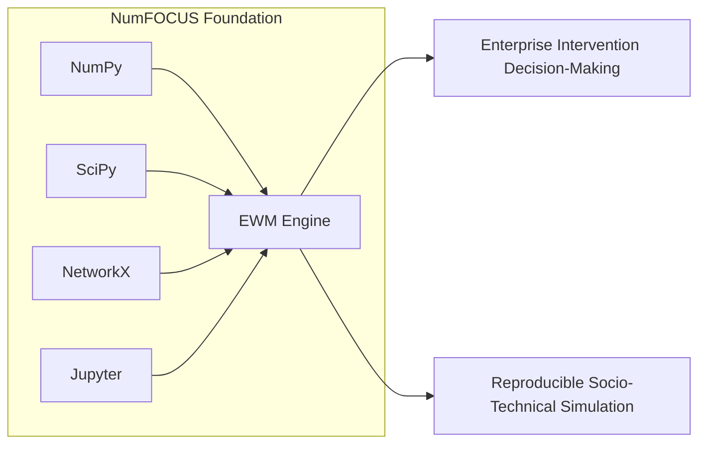
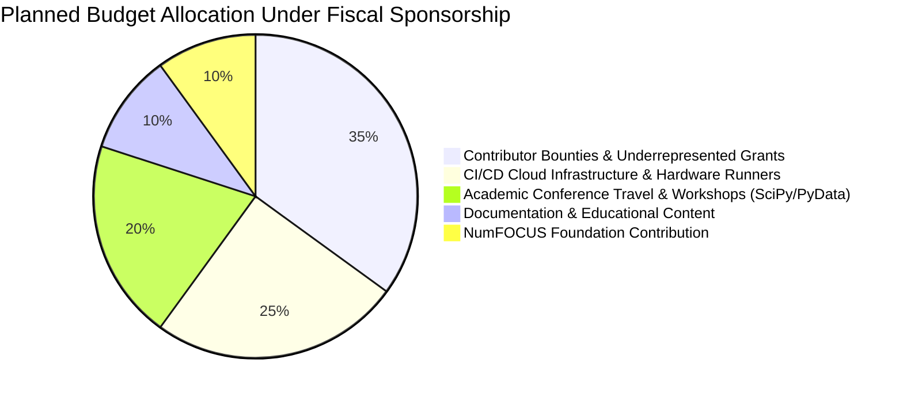
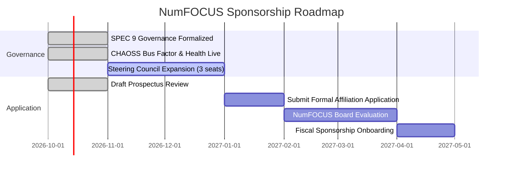

# NumFOCUS Fiscal Sponsorship Prospectus & Roadmap

## 1. Executive Summary & Purpose

The **Enterprise World Model Engine (EWM Engine)** is an open-source, reproducible computational framework for modeling, simulating, and evaluating counterfactual policy decisions in complex socio-technical and enterprise ecosystems.

To secure long-term financial sustainability, establish vendor neutrality, and uphold non-profit stewardship, the project is actively pursuing **Fiscal Sponsorship under [NumFOCUS](https://numfocus.org/)** (501(c)(3) public charity dedicated to promoting open-source scientific computing). NumFOCUS is the recognized home of foundational scientific Python projects—including **NumPy, SciPy, Pandas, Matplotlib, NetworkX, Jupyter, and SymPy**.

---

## 2. Alignment with NumFOCUS Criteria

EWM Engine satisfies each of the core requirements for NumFOCUS Affiliation and Fiscal Sponsorship:

| NumFOCUS Requirement | EWM Engine Compliance & Status |
| :--- | :--- |
| **Open Source Licensing** | 100% OSI-approved [Apache License 2.0](https://github.com/vfcarida/Enterprise-World-Model-Engine/blob/main/LICENSE); no proprietary core. |
| **Scientific Relevance** | Advances reproducible computational modeling of organizational dynamics, causal counterfactuals, and multi-objective optimization. |
| **Scientific Python Stack Integration** | Strictly integrates standard Scientific Python ecosystem libraries (NumPy, SciPy, NetworkX, SymPy, Polars) and follows **SPEC 0, SPEC 8, and SPEC 9**. |
| **Vendor Neutrality** | Governed by an open Steering Council; Elephant Factor is tracked to avoid vendor capture. |
| **Transparent Governance** | Formal [GOVERNANCE.md](https://github.com/vfcarida/Enterprise-World-Model-Engine/blob/main/GOVERNANCE.md) adopting the SPEC 9 maintainer ladder; open decision-making via lazy consensus and RFCs. |
| **Community Code of Conduct** | Comprehensive [Contributor Covenant 2.1](https://github.com/vfcarida/Enterprise-World-Model-Engine/blob/main/CODE_OF_CONDUCT.md) with an active 4-tier enforcement ladder. |

---

## 3. Synergies with Existing NumFOCUS Ecosystem

EWM Engine directly builds upon and strengthens the NumFOCUS scientific stack:

1. **NumPy & SciPy**: Core state spaces utilize vector resources, continuous optimization (HiGHS), and non-parametric bootstrap distributions.
2. **NetworkX**: Organizational topologies, entity relationship graphs, and systemic trace DAGs compile natively to NetworkX graphs.
3. **Jupyter & Matplotlib**: Acceptance fixtures and interactive decision analysis notebooks operate natively within the Jupyter environment.
4. **SymPy / Formal Methods**: Symbolic constraint verification and invariant monitoring.

---

## 4. Planned Use of Funds & Fiscal Stewardship

Under NumFOCUS 501(c)(3) fiscal sponsorship, all contributions, corporate grants, and donations will be managed transparently by the Steering Council for public benefit:

1. **Contributor Bounties & Diversity Grants (35%)**: Micro-grants for students and underrepresented contributors implementing starter tasks ([`docs/good-first-issues.md`](good-first-issues.md)) and ecosystem adapters.
2. **Infrastructure & Cloud Benchmarking (25%)**: Dedicated continuous benchmarking runners (CodSpeed, long-horizon Monte Carlo testing, multi-node scaling).
3. **Conference Travel & Academic Outreach (20%)**: Sponsoring maintainer talks and tutorials at **SciPy, PyData, NeurIPS, and INFORMS**.
4. **Documentation & Accessibility (10%)**: Professional technical writing, interactive tutorials, and translations.
5. **NumFOCUS Operational Contribution (10%)**: Direct contribution to NumFOCUS to support shared legal, accounting, and educational infrastructure.

---

## 5. Application Roadmap & Timeline

The Steering Council is executing a structured roadmap toward full NumFOCUS Affiliated and Sponsored Project status:

- **Phase 1: Governance & Maturity (Completed — October 2026)**:
  Establish SPEC 9 maintainer ladder, RFC process, CHAOSS health metrics, and all-contributors recognition.
- **Phase 2: Community Expansion (November 2026 – January 2027)**:
  Promote active community members to Triager and Committer tiers; expand Steering Council to 3 members.
- **Phase 3: Formal Submission (Q1 2027)**:
  Submit formal NumFOCUS Affiliated Project application supported by academic and industrial letters of recommendation.
- **Phase 4: Full Fiscal Sponsorship (Q2 2027)**:
  Execute NumFOCUS Fiscal Sponsorship Agreement, establish dedicated banking and Open Collective routing, and publish annual transparent financial reports.
