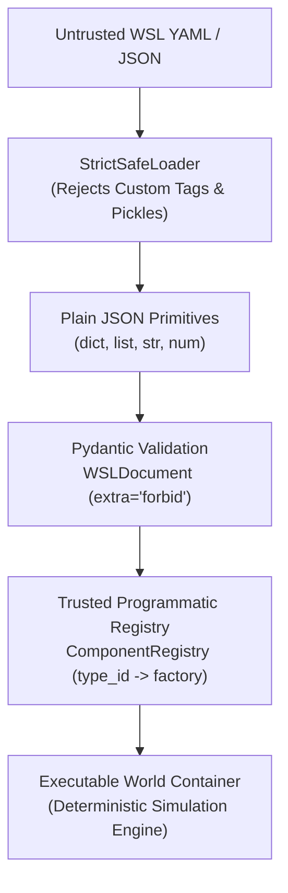

# Feature Specification: FEAT-003 — Heterogeneous Graph World State & World Specification Language (WSL)

**Feature ID:** `FEAT-003`  
**Milestone:** `v2.0.0-candidate` (Prompt `P10`)  
**Status:** Approved  
**Related ADRs:**  
- [`docs/adr/ADR-022-heterogeneous-graph-world-state-and-gnn-dynamics.md`](../../adr/ADR-022-heterogeneous-graph-world-state-and-gnn-dynamics.md)  
- [`docs/adr/ADR-023-declarative-world-specification-language-wsl.md`](../../adr/ADR-023-declarative-world-specification-language-wsl.md)  
- [`docs/adr/ADR-006-python-first-world-specification.md`](../../adr/ADR-006-python-first-world-specification.md)  
**Governing Specification:** [`docs/specs/spec-driven-development.md`](../spec-driven-development.md) (§62, §38)

---

## 1. Executive Summary & "Why Now"

In `ADR-006`, the engine explicitly adopted a **Python-first specification policy**:
> *"Designing a declarative Domain-Specific Language (DSL) prematurely risks freezing awkward grammar before core abstractions have matured under real-world usage. Prioritize Python-first programmatic world definition... A declarative DSL will be considered in future releases once interface patterns stabilize."*

Across releases `v1.0.0` and `v1.1.0`, the core abstractions have been proven, battle-tested, and audited:
- `WorldState` immutability, canonical hashing, and discrete step mechanics.
- Pluggable `DynamicsModel` protocols, deterministic Monte Carlo branching, and invariant gates.
- Operations Research solvers (Z3, OR-Tools, SciPy HiGHS) and receding-horizon controllers.
- Epistemic auditing, causal identifiability checks, and OOD regime-shift detectors.

With the Python interfaces firmly stabilized, `FEAT-003` addresses the two long-horizon capabilities reserved in the roadmap:
1. **Heterogeneous Temporal Relational Graph Representation**: Expanding beyond flat resource dictionaries into multi-relational graphs with typed entity nodes, typed relational edges, temporal validity, and Graph Neural Network (GNN) dynamics.
2. **Safe Declarative World Specification Language (WSL)**: A versioned, declarative specification format for enterprise world models that validates strictly through Pydantic and compiles via the trusted component registry without code execution.

---

## 2. Part 1: Heterogeneous Graph World State

### 2.1 Problem & Architectural Thesis
Enterprise systems are inherently heterogeneous networks:
- **Heterogeneous Nodes**: Warehouses, logistics hubs, retail stores, transport vehicles, regulatory jurisdictions.
- **Multi-Relational Edges**: Supply paths (`supplies`), transportation corridors (`routes_to`), organizational hierarchies (`manages`), legal dependencies (`governs`).
- **Temporal Validity**: Relations and capacities are dynamic; transportation routes open/close on seasonal schedules, contracts expire, and network topologies evolve over simulation steps.

Rather than introducing a breaking rewrite of `WorldState`, the engine implements an **Additive Graph View Pattern**:
- `WorldState` remains the canonical, immutable, auditable state container.
- `HeterogeneousGraphView` provides a zero-friction, strongly-typed multi-relational graph projection over `WorldState.entities`, `WorldState.relationships`, and `WorldState.resources`.
- `state.as_graph()` provides instant access to graph structures, node feature matrices, multi-relational adjacency matrices, and edge feature tensors.

### 2.2 Relational Formalism
A heterogeneous temporal relational graph is defined as:
$$\mathcal{G}_t = (\mathcal{V}_t, \mathcal{E}_t, \mathcal{R}, \mathcal{T}, \mathbf{X}_v, \mathbf{X}_e)$$
Where:
- $\mathcal{V}_t = \bigcup_{\tau \in \mathcal{T}_v} \mathcal{V}_t^{(\tau)}$ is the set of entity nodes partitioned by node type $\tau$ (e.g. `warehouse`, `vehicle`).
- $\mathcal{E}_t = \bigcup_{r \in \mathcal{R}} \mathcal{E}_t^{(r)}$ is the set of directed edges partitioned by relation type $r$ (e.g. `supplies`, `serves`).
- $\mathbf{X}_v \in \mathbb{R}^{|\mathcal{V}^{(\tau)}| \times d_\tau}$ is the node feature matrix combining entity attributes and attached resource values.
- $\mathbf{X}_e \in \mathbb{R}^{|\mathcal{E}^{(r)}| \times d_r}$ is the edge feature matrix containing edge attributes (distance, capacity, latency).
- Temporal validity interval $[t_{\text{valid\_from}}, t_{\text{valid\_until}})$ defines edge and node active windows.

### 2.3 Graph Neural Network Dynamics (`GraphNeuralDynamics`)
Under the `ml` extra, the engine provides `GraphNeuralDynamics`:
- Implements `DynamicsModel` operating over `HeterogeneousGraphView`.
- Executes Relational Graph Convolutional Message Passing:
  $$\mathbf{h}_v^{(l+1)} = \sigma\left( \mathbf{W}_{\text{self}} \mathbf{h}_v^{(l)} + \sum_{r \in \mathcal{R}} \frac{1}{|\mathcal{N}_r(v)|} \sum_{u \in \mathcal{N}_r(v)} \mathbf{W}_r \mathbf{h}_u^{(l)} \right)$$
- Interventions inject action parameters onto node or edge feature vectors.
- Output features project back to resource deltas with hard invariant boundary clamping.
- Zero PyTorch in core (strictly lazy-loaded via `_load_torch()`).

---

## 3. Part 2: World Specification Language (WSL)

### 3.1 Declarative Safety Model
Enterprise world models are frequently defined across organizational boundaries, imported from untrusted repositories, or shared across multi-tenant environments. A specification language must never allow arbitrary code execution.

**Strict Non-Goals (Scope Creep Rejection)**:
- **NO Embedded Python / Code Execution**: No `eval()`, `exec()`, or Python expressions (`${...}`).
- **NO Custom YAML Tags**: No `!python/object`, `!cmd`, or arbitrary constructor hooks.
- **NO Import-by-String**: Specs cannot reference arbitrary module paths (e.g. `module.Class`); components MUST be resolved via the explicit, programmatic `ComponentRegistry`.

### 3.2 WSL Document Grammar (`wsl/2.0.0`)
A valid WSL document contains:
1. `schema_version`: Must equal `"wsl/2.0.0"` or `"2.0.0"`.
2. `metadata`: Model ID, name, version, author, and description.
3. `temporal`: Time units, step duration, default horizon.
4. `entities`: Heterogeneous node definitions with types, attributes, and tags.
5. `relationships`: Directed relational edges with types, attributes, weights, and temporal intervals.
6. `resources`: Measurable finite states bounded by $[min, max]$, attached to entities.
7. `dynamics`: Registered dynamics model component with hyperparameter mapping.
8. `constraints`: Registered constraint components with phases (`PRE_ACTION`, `POST_DYNAMICS`).
9. `scenarios`: Declarative simulation scenarios with seeds and planned interventions.

---

## 4. Migration & Backward Compatibility

### 4.1 Schema Evolution
- `WorldState` in `v1.x` operates on `schema_version="1.0.0"`.
- `v2.0.0` introduces `schema_version="2.0.0"` supporting optional temporal graph metadata while maintaining 100% field compatibility.
- `migrate_v1_to_v2()` and `migrate_v2_to_v1()` guarantee bidirectional state migration.
- Existing `WorldSpec` continues to function as a subset of `WSLDocument`.
