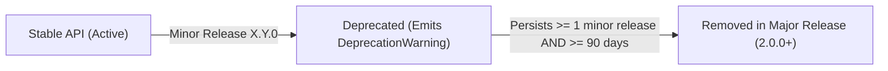

# Stability Policy and Public API Contract

This document codifies the Semantic Versioning (SemVer 2.0.0) stability guarantees, deprecation lifecycle, and API change governance for the **Enterprise World Model Engine (EWM Engine)** across the `1.x` release series.

---

## 1. Scope of the Stable Contract

The normative **Stable Public API Surface** is defined exclusively by the symbols exported from the root `ewm_engine` module via `ewm_engine.__all__`:

```python
(
    Action,
    Constraint,
    ConstraintPhase,
    ConstraintResult,
    ConstraintSeverity,
)
(
    DynamicsModel,
    Entity,
    EvidenceLevel,
    ExogenousEvent,
    Provenance,
    Relationship,
)
(
    Resource,
    Scenario,
    SimulationEngine,
    SimulationResult,
    TraceEdge,
    Trajectory,
)
(
    TrajectoryStatus,
    TransitionResult,
    World,
    WorldState,
    compare_scenarios,
)
__version__
```

### Invariants for the `1.x` Release Series:
1. **Semantic Stability**: Symbols in the Stable surface will not change their normative computational semantics, return types, or invariants throughout the `1.x` lifecycle.
2. **No New Required Arguments**: No new required parameters may be added to public methods or function signatures of Stable symbols in minor or patch releases. All new arguments must be optional with backwards-compatible default values or keyword-only with defaults.
3. **Persisted Field Compatibility**: Any new fields added to serializable models (`WorldState`, `Scenario`, `Provenance`, `Action`, `Entity`, `Resource`) must be optional with default values, ensuring older JSON payloads and schemas continue to deserialize without error.
4. **Removals in Major Releases Only**: No symbol, method, or parameter may be removed from the Stable surface during the `1.x` lifecycle. Removals are strictly reserved for major versions (`2.0.0+`).

---

## 2. Experimental Namespace (`ewm_engine.experimental`)

Components that are actively undergoing research, empirical validation, or iterative API design reside exclusively in the `ewm_engine.experimental` namespace:
- `ewm_engine.experimental.Intervention`, `TransitionDataset`, `TransitionSample`
- `ewm_engine.experimental.dynamics_eval` (Learned-dynamics evaluation harness, metrics, and invariant verification)
- `ewm_engine.experimental.neural_dynamics` (`TorchNeuralResidualDynamics` PyTorch MLP baseline)
- `ewm_engine.experimental.planning` (Rollout scorers: `CVaRScorer`, `ConstraintPenalizedScorer`, `UncertaintyPenalizedScorer`, `PlanningActor`)
- `ewm_engine.experimental.ood` (Grounded-regime detection: `SupportBoundaryOODDetector`, `MahalanobisOODDetector`)
- `ewm_engine.experimental.causal_diagnostics` (Identifiability, positivity, and Twin Rollout noise coupling)
- `ewm_engine.experimental.graph_state` (`HeterogeneousGraphView` and schema migration)
- `ewm_engine.experimental.graph_dynamics` (`GraphNeuralDynamics` relational message passing)
- `ewm_engine.experimental.wsl` (World Specification Language grammar, compiler, and exporter)

**Policy on Experimental Components:**
- Experimental components carry an explicit warning upon instantiation or import.
- Experimental APIs may undergo breaking changes or redesigns in minor releases (`1.x.0`) based on research findings.
- An experimental component graduates to the Stable surface only after an accepted Architecture Decision Record (ADR) and formal schema/contract snapshot approval.

---

## 3. Deprecation Lifecycle

When a public capability, class, or method is superseded by a superior design, it enters the formal deprecation lifecycle before removal:



### Deprecation Requirements:
1. **Runtime Warning**: The deprecated class, function, or parameter must emit a Python `DeprecationWarning` directing users to the modern replacement.
2. **Documentation**: The deprecation must be clearly documented in:
   - The docstring of the symbol.
   - `CHANGELOG.md` under the `### Deprecated` section of the releasing version.
   - Migration notes explaining how to adapt existing code.
3. **Minimum Deprecation Window**: A deprecated feature must remain fully functional for at least **one minor release cycle** (`>= 1 minor`) **AND at least 90 calendar days** (whichever duration is longer) before being eligible for removal in a subsequent major release.

---

## 4. Security Advisories and Emergency Exceptions

In the event of a critical security vulnerability (such as an arbitrary code execution, unsafe deserialization, or credential exposure):
- An immediate patch release (`1.x.Z`) may alter internal behavior or reject unsafe inputs without adhering to the standard deprecation window.
- A GitHub Security Advisory (GHSA) and Common Vulnerabilities and Exposures (CVE) identifier will be published with explicit remediation steps.
- Security fixes must prioritize maintaining the Stable API signatures while neutralizing the threat.

---

## 5. API Change Governance Process

Any proposed modification, deprecation, or addition to the Stable Public API surface must follow the formal API Change Proposal workflow:

1. **Submit Proposal**: Author drafts an API Change Proposal using the template at [`.github/API_CHANGE_PROPOSAL.md`](https://github.com/vfcarida/Enterprise-World-Model-Engine/blob/main/.github/API_CHANGE_PROPOSAL.md).
2. **Architecture Decision Record**: If the change introduces new structural concepts or protocols, an accompanying ADR must be placed in `docs/adr/`.
3. **Review and Consensus**: Maintainers review the proposal against the Definition of Done and backward-compatibility gates.
4. **Contract Test Enforcement (AC-024)**: Any approved API change must update the committed public API snapshot in `tests/contract/test_public_api.py` and `tests/contract/test_api_compatibility.py` with an explicit reference to the approved ACP. Unapproved API drift automatically fails CI.
