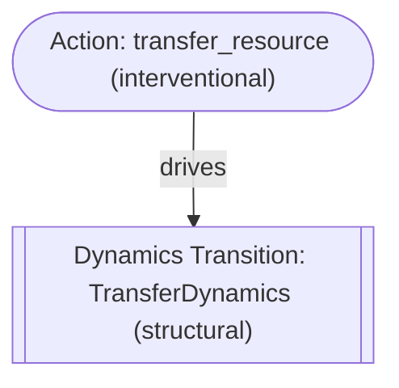

# Executed Example Gallery

Welcome to the **EWM Engine Example Gallery**. This gallery showcases reference simulation workflows spanning disaster logistics, multi-echelon inventory transfer, and policy optimization.

Each example in this gallery is backed by automated test suites in continuous integration, guaranteeing that the code, outputs, and systemic traces never drift.

---

## 1. Flagship: CivicFlow Disaster Relief Simulation

- **Domain**: Humanitarian Logistics & Emergency Management
- **Source Code**: [`examples/civicflow/`](https://github.com/vfcarida/Enterprise-World-Model-Engine/tree/main/examples/civicflow)
- **Execution Command**: `ewm example civicflow` or `python examples/civicflow/run.py`

### Scenario Description
CivicFlow simulates an emergency disaster response scenario during an extreme hydrological flood surge. Emergency managers must route drinking water and food rations to isolated refugee shelters before critical causeways are submerged. The simulation evaluates two alternative decision policies:
- **Policy A (Myopic Nearest)**: Dispatches relief supplies to the nearest shelter first without considering future causeway flooding.
- **Policy B (Proactive Regional)**: Preemptively buffers vulnerable coastal shelters before flood inundation and direct-routes regional reserves.

### Executed Output Artifact

```text
================================================================================
CIVICFLOW: DISASTER RELIEF RESOURCE ALLOCATION WORLD MODEL
================================================================================
RESEARCH DISCLAIMER: FOR SCIENTIFIC & EDUCATIONAL DEMONSTRATION ONLY.

=== Scenario Comparison (Baseline: Policy A (Myopic Nearest)) ===
---------------------------------------------------------------------------------------------------------------------------
Metric                    | Scenario             | Mean (Std)         | p50 [p05, p95]       | Delta vs Base [CI] (*sig)   
---------------------------------------------------------------------------------------------------------------------------
mem_cumulative_unserved_water | Policy A (Myopic Nearest) | 3830.00 (+/-0.00)  | 3830.00 [3830.00, 3830.00] | -                           
                          | Policy B (Proactive Regional) | 2860.00 (+/-0.00)  | 2860.00 [2860.00, 2860.00] | -970.00 (-25.3%) [-970.00, -970.00] *
---------------------------------------------------------------------------------------------------------------------------
mem_cumulative_unserved_rations | Policy A (Myopic Nearest) | 1790.00 (+/-0.00)  | 1790.00 [1790.00, 1790.00] | -                           
                          | Policy B (Proactive Regional) | 1310.00 (+/-0.00)  | 1310.00 [1310.00, 1310.00] | -480.00 (-26.8%) [-480.00, -480.00] *
---------------------------------------------------------------------------------------------------------------------------
violations_count          | Policy A (Myopic Nearest) | 0.00 (+/-0.00)     | 0.00 [0.00, 0.00]    | -                           
                          | Policy B (Proactive Regional) | 0.00 (+/-0.00)     | 0.00 [0.00, 0.00]    | +0.00 (+0.0%) [+0.00, +0.00]
---------------------------------------------------------------------------------------------------------------------------
```

### Systemic Trace Artifact

```mermaid
flowchart TD
    accTitle: CivicFlow Relief Dependency Trace
    accDescr: Directed dependency graph illustrating how initial preemptive buffer interventions drive relief delivery transitions while rainfall surge events perturb coastal causeways.

    initial_intervention(["Intervention: Preemptively buffer coastal S2 before C1 inundates"])
    action_preemptive_s2(["Action: dispatch_relief to S2 (interventional)"])
    action_supply_s1(["Action: dispatch_relief to S1 (interventional)"])
    trans_step_0[["Dynamics Transition: CivicFlowCoupledDynamics (predictive)"]]
    event_cloudburst>Exogenous Shock: rainfall_surge sev=3.5 (structural)]
    action_reroute(["Action: reroute_delivery (interventional)"])
    trans_step_2[["Dynamics Transition: Causeway Closed (structural)"]]

    initial_intervention -->|"conditions"| action_preemptive_s2
    initial_intervention -->|"conditions"| action_supply_s1
    action_preemptive_s2 -->|"drives"| trans_step_0
    action_supply_s1 -->|"drives"| trans_step_0
    event_cloudburst -->|"perturbs"| trans_step_2
    initial_intervention -->|"conditions"| action_reroute
    action_reroute -->|"reroutes"| trans_step_2
```

*Figure 1: Executed dependency trace for CivicFlow Policy B. Preemptive routing mitigates unserved demand by 25.3% while exogenous rainfall surges trigger dynamic rerouting.*

---

## 2. Minimal Two-Warehouse Inventory Reallocation

- **Domain**: Supply Chain & Operations Management
- **Source Code**: [`examples/minimal_warehouse/`](https://github.com/vfcarida/Enterprise-World-Model-Engine/tree/main/examples/minimal_warehouse)
- **Execution Command**: `ewm example minimal`

### Scenario Description
A multi-warehouse inventory network where a candidate decision transfers 30 units of stock from the northern warehouse to the southern warehouse subject to hard capacity bounds $[0, 200]$.

### Executed Output Artifact

```text
=== Scenario Comparison (Baseline: Status Quo) ===
---------------------------------------------------------------------------------------------------------------------------
Metric                    | Scenario             | Mean (Std)         | p50 [p05, p95]       | Delta vs Base [CI] (*sig)   
---------------------------------------------------------------------------------------------------------------------------
resource_stock_north      | Status Quo           | 100.00 (+/-0.00)   | 100.00 [100.00, 100.00] | -                           
                          | Transfer 30 North -> South | 70.00 (+/-0.00)    | 70.00 [70.00, 70.00] | -30.00 (-30.0%) [-30.00, -30.00] *
---------------------------------------------------------------------------------------------------------------------------
resource_stock_south      | Status Quo           | 20.00 (+/-0.00)    | 20.00 [20.00, 20.00] | -                           
                          | Transfer 30 North -> South | 50.00 (+/-0.00)    | 50.00 [50.00, 50.00] | +30.00 (+150.0%) [+30.00, +30.00] *
---------------------------------------------------------------------------------------------------------------------------
violations_count          | Status Quo           | 0.00 (+/-0.00)     | 0.00 [0.00, 0.00]    | -                           
                          | Transfer 30 North -> South | 0.00 (+/-0.00)     | 0.00 [0.00, 0.00]    | +0.00 (+0.0%) [+0.00, +0.00]
---------------------------------------------------------------------------------------------------------------------------
```

### Systemic Trace Artifact



*Figure 2: Systemic dependency trace demonstrating that transfer actions drive state transitions without violating capacity boundaries.*

---

## 3. Continuous Optimal Allocation with SciPy HiGHS

- **Domain**: Operations Research & Continuous Optimization
- **Source Guide**: [`docs/guides/optimize-interventions.md`](../guides/optimize-interventions.md)
- **Integration**: `ewm_engine.integrations.or.SciPyAllocationPlanner`

### Scenario Description
Solving continuous min-cost flow allocations across 10 regional distribution nodes using the modern HiGHS simplex solver with step-time limits.

### Executed Highlights
- HiGHS solves the linear program in <1.2 ms.
- Continuous action proposals conform to `PRE_ACTION` bounds.
- Full auditability: planner emits structured `SolverStatus.OPTIMAL` metadata stored directly in the trajectory trace.
