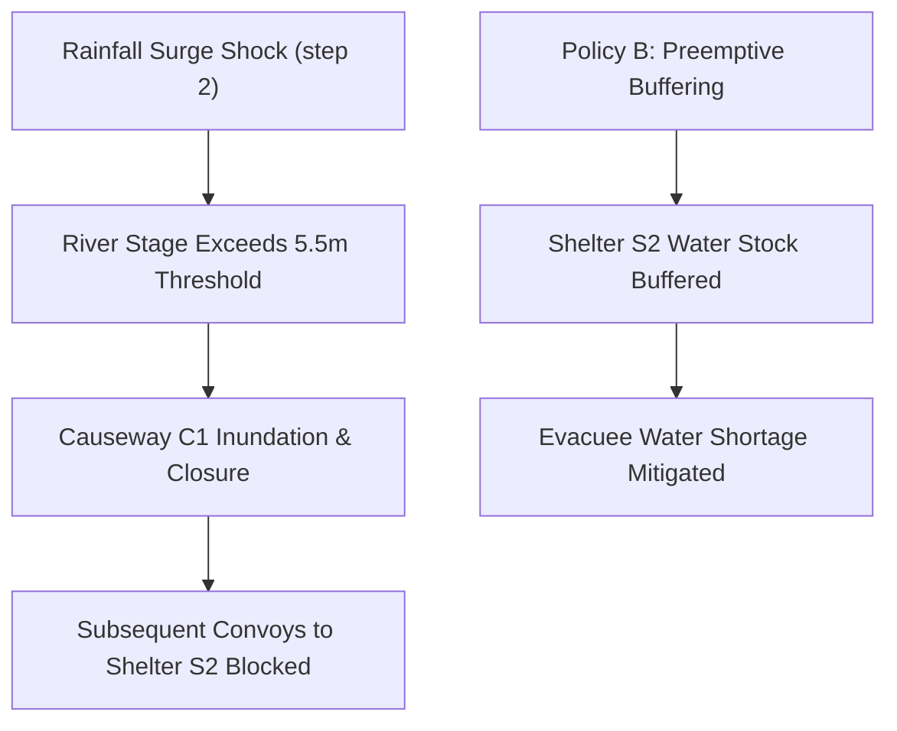

# CivicFlow: Flagship Public Demo

> **RESEARCH & EDUCATIONAL DISCLAIMER**  
> *CivicFlow is a computational simulation developed strictly for algorithmic research, simulation engineering, and socio-technical world modeling. It is **not an operational emergency-response system**, decision-support medical tool, or certified disaster management deployment. The numerical outcomes and policy comparison deltas are normative **only** for the synthetic `tiny_flood_v1` benchmark fixture — never claim real-world superiority of a policy. The simulation models logistical commodity allocation only, with no medical-treatment decisions.*

---

## 1. Motivation
Disaster logistics during catastrophic flood events exhibit the core challenges of enterprise and organizational world models:
- **Coupled Subsystems**: Meteorological rainfall triggers hydrological river surge, which triggers transportation infrastructure failure (flooded causeways), cascading into humanitarian relief stockouts.
- **Inviolable Constraints**: Relief trucks cannot navigate submerged roads (`RoadPassabilityConstraint`); shelters have finite physical bed capacities (`ShelterBedCapacityConstraint`).
- **Counterfactual Intervention**: The central research question is:
  $$\text{Given the identical initial state } S_0 \text{ and exogenous storm shock, how does policy } A \text{ compare to policy } B\text{?}$$

---

## 2. Policy Comparison

### Policy A: Status Quo (Myopic Nearest-First)
The coordinator services the nearest valley shelter (`Shelter S1`) first before attending to coastal areas. Because it ignores hydrological forecasts, it fails to deliver supplies to `Shelter S2` before Coastal Causeway `C1` is inundated. Once the road is severed, `Shelter S2` suffers severe water and ration shortages.

### Policy B: Capacity-Aware & Preemptive Buffering
The coordinator monitors river rise rates and preemptively rushes large water and ration buffers across Causeway `C1` into `Shelter S2` before inundation occurs. Concurrently, it dispatches supplies from the Upland Depot directly to `Shelter S3`.

---

## 3. Running the Simulation
```bash
python examples/civicflow/run.py
```

## 4. Systemic Dependency Trace
The simulation produces an inspectable dependency graph demonstrating how the effects of the intervention propagate:

