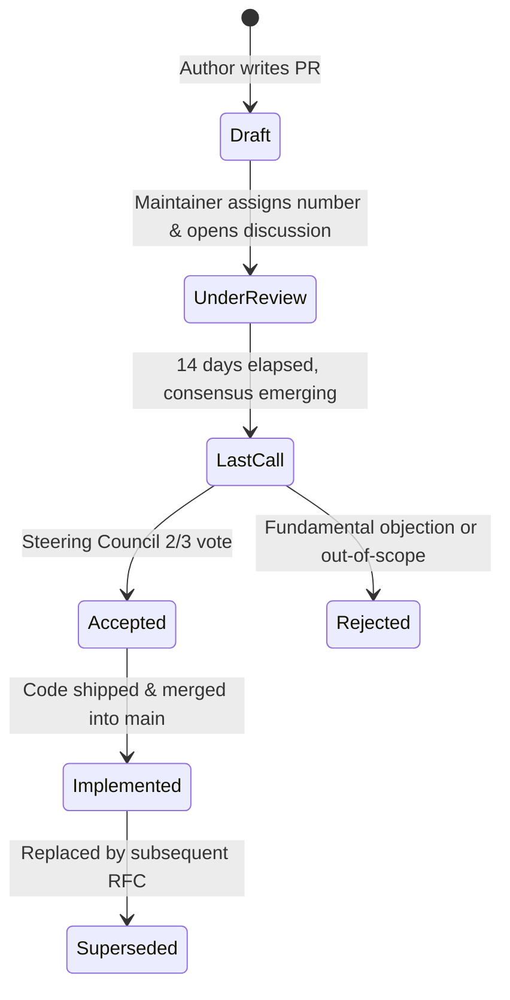

# RFC-0001: The EWM Engine RFC Process

- **RFC Number:** 0001
- **Status:** Accepted
- **Author(s):** Vinicius Caridá (@vfcarida)
- **Created Date:** 2026-10-07
- **Target Release:** v1.5.0
- **Steering Council Sponsor:** Vinicius Caridá (@vfcarida)
- **Related ADRs:** [ADR-038: Open-Source Governance, Community Health, and RFC Process](../docs/adr/ADR-038-open-source-governance-community-health-and-rfc-process.md)
- **Related Issues / PRs:** #200

---

## 1. Executive Summary

This RFC establishes the formal **Request for Comments (RFC) process** for the Enterprise World Model Engine. The RFC process is the primary consensus-building and governance instrument for proposing substantial changes to the public API surface, introducing novel mathematical or simulation paradigms, expanding ecosystem integrations, and evolving project policies.

---

## 2. Motivation: RFCs vs. ADRs

As the project scales from a focused engine to a diverse open-source ecosystem, contributors need a clear, structured way to propose and debate large-scale ideas before committing to code implementation.

We establish a clear dichotomy between **RFCs** and **ADRs**:

| Dimension | Request for Comments (RFC) | Architecture Decision Record (ADR) |
| :--- | :--- | :--- |
| **Primary Scope** | Cross-cutting, strategic, user-facing features, major API evolutions, governance policies | Granular internal implementation choices, technical trade-offs, refactors, CI mechanics |
| **Audience** | Entire community, researchers, end-users, Steering Council | Engineering maintainers and code contributors |
| **Location** | `rfcs/RFC-XXXX-<slug>.md` | `docs/adr/ADR-XXX-<slug>.md` |
| **Format** | SPEC / PEP / NEP proposal specification | MADR 4.x (Markdown Architectural Decision Record) |
| **Review Process** | Public 14-day RFC comment period + Steering Council vote | Standard PR review by subsystem CODEOWNERS |
| **Mutability** | Living proposal during review; frozen once accepted/rejected | Append-only permanent historical decision log |

When an RFC introduces new architectural mechanisms, the implementation PR must cross-link one or more ADRs to record the specific technical implementation choices.

---

## 3. The RFC Lifecycle

Every proposal advances through a five-stage lifecycle:

1. **Draft**: The author forks the repository, copies [`rfcs/0000-template.md`](0000-template.md), names it `rfcs/RFC-XXXX-proposal-title.md`, fills in all sections, and opens a pull request.
2. **Under Review**: A Steering Council member assigns an official RFC number and applies the `rfc` label. The proposal enters a mandatory **14-day community review window** where contributors comment, critique, and propose refinements.
3. **Last Call**: Once discussions converge, the Steering Council sponsor announces a **7-day Last Call period** for final objections.
4. **Decision**:
   - **Accepted**: Ratified by a 2/3 supermajority vote of the Steering Council.
   - **Rejected**: If the proposal violates core invariants (e.g., non-determinism, mandatory LLM coupling) or consensus cannot be achieved. The rejection rationale is documented in the RFC header.
5. **Implemented**: Once the feature is developed, validated against all CI quality gates, and merged into `main`, the status updates to `Implemented`.

---

## 4. Backwards Compatibility & SemVer

All RFCs impacting public API symbols must adhere to:
- SemVer 2.0.0 rules: no breaking changes in `1.x`.
- Deprecation cycle: any deprecated symbol requires at least one minor release cycle warning via NEP-23 / [`ewm_engine.core.deprecation`](../src/ewm_engine/core/deprecation.py).
- Automated contract tests validating backward compatibility.

---

## 5. Security & Invariant Invariants

Proposals must explicitly analyze and preserve core EWM Engine safety guarantees:
- **Bitwise Determinism**: Same seed sequence must yield identical trajectories across platforms.
- **Deep Immutability**: States cannot be modified in-place; all transitions return new snapshots.
- **Strict Offline Core**: The core kernel never makes unsolicited network calls.
- **Zero Unsafe Deserialization**: No dynamic code execution (`eval`/`exec`) or unsafe deserialization (`pickle`).

---

## 6. Implementation & Transition

This RFC takes effect immediately upon merge. All proposals for `v1.6.0+` and `v2.0-alpha` features will follow this process.
